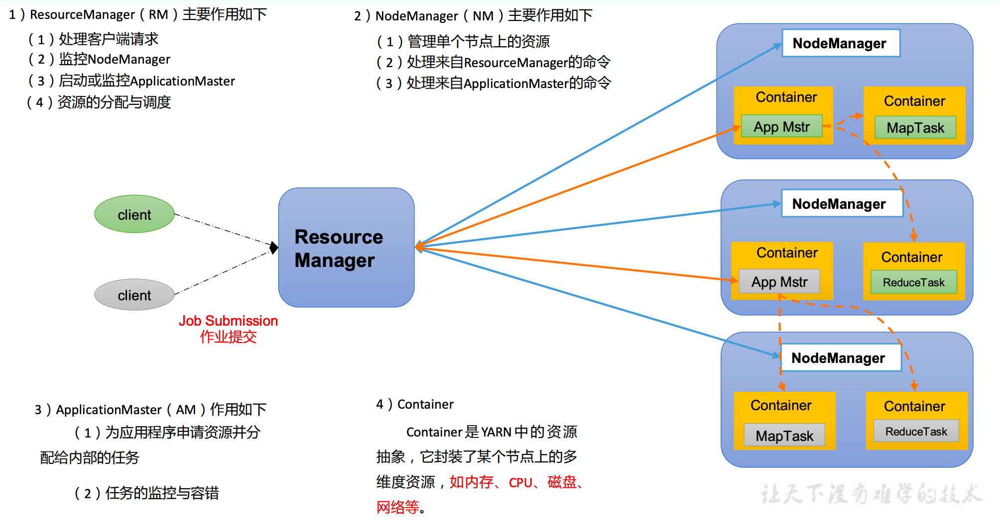
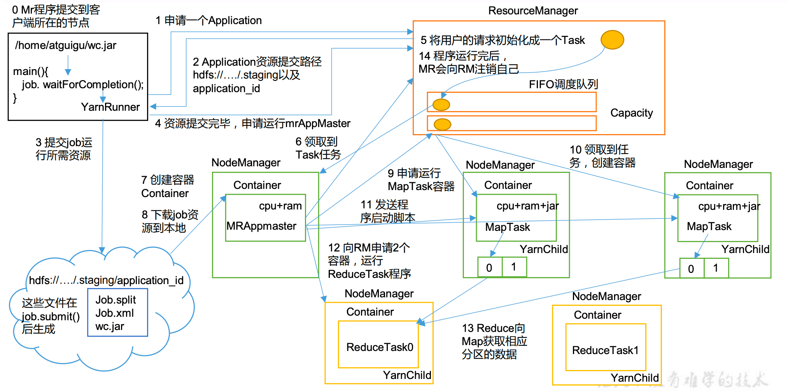
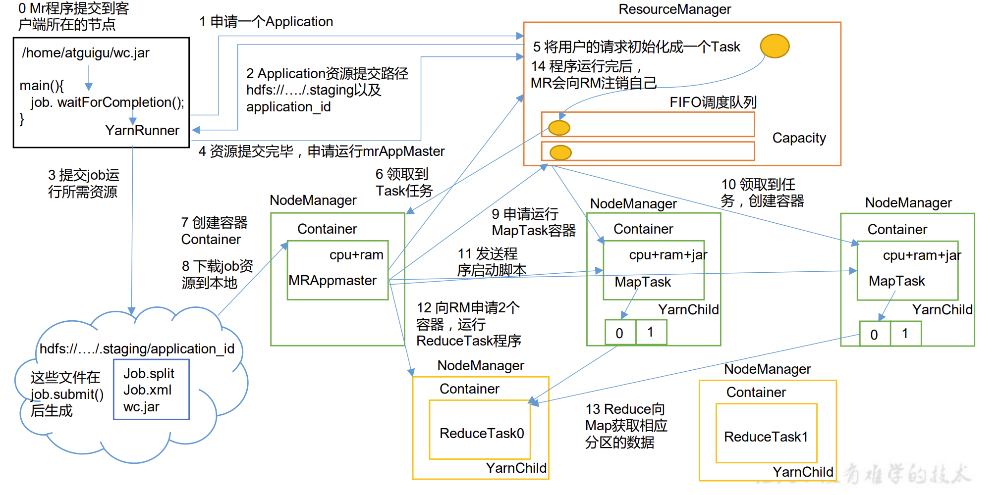

# Yarn资源调度器

Yarn是一个资源调度平台，负责为运算程序提供服务器运算资源，相当于一个分布式的操作系统平台，MapReduce是一个运行在这操作系统之上的应用程序

# Yarn基础架构

四大组件如下：ResourceManager、NodeManager、ApplicationMaster 和 Container

## ResourceManager

**整个集群的老大**

1.处理客户端请求

2.监控NodeManager

3.启动或监控ApplicationMaster

4.资源的分配与调度

## NodeManager

**单个节点的老大**

1.管理单个节点上的资源

2.处理来自ResourceManager的命令

3.处理来自ApplicationMaster的命令

## ApplicationMaster

1.为应用程序申请资源并分配给内部的任务

2.任务的监控与容错

## Container

**容器**

Yarn中资源的抽象，它封装了某个节点上的多维度资源，比如内存、CPU、磁盘、网络等

# Yarn工作机制

0.jar包提交到客户端所在的节点

1.客户端向ResourceManager申请Application

2.ResourceManager同意，并且返回资源提交路径和application_id

3.客户端提交job运行所需要的资源（如果是MR程序那就是split切片、jobxml和jar包）

4.资源提交完毕，申请运行mrAppMaster

5.ResourceManager将用户的请求初始化为一个Task，并放到任务队列里（FIFO调度队列）

6.闲置的NodeManager领取Task任务

7.创建容器Container，并执行MRAppMaster

8.下载job资源到本地（第3步提交的文件）

9.MRAppMaster向ResourceManager申请运行MapTask容器，RM将Task任务仍到调度队列里

10.闲置的NodeManager创建容器，领取任务（拷贝jar包）

11.MR AppMaster发起程序启动脚本，进程为YarnChild，执行代码

12.MapTask运行完毕，MRAppMaster向ResourceManager申请ReduceTask，进程为YarnChild

13.Reduce向Map获取分区数据

14.程序运行完毕MR AppMaster告诉ResourceManager释放资源

# 作业提交全过程

## HDFS、Yarn、MapReduce三者关系

## 作业提交过程-Yarn

## 作业提交过程-HDFS与MapReduce

## 详细过程

**初始化**

1.Client 调用 job.waitForCompletion 方法，向整个集群提交 MapReduce 作业。

2.Client 向 ResourceManager 申请一个作业 id。

3.ResourceManager 给 Client 返回该 job 资源的提交路径和作业 id。

4.Client 提交 jar 包、切片信息和配置文件到指定的资源提交路径。

5.Client 提交完资源后，向 ResourceManager 申请运行 MrAppMaster。

**作业初始化**

6.当 ResourceManager 收到 Client 的请求后，将该 job 添加到容量调度器中。

7.某一个空闲的 NodeManager 领取到该 Job。

8.该 NodeManager 创建 Container ，并产生 MRAppmaster。

9.下载 Client 提交的资源到本地。

**任务分配**

10.MrAppMaster 向 ResourceManager 申请运行多个 MapTask 任务资源。

11.ResourceManager 将运行 MapTask 任务分配给另外两个 NodeManager，另两个 NodeManager 分别领取任务并创建容器。

**任务运行**

12.MapReduce向两个接收到任务的 NodeManager 发送程序启动脚本，这两个 NodeManager 分别启动 MapTask，MapTask 对数据分区排序。

13.MrAppMaster等待所有MapTask运行完毕后，向ResourceManager 申请容器，运行ReduceTask。

14.ReduceTask 向 MapTask 获取相应分区的数据。

15.程序运行完毕后，MapReduce会向 ResourceManager 申请注销自己。

**进度和状态更新**

YARN 中的任务将其进度和状态(包括 counter)

返回给应用管理器, 客户端每秒(通过 mapreduce.client.progressmonitor.pollinterval 设置)向应用管理器请求进度更新, 展示给用户。

**作业完成**

除了向应用管理器请求作业进度外, 客户端每 5 秒都会通过调用 waitForCompletion()来 检查作业是否完成。时间间隔可以通过 mapreduce.client.completion.pollinterval 来设置。作业完成之后, 应用管理器和 Container 会清理工作状态。作业的信息会被作业历史服务器存储以备之后用户核查。

