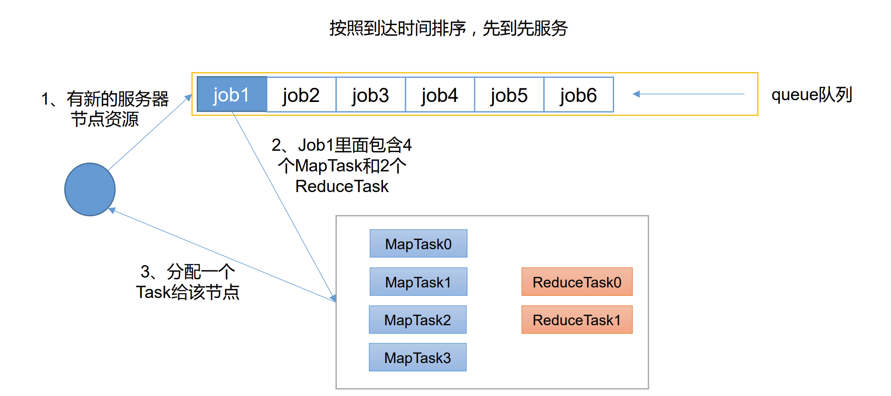
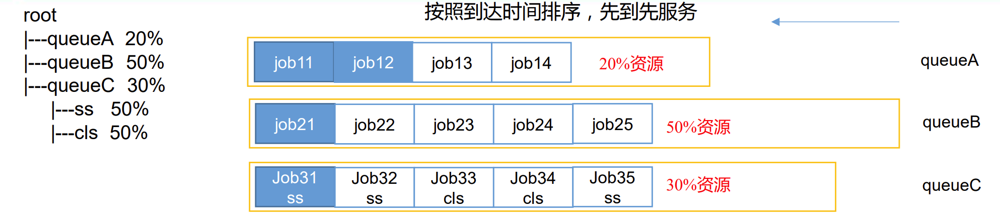
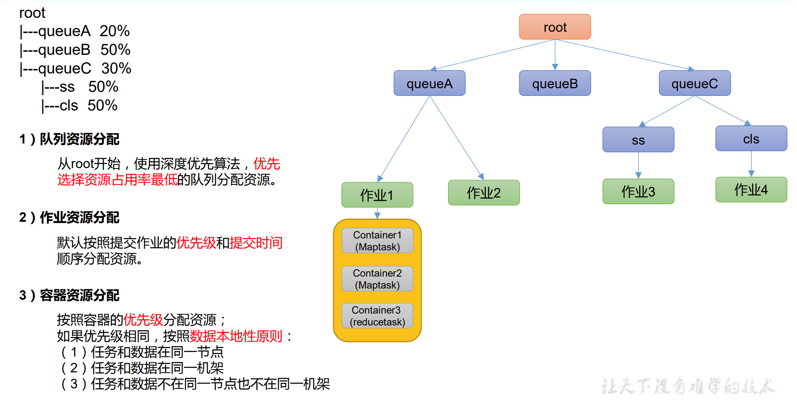
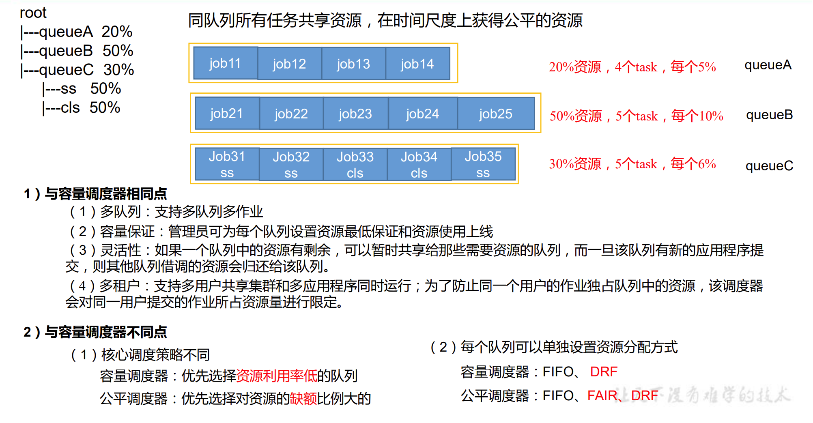
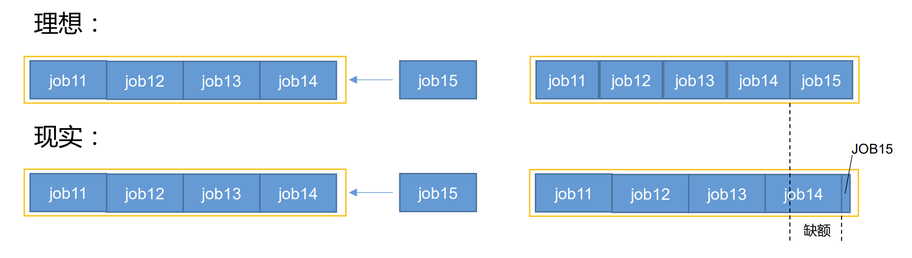
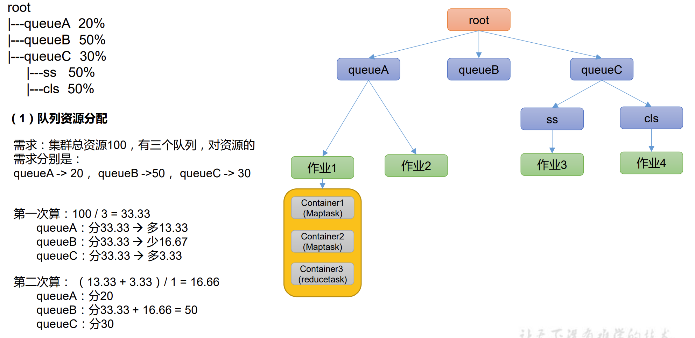
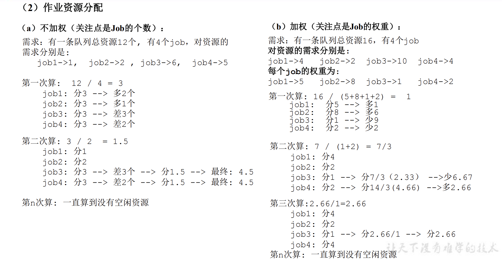
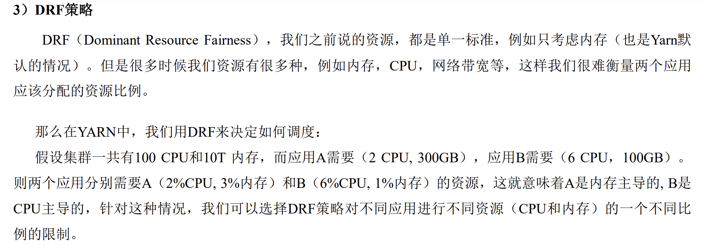

# 是什么

是Yarn的任务队列调度算法


Hadoop 作业调度器主要有三种：FIFO、容量调度器（Capacity Scheduler）和公平调度器（Fair  Scheduler）。

Apache Hadoop3.1.3 默认的资源调度器是 Capacity Scheduler。 CDH 框架默认调度器是 Fair Scheduler。

具体设置详见：yarn-default.xml 文件

```xaml
<property>
     <description>The class to use as the resource scheduler.</description>
     <name>yarn.resourcemanager.scheduler.class</name>
	<value>org.apache.hadoop.yarn.server.resourcemanager.scheduler.capacity.CapacityScheduler</value>
</property>
```


# 先进先出调度器（FIFO）

单队列，根据提交作业的先后顺序，先来先服务。



优点：简单易懂； 

缺点：不支持多队列，生产环境很少使用；


# 容量调度器（Capacity Scheduler）

Capacity Scheduler 是 Yahoo 开发的多用户调度器。



1、多队列：每个队列可配置一定的资源量，每个队列采用FIFO调度策略。

2、容量保证：管理员可为每个队列设置资源最低保证和资源使用上限

3、灵活性：如果一个队列中的资源有剩余，可以暂时共享给那些需要资源的队列，而一旦该队列有新的应用程序提交，则其他队列借调的资源会归还给该队列。

4、多租户： 支持多用户共享集群和多应用程序同时运行。 为了防止同一个用户的作业独占队列中的资源，该调度器会对同一用户提交的作业所占资源量进行限定。-





# 公平调度器（Fair Scheduler）

Fair Schedulere 是 Facebook 开发的多用户调度器




**缺额**

公平调度器设计目标是：在时间尺度上，所有作业获得公平的资源

某一时刻一个作业应获资源和实际获取资源的差距叫“缺额”

调度器会优先为缺额大的作业分配资源




**公平调度器 队列资源分配方式**






