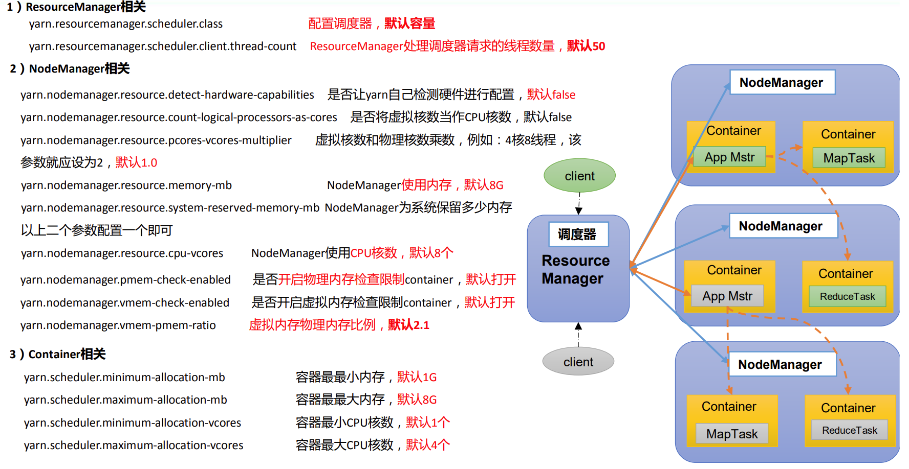

# Application查看任务

## **列出所有 Application**

```shell
yarn application -list
```


## **根据 Application 状态过滤**

```shell
yarn application -list -appStates FINISHED
```

（所有状态：ALL、NEW、 NEW_SAVING、SUBMITTED、ACCEPTED、RUNNING、FINISHED、FAILED、KILLED）


## **Kill 掉 Application**

```shell
yarn application -kill  application_1612577921195_0001
```


# yarn logs 查看日志

## **查询 Application 日志**

yarn logs -applicationId <ApplicationId>

```
yarn logs -applicationId application_1612577921195_0001
```


## 查询 Container 日志

yarn logs -applicationId  <ApplicationId> -containerId <ContainerId>

```shell
yarn logs -applicationId  application_1612577921195_0001 -containerId  container_1612577921195_0001_01_000001 
```


# yarn applicationattempt 查看尝试运行的任务

## 列出所有 Application 尝试的列表

yarn applicationattempt -list  <ApplicationId>

```shell
yarn applicationattempt -list application_1612577921195_0001
```


## 打印 ApplicationAttemp 状态

yarn applicationattempt -status <ApplicationId>

```shell
yarn applicationattempt -status appattempt_1612577921195_0001_000001
```


# yarn container 查看容器

## 列出所有 Container

yarn container -list <ApplicationAttemptId>

```shell
yarn container -list appattempt_1612577921195_0001_000001
```


## 打印 Container 状态

yarn container -status <Container>

```
yarn container -status container_1612577921195_0001_01_000001
```

只有在任务跑的途中才能看到 container 的状态


# yarn node 查看节点状态

## 列出所有节点

```
yarn node -list -all
```


# yarn rmadmin 更新配置

## 加载队列配置

修改队列参数后，可以使用这个重新载入队列

```
yarn rmadmin -refreshQueues
```


# yarn queue 查看队列

## 打印队列信息

yarn queue -status <QueueName>

```
yarn queue -status default
```


# YARN生产环境核心参数


