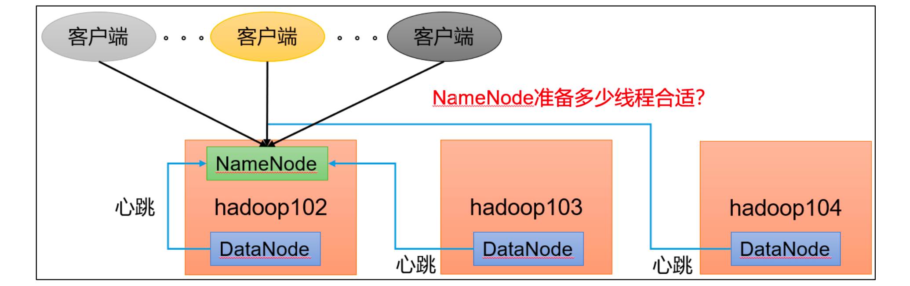
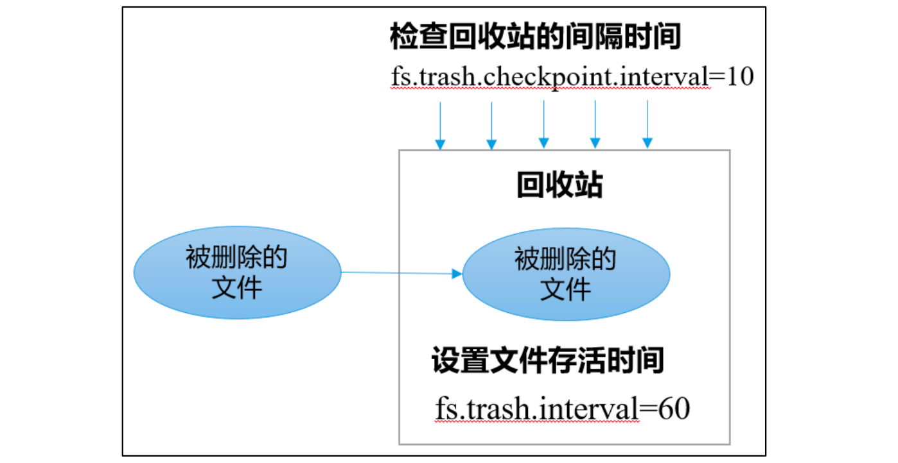

# NameNode内存生产配置

## NameNode内存计算

1.每个文件块大概占用150byte，一台服务器128G内存为例，能存储多少文件块呢？


## NameNode内存配置

**Hadoop2.x 系列，配置 NameNode 内存**

NameNode 内存默认 2000m，如果服务器内存 4G，NameNode 内存可以配置 3g（因为还有其他组件需要占用内存）。在hadoop-env.sh 文件中配置如下。

HADOOP_NAMENODE_OPTS=-Xmx3072m


**Hadoop3.x 系列，配置 NameNode 内存**

（1）hadoop-env.sh 中描述 Hadoop 的内存是动态分配的

```
# The maximum amount of heap to use (Java -Xmx). If no unit
# is provided, it will be converted to MB. Daemons will
# prefer any Xmx setting in their respective _OPT variable.
# There is no default; the JVM will autoscale based upon machine
# memory size.
# export HADOOP_HEAPSIZE_MAX=

# The minimum amount of heap to use (Java -Xms). If no unit
# is provided, it will be converted to MB. Daemons will
# prefer any Xms setting in their respective _OPT variable.
# There is no default; the JVM will autoscale based upon machine
# memory size.
# export HADOOP_HEAPSIZE_MIN=

HADOOP_NAMENODE_OPTS=-Xmx102400m
```


查看NameNode占用内存

```
[atguigu@hadoop102 ~]$ jps
3088 NodeManager
2611 NameNode
3271 JobHistoryServer
2744 DataNode 
3579 Jps

[atguigu@hadoop102 ~]$ jmap -heap 2611

Heap Configuration:
 MaxHeapSize = 1031798784 (984.0MB)
```


查看DataNode占用内存

```
[atguigu@hadoop102 ~]$ jmap -heap 2744

Heap Configuration:
 MaxHeapSize = 1031798784 (984.0MB)
```


查看发现 hadoop102 上的 NameNode 和 DataNode 占用内存都是自动分配的，且相等。不是很合理。


经验参考：https://docs.cloudera.com/documentation/enterprise/6/releasenotes/topics/rg_hardware_requirements.html#concept_fzz_dq4_gbb


| NameNode                         | DataNode                                                 |
| -------------------------------- | -------------------------------------------------------- |
| 最小值：1G                       | 最小值：4G                                               |
| 每增加1000000个block，增加1G内存 | 副本数低于4000000调为4G，超过则每增加1000000副本，增加1G |


**手动修改**

hadoop-env.sh

```
export HDFS_NAMENODE_OPTS="-Dhadoop.security.logger=INFO,RFAS -Xmx1024m"
export HDFS_DATANODE_OPTS="-Dhadoop.security.logger=ERROR,RFAS -Xmx1024m"
```


# NameNode心跳并发机制



在集群一开机时，DataNode需要向NameNode发送心跳信息，注册的，等一系列请求

那么NameNode需要准备多少线程来迎接请求

Hdfs-site.xml

```
The number of Namenode RPC server threads that listen to requests 
from clients. If dfs.namenode.servicerpc-address is not 
configured then Namenode RPC server threads listen to requests 
from all nodes.
NameNode 有一个工作线程池，用来处理不同 DataNode 的并发心跳以及客户端并发
的元数据操作。
对于大集群或者有大量客户端的集群来说，通常需要增大该参数。默认值是 10。

<property>
 <name>dfs.namenode.handler.count</name>
 <value>21</value>
</property>
```


```shell
[atguigu@hadoop102 ~]$ sudo yum install -y python
[atguigu@hadoop102 ~]$ python
Python 2.7.5 (default, Apr 11 2018, 07:36:10) 
[GCC 4.8.5 20150623 (Red Hat 4.8.5-28)] on linux2
Type "help", "copyright", "credits" or "license" for more 
information.
>>> import math
>>> print int(20*math.log(3))
21
>>> quit()
```

# **开启回收站配置**

开启回收站功能，可以将删除的文件在不超时的情况下，恢复原数据，起到防止误删除、备份等作用。

## **回收站工作机制**




## 开启回收站参数说明

（1）默认值 fs.trash.interval = 0，0 表示禁用回收站；其他值表示设置文件的存活时间。

（2）默认值 fs.trash.checkpoint.interval = 0，检查回收站的间隔时间。如果该值为 0，则该值设置和 fs.trash.interval 的参数值相等。

（3）要求 fs.trash.checkpoint.interval <= fs.trash.interval。 


## 启用回收站

core-site.xml

```
<property>
 <name>fs.trash.interval</name>
 <value>1</value>
</property>
```

表示1分钟回收站自动清空


## 查看回收站

回收站目录在 HDFS 集群中的路径：/user/atguigu/.Trash/….

**注意：通过网页上直接删除的文件也不会走回收站。**


## API

通过程序删除的文件不会经过回收站，需要调用 moveToTrash()才进入回收站

Trash trash = New Trash(conf);

trash.moveToTrash(path);


## 命令行

**只有在命令行利用** **hadoop fs -rm** **命令删除的文件才会走回收站。**

```
[atguigu@hadoop102 hadoop-3.1.3]$ hadoop fs -rm -r /user/atguigu/input
2021-07-14 16:13:42,643 INFO fs.TrashPolicyDefault: Moved: 
'hdfs://hadoop102:9820/user/atguigu/input' to trash at: 
hdfs://hadoop102:9820/user/atguigu/.Trash/Current/user/atguigu
/input
```


## 恢复回收站数据

```
[atguigu@hadoop102 hadoop-3.1.3]$ hadoop fs -mv /user/atguigu/.Trash/Current/user/atguigu/input /user/atguigu/input
```


