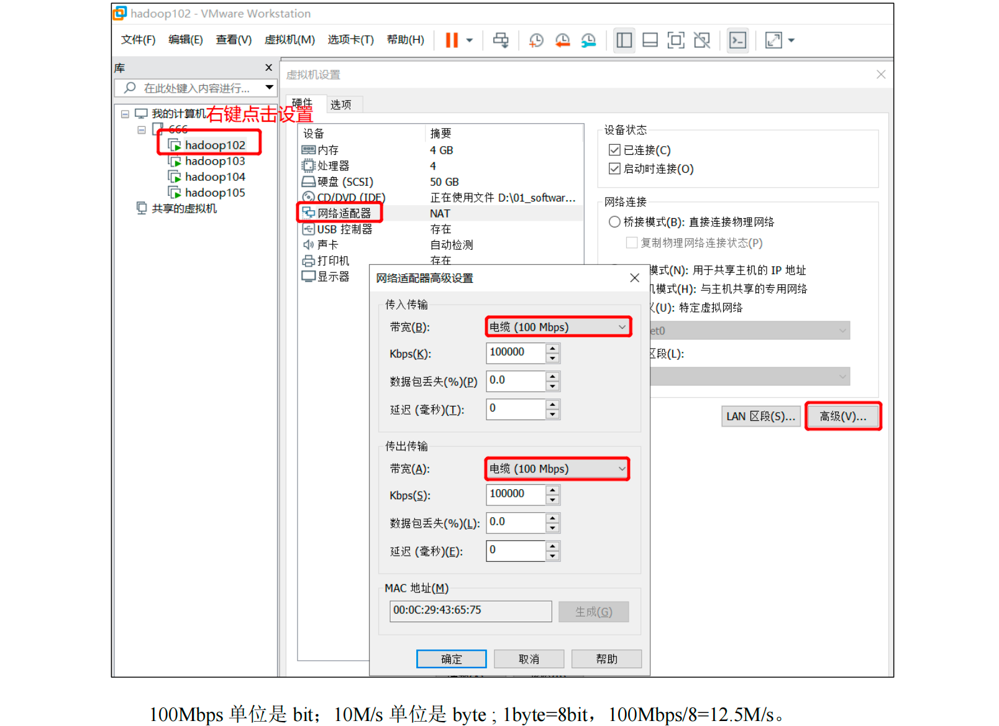
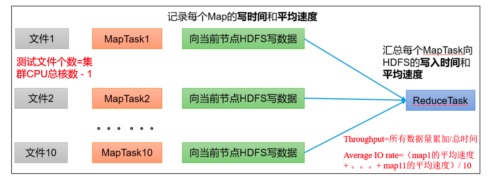
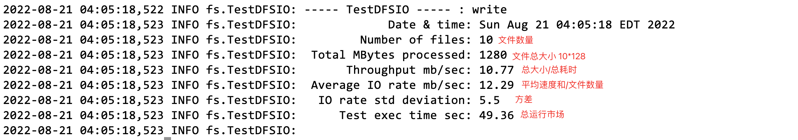
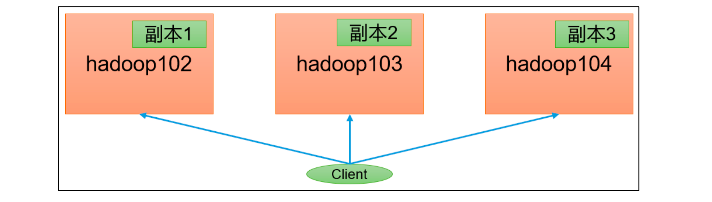
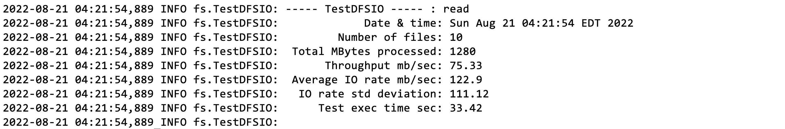

​		在企业中非常关心每天从 Java 后台拉取过来的数据，需要多久能上传到集群？消费者关心多久能从 HDFS 上拉取需要的数据？

为了搞清楚 HDFS 的读写性能，生产环境上非常需要对集群进行压测。


​		HDFS 的读写性能主要受**网络和磁盘**影响比较大。为了方便测试，将 hadoop102、hadoop103、hadoop104 虚拟机网络都设置为 100mbps。



测试网速：来到 hadoop102 的/opt/module 目录，创建一个

```
[atguigu@hadoop102 software]$ python -m SimpleHTTPServer
```

可以向外暴露一个接口，网页端访问可下载文件，可感受网速


# 测试HDFS写性能

## 写测试原理



## 测试内容

向HDFS集群写10个128M的文件

```
[atguigu@hadoop102 mapreduce]$ hadoop jar /opt/module/hadoop-3.1.3/share/hadoop/mapreduce/hadoop-mapreduce-client-jobclient-3.1.3-tests.jar TestDFSIO -write -nrFiles 10 -fileSize 128MB
```



Number of files：生成 mapTask 数量，一般是集群中（CPU 核数-1），我们测试虚

拟机就按照实际的物理内存-1 分配即可


**Total MBytes processed**

单个 map 处理的文件大小


**Throughput mb/sec**

单个 mapTak 的吞吐量

计算方式：处理的总文件大小/每一个 mapTask 写数据的时间累加

集群整体吞吐量：生成 mapTask 数量*单个 mapTak 的吞吐量


**Average IO rate mb/sec**

平均 mapTak 的吞吐量

计算方式：每个 mapTask 处理文件大小/每一个 mapTask 写数据的时间

 全部相加除以 task 数量


**IO rate std deviation**

方差、反映各个 mapTask 处理的差值，越小越均衡


## 结果分析

1.由于副本 1 就在本地，所以该副本不参与测试


一共参与测试的文件：10 个文件 * 2 个副本 = 20 个

压测后的速度：1.61（教程中测试的数据，并把每个节点速度限制为100Mbps）

实测速度：1.61M/s * 20 个文件 ≈ 32M/s

三台服务器的带宽：12.5 + 12.5 + 12.5 ≈ 30m/s

所有网络资源都已经用满。

**如果实测速度远远小于网络，并且实测速度不能满足工作需求，可以考虑采用固态硬盘或者增加磁盘个数。**


2.如果客户端不在集群节点，那就三个副本都参与计算



# 测试HDFS读性能

## 测试内容

读取 HDFS 集群 10 个 128M 的文件

```
hadoop jar /opt/module/hadoop-3.1.3/share/hadoop/mapreduce/hadoop-mapreduce-client-jobclient-3.1.3-tests.jar TestDFSIO -read -nrFiles 10 -fileSize 128MB
```



压测后的速度：75.33

实测速度：75.33*20 = 1500M/s


## 删除测试生成的文件

```
hadoop jar /opt/module/hadoop-3.1.3/share/hadoop/mapreduce/hadoop-mapreduce-client-jobclient-3.1.3-tests.jar TestDFSIO -clean
```


## 测试结果分析

为什么读取文件速度大于网络带宽？由于目前只有三台服务器，且有三个副本，数据读取就近原则，相当于都是读取的本地磁盘数据，没有走网络。