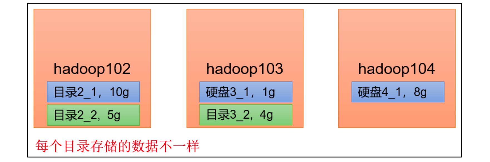
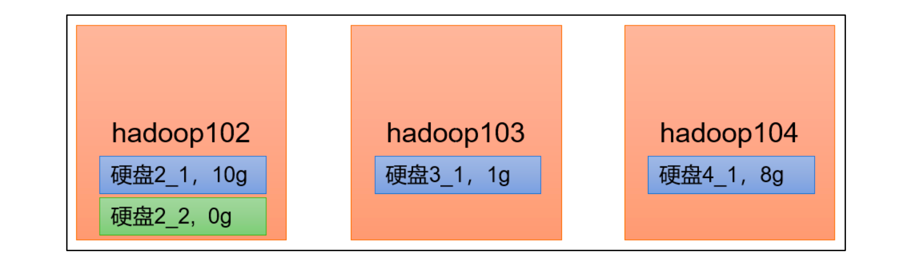

# NameNode多目录

NameNode的本地目录可以配置成多个，且每个目录存放内容相同，增加了可靠性

两个目录存放的都是一摸一样的数据

## 具体配置如下

hdfs-site.Xml

```
<property>
 <name>dfs.namenode.name.dir</name>
<value>file://${hadoop.tmp.dir}/dfs/name1,file://${hadoop.tmp.dir}/dfs/name2</value>
</property>
```

注意：因为每台服务器节点的磁盘情况不同，所以这个配置配完之后，可以选择不分发


（2）停止集群，删除三台节点的 data 和 logs 中所有数据。

```
[atguigu@hadoop102 hadoop-3.1.3]$ rm -rf data/logs/
[atguigu@hadoop103 hadoop-3.1.3]$ rm -rf data/logs/
[atguigu@hadoop104 hadoop-3.1.3]$ rm -rf data/logs/
```


（3）格式化集群并启动。

```
[atguigu@hadoop102 hadoop-3.1.3]$ bin/hdfs namenode -format
[atguigu@hadoop102 hadoop-3.1.3]$ sbin/start-dfs.sh
```


# DataNode多目录

DataNode可以配置成多个目录，每个目录存储的数据不一样（数据不是副本）



那有啥用？增加硬盘的时候有用。


## 具体配置如下

hdfs-site.xml

```
<property>
 <name>dfs.datanode.data.dir</name>
<value>file://${hadoop.tmp.dir}/dfs/data1,file://${hadoop.tmp.dir}/dfs/data2</value>
</property>
```


如果几台datanode配置的完全一样，可以分发。

如果不一样，不需要分发


 

## **集群数据均衡之磁盘间数据均衡**

生产环境，由于硬盘空间不足，往往需要增加一块硬盘。刚加载的硬盘没有数据时，可以执行磁盘数据均衡命令。

（Hadoop3.x 新特性）



（1）生成均衡计划（**我们只有一块磁盘，不会生成计划**）

```
hdfs diskbalancer -plan hadoop103
```

（2）执行均衡计划

```
hdfs diskbalancer -execute hadoop103.plan.json
```

（3）查看当前均衡任务的执行情况

```
hdfs diskbalancer -query hadoop103
```

（4）取消均衡任务

```
hdfs diskbalancer -cancel hadoop103.plan.json
```


