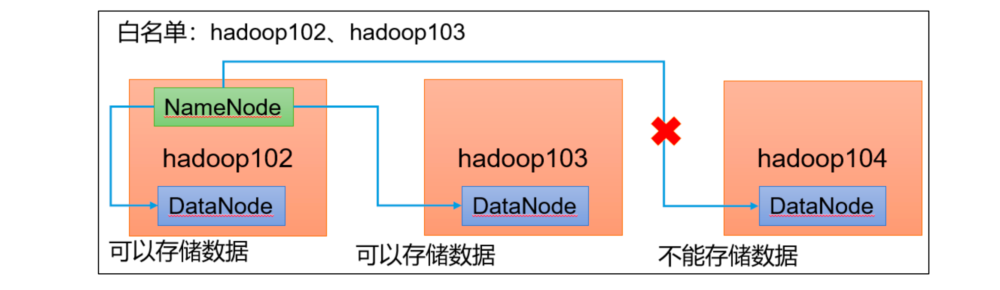
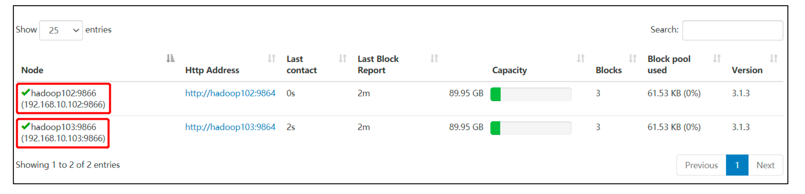
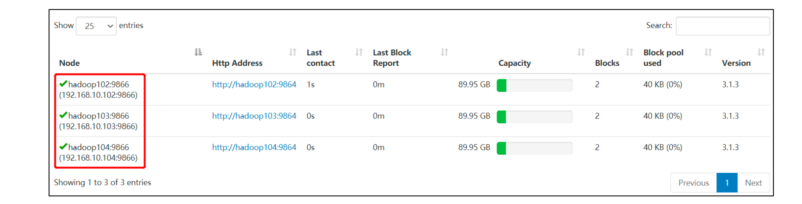

# 添加白名单

白名单：表示在白名单的主机 IP 地址可以，用来存储数据。

企业中：配置白名单，可以尽量防止黑客恶意访问攻击。



## 配置白名单步骤

**在 NameNode节点的/opt/module/hadoop-3.1.3/etc/hadoop目录下分别创建whitelist和blacklist文件**

创建白名单

```
[atguigu@hadoop102 hadoop]$ vim whitelist
```

在 whitelist 中添加如下主机名称，假如集群正常工作的节点为 102 103 

```
hadoop102
hadoop103
```

创建黑名单

```
[atguigu@hadoop102 hadoop]$ touch blacklist
```

保持空的就可以


**在** **hdfs-site.xml** **配置文件中增加** **dfs.hosts** **配置参数**

```
<!-- 白名单 -->
<property>
 <name>dfs.hosts</name>
 <value>/opt/module/hadoop-3.1.3/etc/hadoop/whitelist</value>
</property>
<!-- 黑名单 -->
<property>
 <name>dfs.hosts.exclude</name>
 <value>/opt/module/hadoop-3.1.3/etc/hadoop/blacklist</value>
</property>
```


**分发配置文件**

```
[atguigu@hadoop104 hadoop]$ xsync hdfs-site.xml whitelist
```


**第一次添加白名单必须重启集群，不是第一次，只需要刷新NameNode节点即可**

```
[atguigu@hadoop102 hadoop-3.1.3]$ myhadoop.sh stop
[atguigu@hadoop102 hadoop-3.1.3]$ myhadoop.sh start
```


**在** **web** **浏览器上查看** DN http://hadoop102:9870/dfshealth.html#tab-datanode




**在** **hadoop104** **上执行上传数据数据失败**

```
[atguigu@hadoop104 hadoop-3.1.3]$ hadoop fs -put NOTICE.txt /
```


**二次修改白名单，增加** **hadoop104**

```
[atguigu@hadoop102 hadoop]$ vim whitelist
修改为如下内容
hadoop102
hadoop103
hadoop104
```


**刷新NameNode**

```
[atguigu@hadoop102 hadoop-3.1.3]$ hdfs dfsadmin -refreshNodes Refresh nodes successful
```


**在** **web** **浏览器上查看** **DN http://hadoop102:9870/dfshealth.html#tab-datanode**




此时底层会自动将副本备份到其他服务器，尽量不出现，一个节点有多个相同副本的情况


# 服役新数据节点


