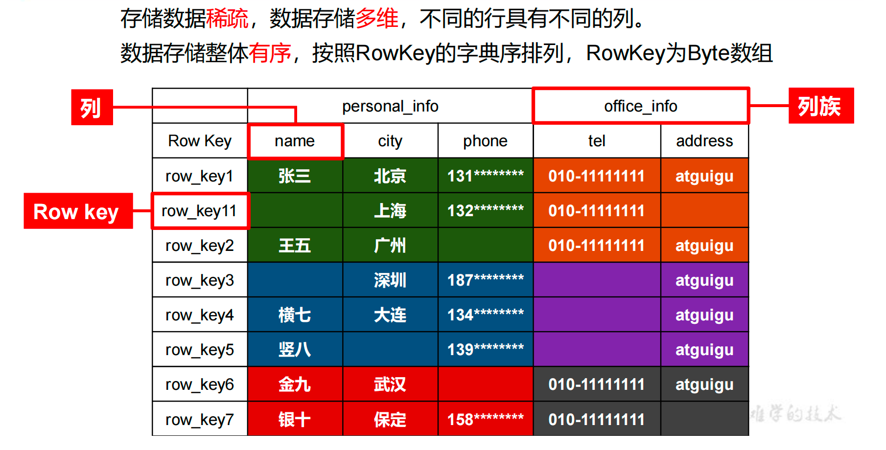
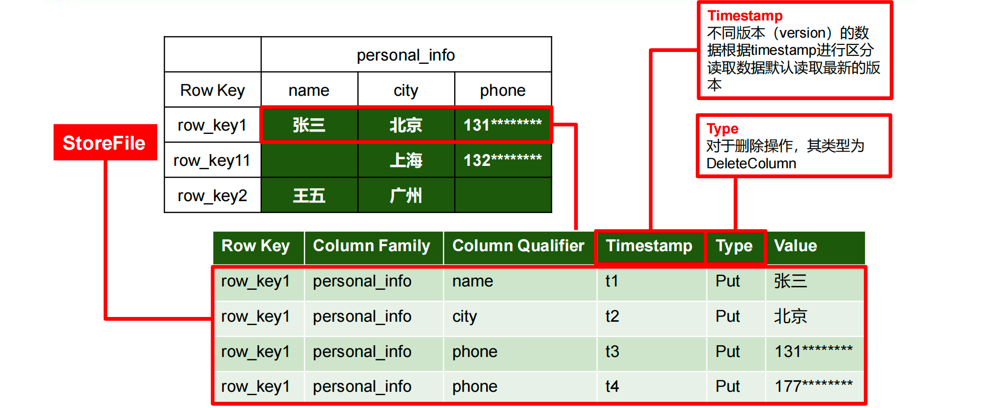

## 依赖框架

Hadoop、Zookeeper


## 整合框架

Phoenix

Hive


# Hbase简介

Apache HBase 是以HDFS为数据存储的，一种分布式、可扩展的NoSQL数据库。

NoSQL：非关系型数据库——以K-V为格式存储的

MySQL：关系型数据库——存储数据都是以表格存储的，有行有列


HBase = HDFS data Base


HBase适用于：随机、随时读取大数据（数十亿行 数百万列）


## Hbase数据模型

HBase的设计理念依据Google的BigTable论文，论文中对数据模型的首句介绍，BigTable是一个稀疏的、分布式的、持久的多维排序map。

稀疏的：不像MySQL一样，每个空值都占据位置。空值直接不存

分布式的：存储海量数据，最根本的

持久的：存储在硬盘里的

多维：一个key能获得多个value


对于映射的解释如下

该映射由行键、列键和时间戳索引；映射中的每一个值都是未解释的字节数组

未解释：序列化前的，更节省存储空间


## Hbase逻辑结构

HBase 可以用于存储多种结构的数据，以 JSON 为例，存储的数据原貌为：

```json
{
  "row_key1":{
    "personal_info":{
      "name":"zhangsan",
      "city":"北京",
      "phone":"131********"
  },
    "office_info":{
      "tel":"010-1111111",
      "address":"atguigu"
  }
  },
  "row_key11":{
    "personal_info":{
      "city":"上海",
      "phone":"132********"
    },
    "office_info":{
      "tel":"010-1111111"
    } },
  "row_key2":{
  ······
}
```



Rowkey：行号，排列和整理数据的（按字典顺序）


存储时会进行拆分，先横向进行拆分，拆分为一个个Region

竖向会以列族进行拆分。拆分为一个个Store，在底层中存储在不同的文件夹中

拆分完后，如上图不同颜色所示


## Hbase物理结构

物理存储结构即为数据映射关系，而在概念视图的空单元格，底层实际根本不存储。



底层存储HDFS里，所以不能够随机修改，只能删除重写或追加写

HBase以时间戳为版本标记，默认使用当前系统的时间，时间不可逆，所以以最新时间的版本为最新的值

如果最新版本的Type字段为 Delete，则说明已删除

StoreFile：存储的物理结构


# 数据模型

## NameSpace

​		命名空间，类似于关系型数据库的database概念，每个命名空间下有多个表。

​		Hbase两个自带的命名空间，分别是hbase和default，hbase里 存放的是Hbase内置的表，default表是用户默认使用的命名空间


## Table

​		类似于关系型数据库的表概念。不同的是，HBase 定义表时只需要声明列族即可，不需要声明具体的列。因为数据存储时稀疏的，所有往 HBase 写入数据时，字段可以动态、按需指定。因此，和关系型数据库相比，HBase 能够轻松应对字段变更的场景。


## Row

​		HBase 表中的每行数据都由一个 **RowKey** 和多个 **Column**（列）组成，数据是按照 RowKey的字典顺序存储的，并且查询数据时只能根据 RowKey 进行检索，所以 RowKey 的设计十分重要。


## Column

​		HBase 中的每个列都由 Column Family(列族)和 Column Qualifier（列限定符）进行限定，例如 info：name，info：age。建表时，只需指明列族，而列限定符无需预先定义。


## Time Stamp

​		HBase 中的每个列都由 Column Family(列族)和 Column Qualifier（列限定符）进行限定，例如 info：name，info：age。建表时，只需指明列族，而列限定符无需预先定义。


## Ceil

​		由{rowkey, column Family：column Qualifier, timestamp} 唯一确定的单元。cell 中的数据全部是字节码形式存贮。

​		指的是底层存储的一行数据。


