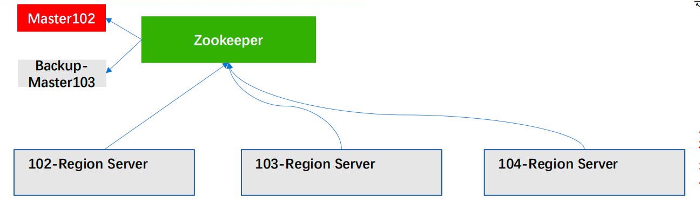
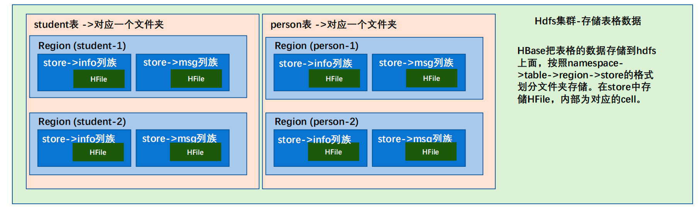

## 老大 - Master

老大：Master，通过Zookeeper实现分布式管理

主要进程，具体实现类为HMaster，通常部署在namenode上。

**功能**：负责通过ZK监控RegionServer进程状态，同时是所有元数据变化的接口。内部启动监控执行region的故障转移和拆分的线程。

> 实现类为 HMaster，负责监控集群中所有的 RegionServer 实例。主要作用如下：
>
> （1）管理元数据表格 hbase:meta，接收用户对表格创建修改删除的命令并执行
>
> （2）监控 region 是否需要进行负载均衡，故障转移和 region 的拆分。
>
> 通过启动多个后台线程监控实现上述功能：
>
> ①LoadBalancer 负载均衡器
>
> 周期性监控 region 分布在 regionServer 上面是否均衡，由参数 hbase.balancer.period 控制周期时间，默认 5 分钟。
>
> ②CatalogJanitor 元数据管理器
>
> 定期检查和清理 hbase:meta 中的数据。meta 表内容在进阶中介绍。
>
> ③MasterProcWAL master 预写日志处理器
>
> 把 master 需要执行的任务记录到预写日志 WAL 中，如果 master 宕机，让 backupMaster读取日志继续干。

## 小弟 - Region Server

小弟：Region Server，通过Zookeeper注册信息

主要进程，具体实现类为HRegionServer，部署在datanode上。

**功能**：主要负责数据cell的处理。同时在执行区域的拆分和合并的时候，由RegionServer来实际执行。

> Region Server 实现类为 HRegionServer，主要作用如下: 
>
> （1）负责数据 cell 的处理，例如写入数据 put，查询数据 get 等 
>
> （2）拆分合并 region 的实际执行者，有 master 监控，有 regionServer 执行。

## 备胎：Backup-Master

当Master挂了之后，备胎可以上位

## 结构

Hbase的一个表，对应着HDFS里的一个文件夹

一个Region存放为一个文件，一个文件里的每一个数据叫store

**Region Server操控Region**

随机进行管理，由Master操控Region Server管理哪个，会尽量均衡

当管理不均衡的时候，比如多个Region都由一个Region Master管理，Master会进行拆分

**管理**：读写数据由谁操作

**表格hbase:meta**

是一个特例，它存储在hdfs，但是由master管理

**故障转移**：如果有一个Region Server挂了，Master会将挂了的服务器管理的Region给另外的Region Server管理

RegionServer只是一个服务，管理的服务，数据都存放在HDFS里

## Zookeeper

​		HBase 通过 Zookeeper 来做 master 的高可用、记录 RegionServer 的部署信息、并且存储有 meta 表的位置信息。 

​		HBase 对于数据的读写操作时直接访问 Zookeeper 的，在 2.3 版本推出 Master Registry模式，客户端可以直接访问 master。使用此功能，会加大对 master 的压力，减轻对 Zookeeper的压力。