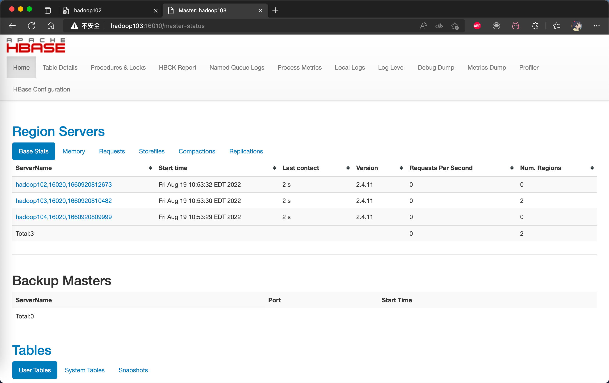

# 前置工作

安装Hadoop和Zookeeper，请自行安装并运行在后台


## Hbase解压和更名

```
[atguigu@hadoop102 software]$ tar -zxvf hbase-2.4.11-bin.tar.gz -C /opt/module/
[atguigu@hadoop102 software]$ mv /opt/module/hbase-2.4.11 /opt/module/hbase
```


## 配置环境变量

```
#HBASE_HOME
export HBASE_HOME=/opt/module/hbase
export PATH=$PATH:$HBASE_HOME/bin
```


# Hbase配置文件

所有的配置文件都在conf目录下

## hbase-env.sh 

```
export HBASE_MANAGES_ZK=false
```

**Tell HBase whether it should manage it's own instance of ZooKeeper or not.**

告诉Hbase是否管理一个他自己的zookeeper实例

改成false，不需要hbase自己的zookeeper，用我们自己的zookeeper实例


## hbase-site.xml

```xml
<!-- 是否改成集群模式-->
<property>
    <name>hbase.cluster.distributed</name>
    <value>true</value>
  </property>

<!--自定义zookeeper的地址-->
<property>
   <name>hbase.zookeeper.quorum</name>
   <value>hadoop102,hadoop103,hadoop104</value> 
   <description>The directory shared by RegionServers.</description>
 </property>

<!-- <property>-->
<!-- <name>hbase.zookeeper.property.dataDir</name>-->
<!-- <value>/export/zookeeper</value>-->
<!-- <description> 记得修改 ZK 的配置文件 -->
<!-- ZK 的信息不能保存到临时文件夹-->
<!-- </description>-->
<!-- </property>-->

<!--hbase存放在hbase的路径-->
 <property>
   <name>hbase.rootdir</name>
   <value>hdfs://hadoop102:8020/hbase</value>
   <description>The directory shared by RegionServers.
   </description>
</property>
</configuration>
```

## regionservers

```
hadoop102
hadoop103
hadoop104
```

写上所有集群的地址


# 解决兼容性问题

```shell
mv /opt/module/hbase/lib/client-facing-thirdparty/slf4j-reload4j-1.7.33.jar /opt/module/hbase/lib/client-facing-thirdparty/slf4j-reload4j-1.7.33.jar.bak
```

因为hbase和Hadoop都有一个这个jar包，版本不一样会冲突。所以把hbase的给删了就可以了（更名加后缀.bak）


# 同步配置

**操作完毕记得将所有配置文件同步到别的集群**

```
 xsync hbase/
```


# 启停脚本

## 单点启停

```
[atguigu@hadoop102 hbase]$ bin/hbase-daemon.sh start master
[atguigu@hadoop102 hbase]$ bin/hbase-daemon.sh start regionserver
```


## 群起/停

```
启动服务
[atguigu@hadoop102 hbase]$ bin/start-hbase.sh

对应的停止服务
[atguigu@hadoop102 hbase]$ bin/stop-hbase.sh
```


# 查看可视化界面

启动成功后，可以通过“host:port”的方式来访问 HBase 管理页面，例如：

http://hadoop102:16010


# 高可用

在 HBase 中 HMaster 负责监控 HRegionServer 的生命周期，均衡 RegionServer 的负载，如果 HMaster 挂掉了，那么整个 HBase 集群将陷入不健康的状态，并且此时的工作状态并不会维持太久。所以 HBase 支持对 HMaster 的高可用配置。

## 配置

**1.创建conf/backup-masters文件并写入备份地址**

```
[atguigu@hadoop102 hbase]$ touch conf/backup-masters
```

写入

```
hadoop103
```


**2.同步conf目录**

```
 xsync conf
```


**3.启动节点并查看**

```
hbase-start.sh
```

http://hadooo102:16010


## 测试高可用

启动时，默认hadoop102时master

hadoop103为backup-master，此时hadoop103没有任何小弟信息


如果把hadoop102节点的master kill掉，hadoop103就会成为新的master

此时，关闭集群的时候要在hadoop103里关，因为这里才有所有小弟的信息



