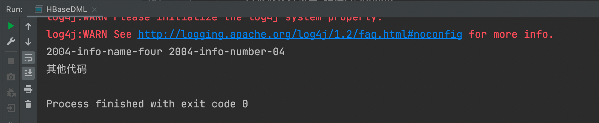

# 环境准备

新建项目后在 pom.xml 中添加依赖

```xml
<dependencies>
   <dependency>
       <groupId>org.apache.hbase</groupId>
       <artifactId>hbase-client</artifactId>
       <version>2.4.11</version>
       <exclusions>
       <exclusion>
       <groupId>org.glassfish</groupId>
       <artifactId>javax.el</artifactId>
       </exclusion>
       </exclusions>
   </dependency>
   <dependency>
       <groupId>org.glassfish</groupId>
       <artifactId>javax.el</artifactId>
       <version>3.0.1-b06</version>
    </dependency>
</dependencies>
```

注意：会报错 javax.el 包不存在，是一个测试用的依赖，不影响使用


## 官网API查看


# 创建连接

根据官方 API 介绍，HBase 的客户端连接由 ConnectionFactory 类来创建，用户使用完成之后需要手动关闭连接。同时连接是一个重量级的，推荐一个进程使用一个连接，对 HBase的命令通过连接中的两个属性 Admin 和 Table 来实现。


## 单线程

```java
package com.atguigu;

import org.apache.hadoop.conf.Configuration;
import org.apache.hadoop.hbase.client.AsyncConnection;
import org.apache.hadoop.hbase.client.Connection;
import org.apache.hadoop.hbase.client.ConnectionFactory;

import java.io.IOException;
import java.util.concurrent.CompletableFuture;

public class HBaseConnection {
    public static void main(String[] args) throws IOException {
        //1 创建连接配置对象
        Configuration conf = new Configuration();

        //2 添加配置参数
        conf.set("hbase.zookeeper.quorum", "hadoop102,hadoop103,hadoop104");

        //3 创建连接
        //默认使用同步连接
        Connection connection = ConnectionFactory.createConnection(conf);

        //可以使用异步连接(不推荐)
        CompletableFuture<AsyncConnection> asyncConnection = ConnectionFactory.createAsyncConnection(conf);

        //4 使用连接
        System.out.println(connection);

        //5 关闭连接
        connection.close();
    }
}
```


## 多线程（推荐）

**官方建议的连接方式如下：**

在resources建立hbase-site.xml文件，并把配置文件写入

```xml
<configuration>

    <!--自定义zookeeper的地址-->
    <property>
        <name>hbase.zookeeper.quorum</name>
        <value>hadoop102,hadoop103,hadoop104</value>
        <description>The directory shared by RegionServers.</description>
    </property>

</configuration>

```

在创建连接，可直接调用ConnectionFactory.createConnection()空参数的方法，默认读取本地配置文件创建连接

连接和关闭的方法都写在static代码块或方法里，这样所有线程共用一个连接

```JAVA
package com.atguigu;

import org.apache.hadoop.conf.Configuration;
import org.apache.hadoop.hbase.client.AsyncConnection;
import org.apache.hadoop.hbase.client.Connection;
import org.apache.hadoop.hbase.client.ConnectionFactory;

import java.io.IOException;
import java.util.concurrent.CompletableFuture;

public class HBaseConnection {
    //声明一个静态属性
    public static Connection connection = null;

    static {
        //1 创建连接
        //默认使用同步连接
        try {
            //使用读取本地文件的模式添加参数
            connection = ConnectionFactory.createConnection();
        } catch (IOException e) {
            e.printStackTrace();
        }
    }

    public static void closeConnection() throws IOException {
        //判断连接是否为空值
        if (connection != null) {
            connection.close();
        }
    }

    public static void main(String[] args) throws IOException {
        //直接使用创建好的连接，不要在main线程里单独创建
        System.out.println(HBaseConnection.connection);

        //关闭连接
        HBaseConnection.closeConnection();
    }
}
```


# DDL

## 创建命名空间

```Java
/**
 * 创建命名空间
 * @param namespace 命名空间名称
 */
public static void createNamespace(String namespace) throws IOException {
    //1.获取admin
    //此处的异常先不要抛出，等待方法写完再统一进行处理
    // admin的连接是轻量级的，不是线程安全的，不推荐池化或者缓存这个连接
    Admin admin = connection.getAdmin();

    //2.调用方法创建命名空间
    //代码相对shell更加底层，所以shell能够实现的功能代码一定能实现
    //所以需要填写完整的命名空间描述

    //2.1 创建命名空间描述建造者 => 设计师
    NamespaceDescriptor.Builder builder = NamespaceDescriptor.create(namespace);

    //2.2 给命名空间添加需求
    builder.addConfiguration("user", "atguigu");

    //2.3 使用builder构造出 对应的 添加完参数的对象  完成创建
    //创建命名空间的本身问题，不应该抛出。抛出会把JVM干崩，会影响别的代码运行
    try {
        admin.createNamespace(builder.build());
    } catch (IOException e) {
        System.out.println("命名空间已经存在");
        e.printStackTrace();
    }

    //3. 关闭admin
    admin.close();

}
```

## 判断表格是否存在

```Java
/**
 * 判断表格是否存在
 * @param namespace 命名空间名称
 * @param tableName 表格名称
 * @return true表示存在
 */
public static boolean isTableExists(String namespace, String tableName) throws IOException {
    //1.获取admin
    Admin admin = connection.getAdmin();

    //2.使用方法判断表格是否存在
    boolean b = false;

    try {
        b = admin.tableExists(TableName.valueOf(tableName));
    } catch (IOException e) {
        e.printStackTrace();
    }

    //3.关闭admin
    admin.close();

    //4.返回结果
    return b;
}
```

测试方法

```java
public static void main(String[] args) throws IOException {
    // 测试判断表格是否存在
    System.out.println(isTableExists("bigdata", "student"));

    // 其他代码
    System.out.println("其他代码");

    //关闭连接
    HBaseConnection.closeConnection();
}
```


## 创建表格

```JAVA
/**
     * 创建表格
     * @param namespace 命名空间名称
     * @param tableName 表格名称
     * @param columnFamilies 列族名称 可以有多个
     */
    public static void createTable(String namespace, String tableName, String... columnFamilies) throws IOException {
        //加强健壮性
        //0.1 判断是否至少有一个列族
        if (columnFamilies.length == 0) {
            System.out.println("创建表格至少有一个列族");
            return;
        }

        //0.2 判断表格是否存在
        if (isTableExists(namespace, tableName)) {
            System.out.println("表格已经存在");
            return;
        }
        
        //1 获取Admin
        Admin admin = connection.getAdmin();

        //2 调用方法，创建表格
        //2.1 创建表格描述的建造者
        TableDescriptorBuilder tableDescriptorBuilder = TableDescriptorBuilder.
                newBuilder(TableName.valueOf(namespace, tableName));

        //2.2 添加参数
        for (String columnFamily : columnFamilies) {
            //2.3 创建列族描述
            ColumnFamilyDescriptorBuilder columnFamilyDescriptorBuilder =
                    ColumnFamilyDescriptorBuilder.newBuilder(Bytes.toBytes(columnFamily));

            //2.4 对应当前的列族添加参数
            // 添加版本参数
            columnFamilyDescriptorBuilder.setMaxVersions(5);

            // 2.5 创建添加完参数的列族描述
            tableDescriptorBuilder.setColumnFamily(columnFamilyDescriptorBuilder.build());
        }

        // 2.3 创建对应的表格描述
        try {
            admin.createTable(tableDescriptorBuilder.build());
        } catch (IOException e) {
            System.out.println("表格已经存在");
            e.printStackTrace();
        }

        // 2.4 关闭连接
        admin.close();

    }
```

测试代码

```JAVA
public static void main(String[] args) throws IOException {
    //测试创建表格
    createTable("atguigu", "student", "info","msg");

    // 其他代码
    System.out.println("其他代码");

    //关闭连接
    HBaseConnection.closeConnection();
}
```


## 修改表格

```Java
    /**
     * 修改表格中一个列族的版本
     * @param namespace 命名空间名称
     * @param tableName 表格名称
     * @param columnFamily 列族名称
     * @param version 版本
     */
    public static void modifyTable(String namespace, String tableName, String columnFamily, int version) throws IOException {
        //判断表格是否存在
        if (!isTableExists(namespace, tableName)) {
            System.out.println("表格不存在！");
            return;
        }

        //1. 获取admin
        Admin admin = connection.getAdmin();

        try {

            //2. 调用方法修改表格
            //2.0 获取之前的表格描述
            TableDescriptor descriptor = admin.getDescriptor(TableName.valueOf(namespace, tableName));

            //2.1 创建表格描述
            // 如果使用填写tablename的方法，相当于创建了一个新的表格描述建造者，没有之前的信息
            // 如果想要修改之前的信息，必须调用方法前写一个旧的表格描述

            TableDescriptorBuilder tableDescriptorBuilder =
                    TableDescriptorBuilder.newBuilder(descriptor);

            //2.2 对应建造者进行表格数据的修改
            ColumnFamilyDescriptor columnFamily1 = descriptor.getColumnFamily(Bytes.toBytes(columnFamily));

            //创建列族描述建造者

            ColumnFamilyDescriptorBuilder columnFamilyDescriptorBuilder =
                    ColumnFamilyDescriptorBuilder.newBuilder(columnFamily1);

            //修改对应版本
            columnFamilyDescriptorBuilder.setMaxVersions(version);

            //此处修改的是，如果填写的是新创建的，别的参数会初始化
            //如果填写的是旧的
            tableDescriptorBuilder.modifyColumnFamily(columnFamilyDescriptorBuilder.build());

            admin.modifyTable(tableDescriptorBuilder.build());

        } catch (IOException e) {
            e.printStackTrace();
        }

        //3 关闭连接
        admin.close();
    }
```


## 删除表格

```JAVA
/**
 * 删除表格
 * @param namespace 命名空间名称
 * @param tableName 表格名称
 * @return true表示删除成功
 */
public static boolean deleteTable(String namespace, String tableName) throws IOException {
    //1 判断表格是否存在
    if (!isTableExists(namespace, tableName)) {
        System.out.println("表格不存在，删除失败");
        return false;
    }

    //2 获取admin
    Admin admin = connection.getAdmin();

    //3 调用相关方法删除表格
    try {
        // 删除表格前，要先把表格标记为不可用
        admin.disableTable(TableName.valueOf(namespace, tableName));
        admin.deleteTable(TableName.valueOf(namespace, tableName));
    } catch (IOException e) {
        e.printStackTrace();
    }

    //4 关闭admin
    admin.close();

    return true;
}
```


# DML

## 写入数据

```JAVA
/**
 * 插入数据
 * @param namespace 命名空间名称
 * @param tableName 表格名称
 * @param rowKey    主键
 * @param columnFamily  列族名称
 * @param columnName    列名
 * @param value     值
 */
public static void putCell(String namespace, String tableName, String rowKey, String columnFamily, String columnName, String value) throws IOException {
    //1.获取table
    Table table = connection.getTable(TableName.valueOf(namespace, tableName));

    //2.调用相关方法插入数据
    Put put = new Put(Bytes.toBytes(rowKey));

    //3.添加属性
    put.addColumn(Bytes.toBytes(columnFamily),
            Bytes.toBytes(columnName),
            Bytes.toBytes(value));

    //4.将对象写入对应的方法
    try {
        table.put(put);
    } catch (IOException e) {
        e.printStackTrace();
    }

    //5.关闭table
    table.close();

}
```


## 读取数据

```JAVA
/**
 * 读取一行中的某一列
 * @param namespace 命名空间名称
 * @param tableName 表格名称
 * @param rowKey    主键
 * @param columnFamily  列族名称
 * @param columnName    列名
 */
public static void getCells(String namespace, String tableName, String rowKey,
                            String columnFamily, String columnName) throws IOException {
    //1.获取table
    Table table = connection.getTable(TableName.valueOf(namespace, tableName));

    //2.创建get对象
    Get get = new Get(Bytes.toBytes(rowKey));

    //3.如果直接调用get方法读取数据 此时读一整行数据
    //如果想读取某一列的数据，需要添加对应的参数
    get.addColumn(Bytes.toBytes(columnFamily), Bytes.toBytes(columnName));

    //设置读取数据的版本
    get.readAllVersions();

    //读取数据得到result对象
    Result result = null;
    try {
        result = table.get(get);
        //处理数据
        Cell[] cells = result.rawCells();

        //测试方法，直接把读取的数据打印到控制台 如果是实际开发 需要写对应处理的数据
        for (Cell cell : cells) {
            //cell存储数据比较底层， 需要
            String value =new String(CellUtil.cloneValue(cell));
            System.out.println(value);
        }

    } catch (IOException e) {
        e.printStackTrace();
    }

}
```


## 扫描数据

```JAVA
/**
 * 扫描数据
 * @param namespace 命名空间
 * @param tableName 表格名称
 * @param startRow  开始的row 包含的
 * @param stopRow   结束的row 不包含
 */
public static void scanRows(String namespace, String tableName, String startRow, String stopRow) throws IOException {
    //1 获取table
    Table table = connection.getTable(TableName.valueOf(namespace, tableName));

    //2 创建Scan对象
    Scan scan = new Scan();
    //如果此时直接调用，相当于扫描整张表

    //添加参数，控制扫描的数据
    //默认包含
    scan.withStartRow(Bytes.toBytes(startRow));
    //默认不包含
    scan.withStopRow(Bytes.toBytes(stopRow));

    //读取多行数据 获得scannner
    ResultScanner scanner = null;
    try {
        scanner = table.getScanner(scan);
        //result来记录多行数据
        for (Result result : scanner) {
            Cell[] cells = result.rawCells();
            for (Cell cell : cells) {
                System.out.print(new String(CellUtil.cloneRow(cell)) + "-" +
                        new String(CellUtil.cloneFamily(cell)) + "-" +
                        new String(CellUtil.cloneQualifier(cell)) + "-" +
                        new String(CellUtil.cloneValue(cell))+ "\t");
            }
            System.out.println();
        }

    } catch (IOException e) {
        e.printStackTrace();
    }


    //3.关闭table
    table.close();
}
```

```
public static void main(String[] args) throws IOException {
    //添加测试数据
    //putCell("atguigu", "student", "2004", "info","number", "04");
    //putCell("atguigu", "student", "2002", "info","number", "02");
    //putCell("atguigu", "student", "2003", "info","number", "03");

    scanRows("atguigu","student","2001","2004" );
    //其他代码
    System.out.println("其他代码");

    //关闭连接
    HBaseConnection.closeConnection();

}
```

测试输出为：


## 带过滤的扫描-单个

```JAVA
/**
 * 带过滤的扫描
 * @param namespace 命名空间
 * @param tableName 表格名称
 * @param startRow  开始row
 * @param stopRow   结束row
 * @param columnFamily  列族名称
 * @param columnName    列名
 * @param value     value值
 * @throws IOException
 */
public static void filterRows(String namespace, String tableName, String startRow, String stopRow,
                              String columnFamily, String columnName, String value) throws IOException {
    //1 获取table
    Table table = connection.getTable(TableName.valueOf(namespace, tableName));

    //2 创建Scan对象
    Scan scan = new Scan();
    //如果此时直接调用，相当于扫描整张表

    //添加参数，控制扫描的数据
    //默认包含
    scan.withStartRow(Bytes.toBytes(startRow));
    //默认不包含
    scan.withStopRow(Bytes.toBytes(stopRow));

    // 添加过滤 可以添加多个过滤
    FilterList filterList = new FilterList();

    //创建过滤层
    //(1) 结果只保留当前列的数据
    ColumnValueFilter columnValueFilter = new ColumnValueFilter(
            //列族名称
            Bytes.toBytes(columnFamily),
            //列名
            Bytes.toBytes(columnName),
            //比较关系,
            CompareOperator.EQUAL,
            //值
            Bytes.toBytes(value)
    );

    filterList.addFilter(columnValueFilter);
    scan.setFilter(filterList);

    //读取多行数据 获得scannner
    ResultScanner scanner = null;
    try {
        scanner = table.getScanner(scan);
        //result来记录多行数据
        for (Result result : scanner) {
            Cell[] cells = result.rawCells();
            for (Cell cell : cells) {
                System.out.print(new String(CellUtil.cloneRow(cell)) + "-" +
                        new String(CellUtil.cloneFamily(cell)) + "-" +
                        new String(CellUtil.cloneQualifier(cell)) + "-" +
                        new String(CellUtil.cloneValue(cell))+ "\t");
            }
            System.out.println();
        }

    } catch (IOException e) {
        e.printStackTrace();
    }


    //3.关闭table
    table.close();
}
```

```
public static void main(String[] args) throws IOException {
    //添加测试数据
    //putCell("atguigu", "student", "2004", "info","number", "04");
    //putCell("atguigu", "student", "2002", "info","number", "02");
    //putCell("atguigu", "student", "2003", "info","number", "03");

    //带过滤器的扫描
    filterRows("atguigu", "student", "2001", "2005",
            "info", "name", "four");
    //其他代码

    System.out.println("其他代码");

    //关闭连接
    HBaseConnection.closeConnection();

}
```


## 带过滤的扫描-整行

```JAVA
//(2) 结果保留整行数据
//结果会同时保留没有当前列的数据,因为筛选的方法是删除不等的，没有数据的不处理
SingleColumnValueFilter singleColumnValueFilter = new SingleColumnValueFilter(
        //列族名称
        Bytes.toBytes(columnFamily),
        //列名
        Bytes.toBytes(columnName),
        //比较关系,
        CompareOperator.EQUAL,
        //值
        Bytes.toBytes(value)
);

filterList.addFilter(singleColumnValueFilter);
scan.setFilter(filterList);
```

同样数据，效果如下




## 删除某列数据

```JAVA
/**
 * 删除一行中的一列数据
 * @param namespace 命名空间
 * @param tableName 表格名称
 * @param rowKey    主键
 * @param columnFamily  列族
 * @param columnName    列名
 */
public static void deleteColumn(String namespace, String tableName,String rowKey,
                                String columnFamily, String columnName) throws IOException {
    // 1 获取table
    Table table = connection.getTable(TableName.valueOf(namespace, tableName));

    // 2 创建delete对象
    Delete delete = new Delete(Bytes.toBytes(rowKey));

    // 添加列信息
    // 删除一个版本 delete.addColumn()
    // 删除所有版本
    delete.addColumns(Bytes.toBytes(columnFamily), Bytes.toBytes(columnName));

    try {
        table.delete(delete);
    } catch (IOException e) {
        e.printStackTrace();
    }

    //3.关闭table
    table.close();
}
```

```Java
public static void main(String[] args) throws IOException {
   
    deleteColumn("atguigu", "student", "2001", "info", "name");
    scanRows("atguigu","student","2001","2004" );
    
    //其他代码
    System.out.println("其他代码");

    //关闭连接
    HBaseConnection.closeConnection();

}
```

