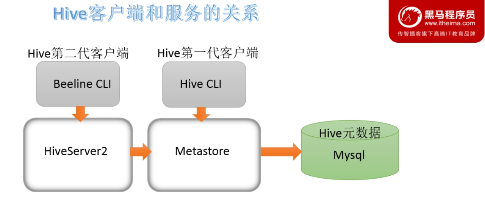
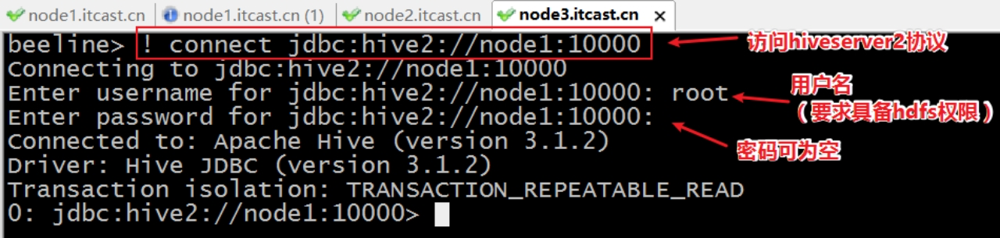

# Hive Client、Hive Beeline Client

Hive发展至今，总共历经了两代客户端工具。


## 第一代客户端

（deprecated不推荐使用）

$HIVE_HOME/bin/hive, 是一个 shellUtil。

主要功能：

一是可用于以交互或批处理模式运行Hive查询

二是用于Hive相关服务的启动，比如metastore服务。


## 第二代客户端

（recommended 推荐使用）

$HIVE_HOME/bin/beeline，是一个JDBC客户端

是官方强烈推荐使用的Hive命令行工具，和第一代客户端相比，性能加强安全性提高。

Beeline Shell在嵌入式模式和远程模式下均可工作。

在嵌入式模式下，它运行嵌入式 Hive(类似于Hive Client)

远程模式下beeline通过 Thrift 连接到单独的 HiveServer2 服务上，这也是官方推荐在生产环境中使用的模式。


# Hive Server、Hive Server 2

HiveServer、HiveServer2都是Hive自带的两种服务，允许客户端在不启动CLI的情况下对Hive中的数据进行操作，且两个都允许远程客户端使用多种编程语言如java，python等向hive提交请求，取回结果。

但是，HiveServer不能处理多于一个客户端的并发请求。因此在Hive-0.11.0版本中重写了HiveServer代码得到了HiveServer2，进而解决了该问题。HiveServer已经被废弃。

HiveServer2支持多客户端的并发和身份认证，旨在为开放API客户端如JDBC、ODBC提供更好的支持。


# Hive服务和客户端



HiveServer2通过Metastore服务读写元数据。所以在远程模式下，启动HiveServer2之前必须先首先启动metastore服务。

特别注意：远程模式下，Beeline客户端只能通过HiveServer2服务访问Hive。而Hive Client是通过Metastore服务访问的。


# Hive Client的使用

在hive安装包的bin目录下，有hive提供的第一代客户端 bin/hive。该客户端可以访问hive的metastore服务，从而达到操作hive的目的。


**友情提示**：如果您是远程模式部署，请手动启动运行metastore服务。如果是内嵌模式和本地模式，直接运行bin/hive，metastore服务会内嵌一起启动。

可以直接在启动Hive metastore服务的机器上使用bin/hive客户端操作，此时不需要进行任何配置。

```shell
#远程模式 首先启动metastore服务
/export/server/hive/bin/hive --service metastore
#克隆CRT会话窗口 使用hive client连接
/export/server/hive/bin/hive
```


如果需要在其他机器上通过bin/hive访问hive metastore服务，只需要在该机器的hive-site.xml配置中添加metastore服务地址即可。


```shell
#上传hive安装包到另一个机器上，比如node3：
cd /export/server/
tar zxvf apache-hive-3.1.2-bin.tar.gz
mv apache-hive-3.1.2-bin hive

#解决hadoop、hive之间guava版本差异
cd /export/server/hive/
rm -rf lib/guava-19.0.jar
cp /export/server/hadoop-3.1.4/share/hadoop/common/lib/guava-27.0-jre.jar ./lib/

#修改hive环境变量文件 添加Hadoop_HOME
cd /export/server/hive/conf
mv hive-env.sh.template hive-env.sh
vim hive-env.sh
export HADOOP_HOME=/export/server/hadoop-3.1.4

#添加metastore服务地址
cd /export/server/hive/conf/
vim  hive-site.xml

<configuration>
<property>
    <name>hive.metastore.uris</name>
    <value>thrift://node1:9083</value>
</property>
</configuration>
```


# Hive Beeline Client的使用

hive经过发展，推出了第二代客户端beeline，但是beeline客户端不是直接访问metastore服务的，而是**需要单独启动hiveserver2服务**。


在hive运行的服务器上，首先启动metastore服务，然后启动hiveserver2服务。

```shell
#先启动metastore服务 然后启动hiveserver2服务
nohup /export/server/hive/bin/hive --service metastore &
nohup /export/server/hive/bin/hive --service hiveserver2 &
```

在node3上使用beeline客户端进行连接访问。需要注意hiveserver2服务启动之后需要稍等一会才可以对外提供服务。

Beeline是JDBC的客户端，通过JDBC协议和Hiveserver2服务进行通信，协议的地址是：**jdbc:hive2://node1:10000**;


```shell
[root@node3 ~]# /export/server/hive/bin/beeline 
Beeline version 3.1.2 by Apache Hive
beeline> ! connect jdbc:hive2://node1:10000
Connecting to jdbc:hive2://node1:10000
Enter username for jdbc:hive2://node1:10000: root
Enter password for jdbc:hive2://node1:10000: 
Connected to: Apache Hive (version 3.1.2)
Driver: Hive JDBC (version 3.1.2)
Transaction isolation: TRANSACTION_REPEATABLE_READ
0: jdbc:hive2://node1:10000> 
```





# 附：分布式运行条件

如果把hive客户端

首先群起hadoop集群

metastore运行在hadoop102

hiveserver2运行在hadoop103

beeline 在hadoop104 jdbc连接 103的hiveserver


1.102的配置文件hadoop的 core-site要添加，给予连接权限

```xaml
 <property>
  <name>hadoop.proxyuser.atguigu.hosts</name>
  <value>*</value>
</property>
<property>
  <name>hadoop.proxyuser.atguigu.groups</name>
  <value>*</value>
</property>
```


bin/hive --service metastore


2.103在hive-site.xml写，其他什么都不用动

```xml
<!-- 指定存储元数据要连接的地址 -->
 <property>
 <name>hive.metastore.uris</name>
 <value>thrift://hadoop102:9083</value>
</property>
```


bin/hive --service hiveserver2


3.104 什么都不用动 直接启动beeline

```bash
[atguigu@hadoop104 hive]$ bin/beeline

SLF4J: Class path contains multiple SLF4J bindings.
SLF4J: Found binding in [jar:file:/opt/module/hive/lib/log4j-slf4j-impl-2.10.0.jar!/org/slf4j/impl/StaticLoggerBinder.class]
SLF4J: Found binding in [jar:file:/opt/module/hadoop-3.1.3/share/hadoop/common/lib/slf4j-log4j12-1.7.25.jar!/org/slf4j/impl/StaticLoggerBinder.class]
SLF4J: See http://www.slf4j.org/codes.html#multiple_bindings for an explanation.
SLF4J: Actual binding is of type [org.apache.logging.slf4j.Log4jLoggerFactory]
Beeline version 3.1.2 by Apache Hive

beeline> ! connect jdbc:hive2://hadoop103:10000

Connecting to jdbc:hive2://hadoop103:10000
Enter username for jdbc:hive2://hadoop103:10000: atguigu
Enter password for jdbc:hive2://hadoop103:10000: 
Connected to: Apache Hive (version 3.1.2)
Driver: Hive JDBC (version 3.1.2)
Transaction isolation: TRANSACTION_REPEATABLE_READ

0: jdbc:hive2://hadoop103:10000> 
```

