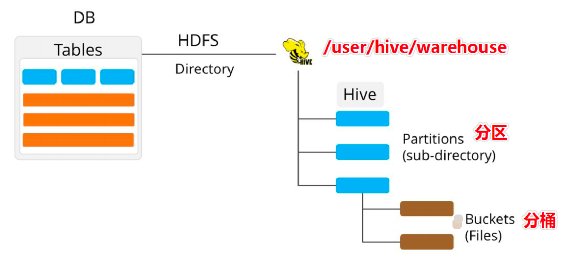
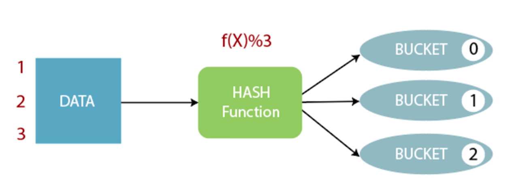
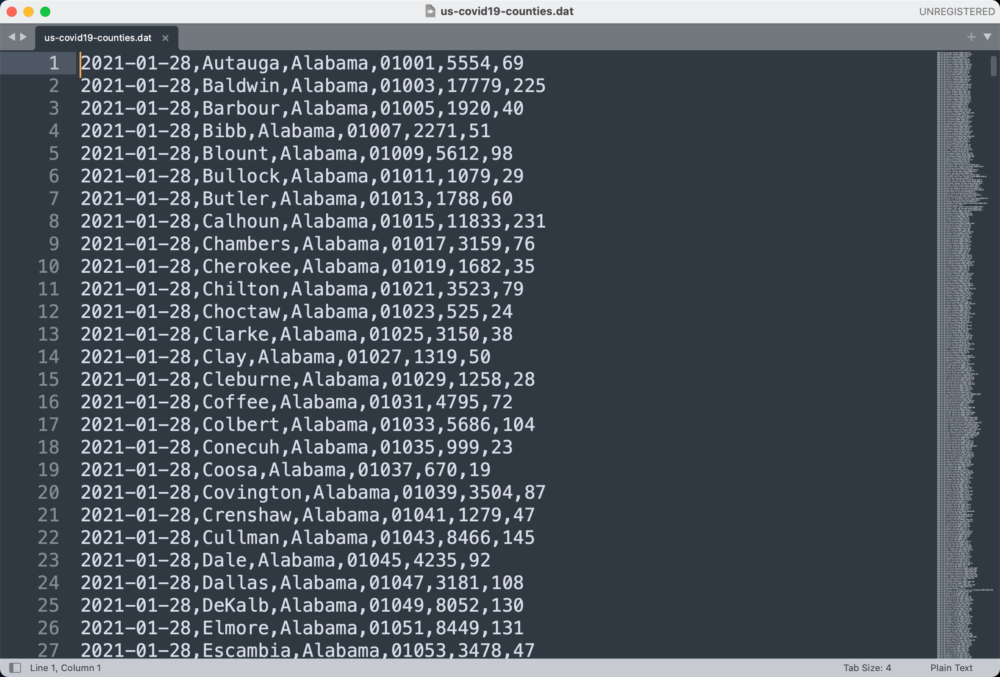
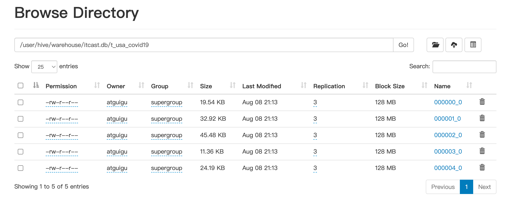
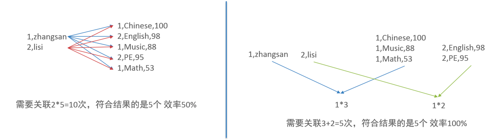

# 分桶表是什么

分桶表也叫桶表，bucket，是一种用于优化查询而设计的表类型

分桶表对应的数据文件在底层会被分解为若干个部分，通俗来说就是被**拆解为若干个独立的小文件**




# 分桶规则

桶编号相同的数据会被分到同一个桶当中


hash_function取决于分桶字段bucketing_column类型

1.如果是int类型，hash_function(int) == int

2.如果是其他类型比如bigint,string或者复杂数据类型，hash_function比较棘手，将是从该类型派生的某个数字，比如hashcode值




# 语法

```hive
--分桶表建表语句
CREATE [EXTERNAL] TABLE [db_name.]table_name
[(col_name data_type, ...)]
CLUSTERED BY (col_name)
INTO N BUCKETS;
```

其中CLUSTERED BY (col_name)表示根据哪个字段进行分；

INTO N BUCKETS表示分为几桶（也就是几个部分）。

需要注意的是，分桶的字段必须是表中已经存在的字段。


# 案例

## 数据集

现有美国2021-1-28号，各个县county的新冠疫情累计案例信息，包括确诊病例和死亡病例



字段含义如下：count_date（统计日期）,county（县）,state（州）,fips（县编码code）,cases（累计确诊病例）,deaths（累计死亡病例）。


## 建表

根据state州把数据分为5桶，建表语句如下：

```hive
CREATE TABLE itcast.t_usa_covid19(
    count_date string,
    county string,
    state string,
    fips int,
    cases int,
    deaths int)
CLUSTERED BY(state) INTO 5 BUCKETS;
```

在创建分桶表时，还可以指定分桶内的数据排序规则

```hive
--根据state州分为5桶 每个桶内根据cases确诊病例数倒序排序
CREATE TABLE itcast.t_usa_covid19_bucket_sort(
      count_date string,
      county string,
      state string,
      fips int,
      cases int,
      deaths int)
CLUSTERED BY(state) sorted by (cases desc) INTO 5 BUCKETS;
```


## 加载

```hive
--step1:开启分桶的功能 从Hive2.0开始不再需要设置
set hive.enforce.bucketing=true;

--step2:把源数据加载到普通hive表中
CREATE TABLE itcast.t_usa_covid19(
       count_date string,
       county string,
       state string,
       fips int,
       cases int,
       deaths int)
row format delimited fields terminated by ",";
--将源数据上传到HDFS，t_usa_covid19表对应的路径下
hadoop fs -put us-covid19-counties.dat /user/hive/warehouse/itcast.db/t_usa_covid19

--step3:使用insert+select语法将数据加载到分桶表中
insert into t_usa_covid19_bucket select * from t_usa_covid19;

```

到HDFS上查看t_usa_covid19_bucket底层数据结构可以发现，数据被分为了5个部分。



并且从结果可以发现，只要hash_function(bucketing_column)一样的，就一定被分到同一个桶中。


# 好处

**1.基于分桶字段查询时，减少全表扫描**

比如我要找 state = newyork的信息

我只需要找到newyork的hash值，查找newyork的文件即可


**2.JOIN时可以提高MR程序效率，减少笛卡尔积数量**

根据join字段对表进行分桶

a join b on a.id = b.id



**3.分桶表数据进行高效抽样**

当数据量非常大的时候，对全体数据进行处理 存在困难，抽样就很重要了，抽样可以从被抽取的数据中 估计 和 推断出整体的特性，是科学实验、质量检验、社会普查采用的普遍工具