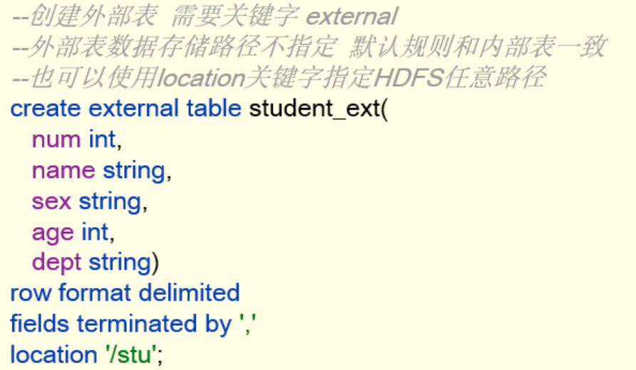
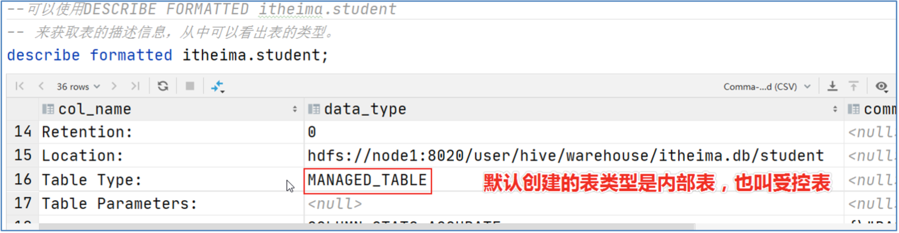
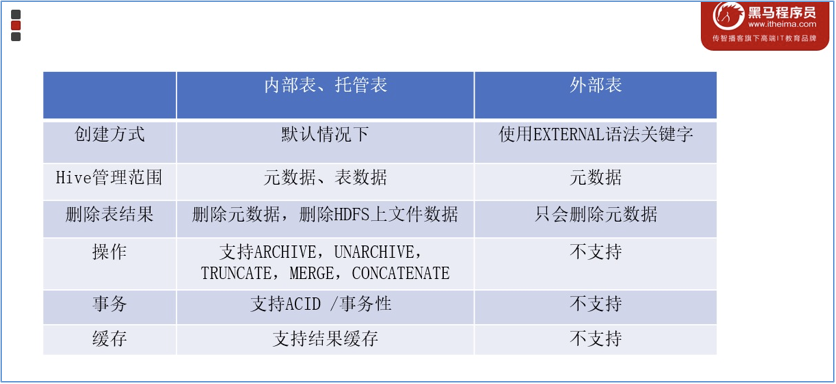

# Hive内、外部表

## 内部表

**内部表 Internal table**

也称为被Hive拥有和管理的托管表 Managed table

默认情况下创建的表就是内部表，hive拥有该表的结构和文件

也就是Hive完全管理表的生命周期，类似于RDBMS 中的表 删除内部表时，会删除数据和元数据

## 外部表

**外部表（External table）**中的数据不是Hive拥有或管理的

只管理表元数据的生命周期。要创建一个外部表，需要使用EXTERNAL语法关键字

删除外部表只会删除元数据，而不会删除实际数据。在Hive外部仍然可以访问实际数据

而且外部表更为方便的是可以搭配location语法指定数据的路径

## 如何查看表信息

DESCRIBLE FORMATTED tablename 来获取表元数据描述信息，可看到表的类型

## 内外部表差异

无论内部表还是外部表，Hive都在Hive Metastore中管理表定义及其分区信息。

删除内部表会从Metastore中删除表元数据，还会从HDFS中删除其所有数据/文件。

**删除外部表，只会从Metastore中删除表的元数据**，并保持HDFS位置中的实际数据不变。

## 如何选择哪、外部表

当需要通过Hive完全控制表的整个生命周期时，请使用内部表

当数据来之不易，防止误删，请使用外部表，因为即便删除表，文件也不会删除

## Location再探究

1.创建外部表，不指定location时：

还是在默认位置

2.创建内部表时，是否可以用location指定：

可以

3.是否意味着hive表的hdfs的位置不少一定要在/user/hive/warehouse下？

不一定，不管内部表还是外部表，默认存在这，当然也可以通过location重新指定路径

 