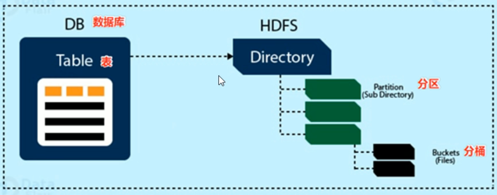
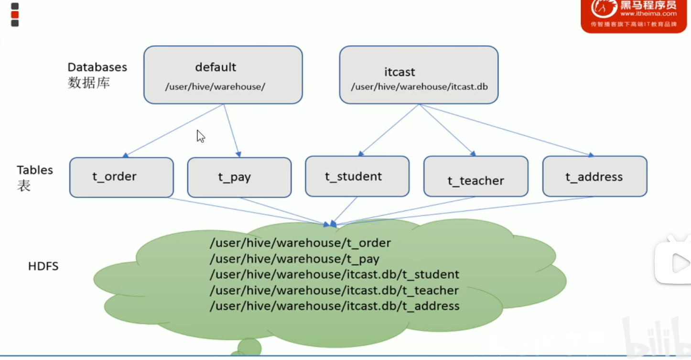
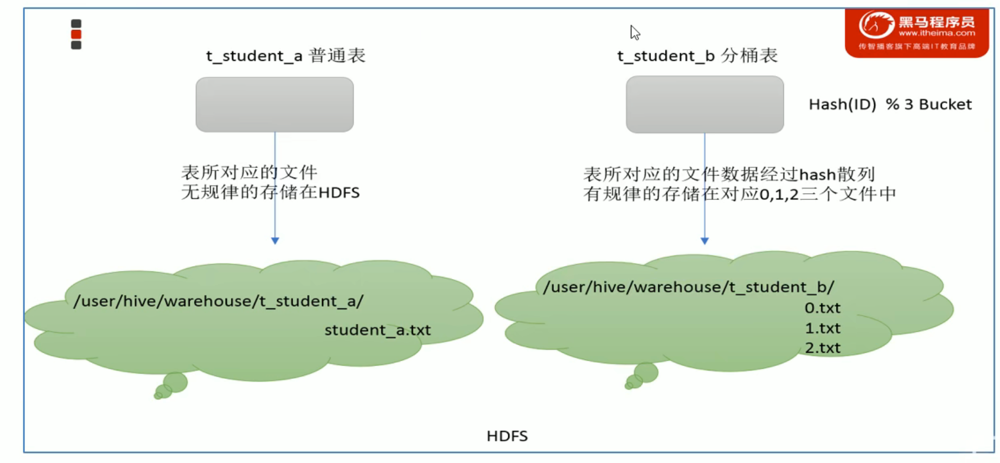

# Hive架构、组件

## 用户接口

1.CLI （command line interface）shell命令行

2.JDBC/ODBC Hive中的ThriftServer允许外部客户端通过网络进行交互

3.WebGUI 通过浏览器访问Hive

## 元数据存储

通常是存储在关系数据库中（例如mysql/derby）

Hive中的元数据包括表的名字，表的列和分区及其属性，表的属性，表的书就所在目录等

## Driver驱动程序

包括语法解析器、计划编译器、优化器、执行器

完成HQL查询语句从词法分析、语法分析、编译、优化以及查询计划的生成。生成的查询计划存储在HDFS中，并在随后有执行引擎调用执行

## 执行引擎

Hive本身并不直接处理数据文件，而是通过执行引擎处理。当下Hive支持MR、Tez、Spark3种执行引擎

# Hive数据模型

Data Model概念

数据模型：用来描述数据、组织数据和对数据进行操作，是对现实世界数据特征的描述

Hive的数据模型类似于RDBMS库表结构，此外还有自己的模型

Hive中的数据可以在粒度级别上分为三类：Table Partition Bucket

## Databases数据库

Hive作为数据仓库，在结构上向传统数据库看齐，分为数据库，每个数据库下面有各自的表组成 默认数据库default

Hive的数据都是存储在HDFS上的，默认有一个根目录，在hive-site.xml中

hive.metastore.warehouse.dir指定。默认值为/user/hive/warehouse

比如 名为itcast的数据库存储路径为

/user/hive/warehouse/itcast.db

## Tables表

hive表与关系数据库中的表相同。Hive中的表所对应的数据通常是存储在HDFS中的，而表相关的元数据是存储在RDBMS中

Hive中的表的数据在HDFS上的存储路径为

${hive.metastore.warehouse.dir} / databasename.db / tablename

## Partitions分区

partition分区是hive的一种优化手段表。

分区是指根据分区列的值将表划分为不同的分区，这样可以快速的对指定分区的数据进行查询

分区在存储层面上的表现是 tables表目录下以子文件夹的形式存在

一个文件夹表示一个分区。子文件夹的命名标准为：分区列=分区值

Hive还支持分区下继续创建分区

## Buckets分桶

Bucket分桶表是hive的一种优化手段表。分桶是指根据表中的字段的值，经过hash计算规则将数据文件划分成指定的若干个小文件

分桶的好处在于可以优化join查询和方便抽样查询

Bucket分桶表在HDFS中表现为同一个表目录下数据根据hash散列之后变成多个文件。

