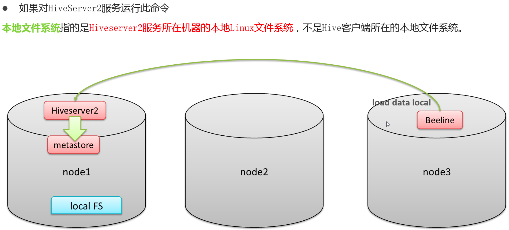
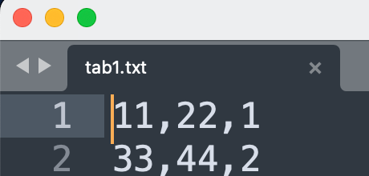
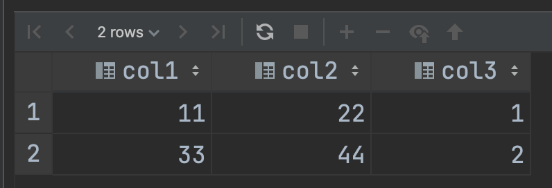

# 回顾

要想让hive的表和结构化的数据文件产生映射，就需要把文件移到到表对应的文件夹下面，当然，可以在建表的时候使用location语句指定数据文件的路径。但是不管路径在哪里，必须把数据文件移动到对应的路径下面。

最原始暴力直接的方式就是使用hadoop fs –put等方式将数据移动到路径下面。

Hive官方推荐使用Load命令将数据加载到表中。


# 功能

Load：将数据文件移动到hive表相应的位置，移动时是复制，移动操作

```hive
LOAD DATA [LOCAL] INPATH 'filepath' [OVERWRITE] INTO TABLE tablename [PARTITION (partcol1=val1, partcol2=val2 ...)]

LOAD DATA [LOCAL] INPATH 'filepath' [OVERWRITE] INTO TABLE tablename [PARTITION (partcol1=val1, partcol2=val2 ...)] [INPUTFORMAT 'inputformat' SERDE 'serde'] (3.0 or later)
```


## filepath：文件路径

> filepath表示的待移动数据的路径，可以引用一个文件（在这种情况下，Hive将文件移动到表中），也可以是一个目录（在这种情况下，Hive将把该目录中的所有文件移动到表中）。
>
> 相对路径，例如：project/data1 
>
> 绝对路径，例如：/user/hive/project/data1 
>
> 具有schema的完整URI，例如：hdfs://namenode:9000/user/hive/project/data1


## LOCAL：在本地文件系统加载数据

> 指定LOCAL
>
> 将在本地文件系统中查找文件路径。若指定相对路径，将相对于用户的当前工作目录进行解释
>
> 用户也可以为本地文件指定完整的URI-例如：file:///user/hive/project/data1。
>
> 
>
> 没有指定LOCAL关键字
>
> 如果filepath指向的是一个完整的URI，会直接使用这个URI；
>
> 如果没有指定schema，Hive会使用在hadoop配置文件中参数fs.default.name指定的（不出意外，都是HDFS）。


本地在哪里？




## Overwrite：覆盖写入

如果使用了overwrite关键字，则目标表中的已存在数据会被删除，然后再将filepath指向文件/目录中的内容添加到表/分区中


# 案例

## 创建表

```hive
--建表 从本地加载数据
create table student_local(
    num int,
    name string,
    sex string,
    age int,
    dept string
)row format delimited fields terminated by ',';

--建表 从hdfs加载数据
create external table student_HDFS(
      num int,
      name string,
      sex string,
      age int,
      dept string
)row format delimited fields terminated by ',';

--建表，从hdfs加载数据到分区表
create external table student_HDFS_part(
      num int,
      name string,
      sex string,
      age int,
      dept string
)partitioned by (county string)
row format delimited fields terminated by ',';
```


## 加载数据

```hive
--从本地加载
load data local inpath '/opt/hivedata/students.txt' into table student_local;

--从HDFS加载 此时HDFS里做移动操作
load data inpath '/hivedata/students.txt'  into table student_HDFS;

--从HDFS加载 为分区
load data inpath '/hivedata/students.txt'  into table student_HDFS_Part partition(county="China");
```


# Hive3.0新特性

Hive3.0+，load加载数据时除了移动、复制操作之外，在某些场合下还会将加载重写为INSERT AS SELECT。

Hive3.0+，还支持使用inputformat、SerDe指定输入格式，例如Text，ORC等。


比如，如果表具有分区，则load命令没有指定分区

则将load转换为INSERT AS SELECT，并假定最后一组列为分区列，如果文件不符合预期，则报错。


## load特性案例

文件是这样的文件




```hive
create table if not exists tab1(col1 int, col2 int)
partitioned by (col3 int)
row format delimited fields terminated by ',';

load data inpath '/hivedata/tab1.txt' into table tab1;

select * from tab1;
```

正常来说 应该加载前两个列，分区的标识那列要手动绑定

但是3.0新特性会默认将最后一列座位分区列




