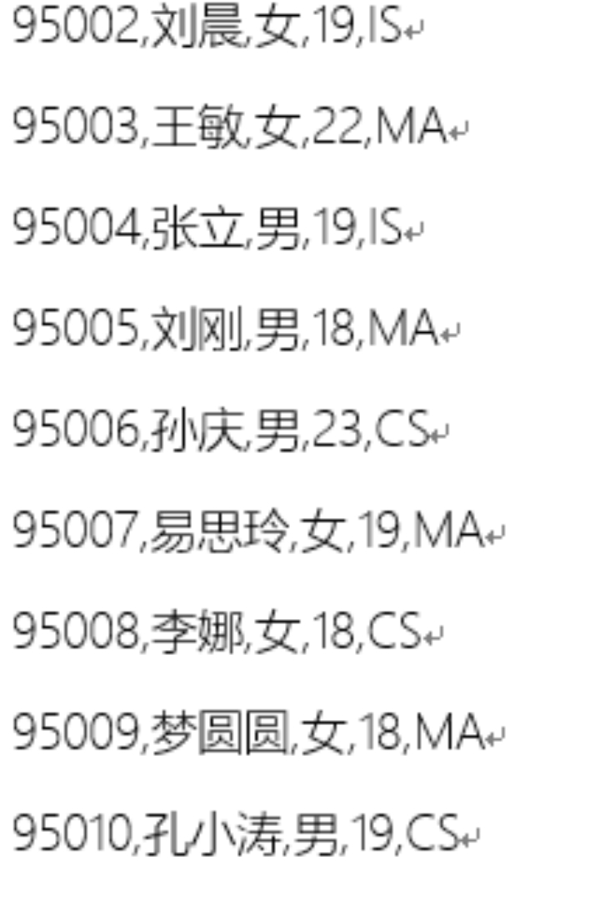

# 用RDBMS的方式插入数据

```hive
create table t_test_insert(id int,name string,age int);

Insert into table t_test_insert values(1,"Allen",18);
```


会非常的慢，很耗时间


# Hive官方推荐加载数据的方式

清洗数据成为结构化文件，再使用Load语法加载数据到表中。这样效率更高

但是并不意味着insert语法在hive中没有用武之地


# insert+select

将后面查询返回的结果作为内容插入到指定表中，注意OWERWRITE将覆盖已有数据


需要保证查询结果列的数目和需要插入数据表格的列数目一致。

如果查询出来的数据类型和插入表格对应的列数据类型不一致，将会进行转换，但是不能保证转换一定成功，转换失败的数据将会为NULL。


```hive
INSERT OVERWRITE TABLE tablename1 [PARTITION (partcol1=val1, partcol2=val2 ...) [IF NOT EXISTS]] select_statement1 FROM from_statement;

INSERT INTO TABLE tablename1 [PARTITION (partcol1=val1, partcol2=val2 ...)] select_statement1 FROM from_statement;
```


## 案例

```hive
--step1:创建一张源表student
drop table if exists student;
create table student(num int,name string,sex string,age int,dept string)
row format delimited
fields terminated by ',';
--加载数据
load data local inpath '/opt/hivedata/students.txt' into table student;

--step2：创建一张目标表  只有两个字段
create table student_from_insert(sno int,sname string);
--使用insert+select插入数据到新表中
insert into table student_from_insert select num,name from student;

select *
from student_from_insert;

```


# Multiple insert

## 引出案例

首先创造了一张表

```hive
create table student(
  num int,
  name string,
  sex string,
  age int,
  dept string)
row format delimited
fields terminated by ',';
```


再创造两张新表

```hive
create table student_insert1(sno int);
create table student_insert2(sname string);
```


从最大的表中往里插入数据

```hive
insert into student_insert1
select num from student;

insert into student_insert2
select name from student;
```


这样效率有点慢 都扫描同一个表了，我能不能一次全部搞定呢


## 多重插入

```hive
from student

insert overwrite table student_insert1

select num

insert overwrite table student_insert2

select name;
```


即可一次扫描 多次插入


# dynamic partition Insert

## 静态分区

对于分区表的数据导入加载，最基础的是通过load命令加载数据。

在load过程中，分区值是手动指定写死的，叫做静态分区。


```hive
create table student_HDFS_p(
  Sno int,
  Sname string,
  Sex string,
  Sage int,
  Sdept string) 
partitioned by(country string) 
row format delimited fields terminated by ',';

--注意 分区字段country的值是在导入数据的时候手动指定的 China
LOAD DATA INPATH '/students.txt'
INTO TABLE student_HDFS_p partition(country ="China");
```


## 动态分区

**引子1**

假如说现在有全球224个国家的人员名单（每个国家名单单独一个文件）

导入到分区表中，不同国家不同分区，如何高效实现？使用load语法导入224次？


**引子2**

再假如，现在有一份名单students.txt，内容如下；

要求创建一张分区表，根据最后一个字段（选修专业）进行分区，同一个专业的同学分到同一个分区中，如何实现？




## **配置参数**

set hive.exec.dynamic.partition=true		        需要设置true为启动动态分区插入

set hive.exec.dynamic.partition.mode=strict	严格模式下，用户必须至少指定一个静态分区，以防覆盖所有分区，非严格状态下，允许所有分区都是动态的			


```hive
FROM page_view_stg pvs
INSERT OVERWRITE TABLE page_view PARTITION(dt='2008-06-08', country)
SELECT pvs.viewTime, pvs.userid, pvs.page_url, pvs.referrer_url, null, null, pvs.ip, pvs.cnt

--在这里，country分区将由SELECT子句（即pvs.cnt）的最后一列动态创建。
--而dt分区是手动指定写死的。
--如果是nonstrict模式下，dt分区也可以动态创建。
```


## 案例

```hive
--1、首先设置动态分区模式为非严格模式 默认已经开启了动态分区功能
set hive.exec.dynamic.partition = true;
set hive.exec.dynamic.partition.mode = nonstrict;
--2、当前库下已有一张表student
select * from student;
--3、创建分区表 以sdept作为分区字段
create table student_partition(Sno int,Sname string,Sex string,Sage int) partitioned by(Sdept string);

--4、执行动态分区插入操作
insert into table student_partition partition(Sdept)
select num,name,sex,age,dept from student;
--其中，num,name,sex,age作为表的字段内容插入表中
--dept作为分区字段值

select *
from student_partition;

--展示分区
show partitions student_partition; 
```


# insert directory

## 导出数据

Hive支持将select查询结果 导出成文件 存放在文件系统中

注意，导出操作是一个overwrite操作，慎重


## 语法

```hive
--标准语法:
INSERT OVERWRITE [LOCAL] DIRECTORY directory1
[ROW FORMAT row_format] [STORED AS file_format]
SELECT ... FROM ...

--Hive extension (multiple inserts):
FROM from_statement
INSERT OVERWRITE [LOCAL] DIRECTORY directory1 select_statement1
[INSERT OVERWRITE [LOCAL] DIRECTORY directory2 select_statement2] ...

--row_format
: DELIMITED [FIELDS TERMINATED BY char [ESCAPED BY char]] [COLLECTION ITEMS TERMINATED BY char]
[MAP KEYS TERMINATED BY char] [LINES TERMINATED BY char]
```


1.目录可以是完整的URI。如果未指定scheme，则Hive将使用hadoop配置变量fs.default.name来决定导出位置；

2.如果使用LOCAL关键字，则Hive会将数据写入本地文件系统上的目录；

3.写入文件系统的数据被序列化为文本，列之间用\001隔开，行之间用换行符隔开。如果列都不是原始数据类型，那么这些列将序列化为JSON格式。也可以在导出的时候指定分隔符换行符和文件格式。


## 案例

```hive
--导出到HDFS上
insert overwrite directory '/opt/hiveout/e1'
select num,name,age from student limit 2;

--导出到local上
insert overwrite local directory '/opt/hiveout/e1'
select num,name,age from student limit 2;

--指定分隔符和文件存储形式
insert overwrite directory '/opt/hiveout/e1'
row format delimited fields terminated by ','
stored as orc
select * from student;
```


