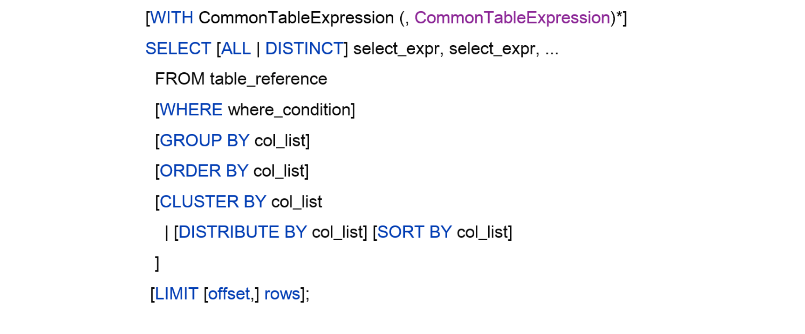
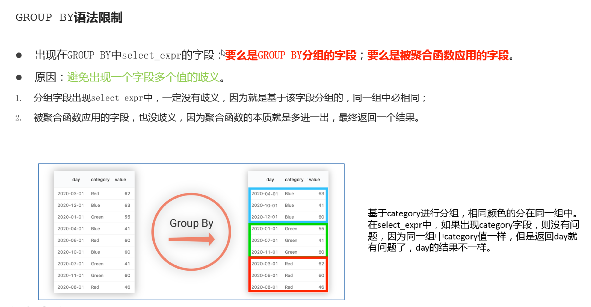
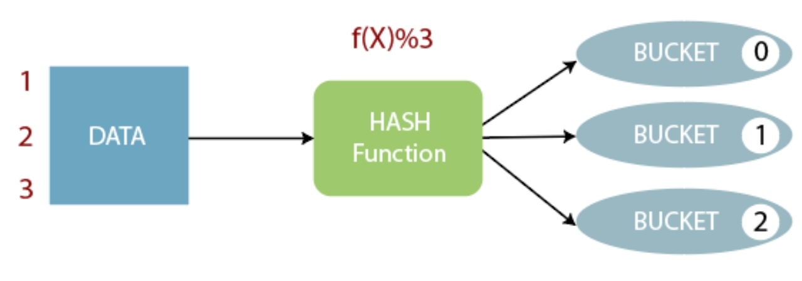
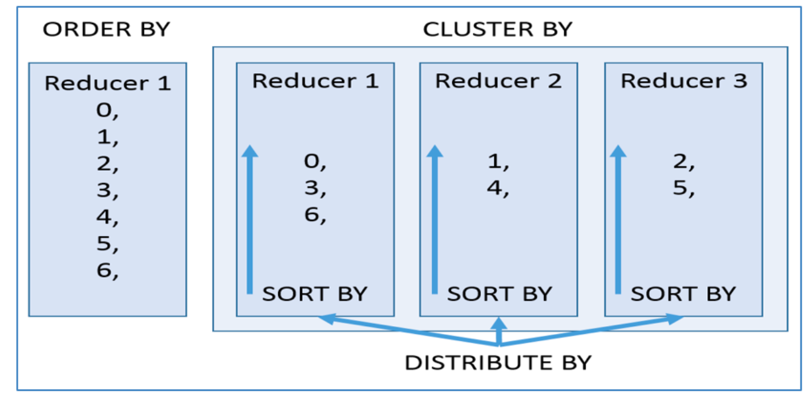
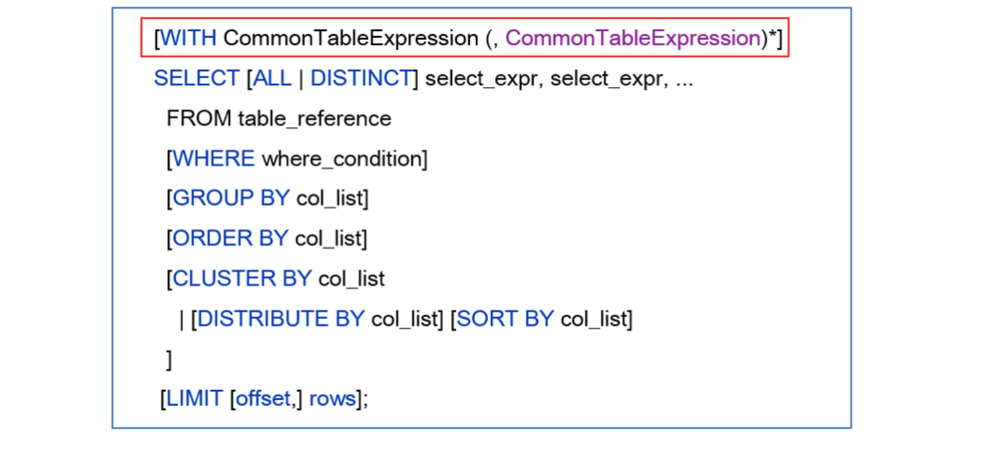

# 语法树

从哪里查询 取决于From关键字后面的table_reference

可以是普通物理表、视图、join结果共同的结果




## 案例

```hive
--step1:创建普通表t_usa_covid19
drop table if exists t_usa_covid19;
CREATE TABLE t_usa_covid19(
       count_date string,
       county string,
       state string,
       fips int,
       cases int,
       deaths int)
row format delimited fields terminated by ",";
--将源数据load加载到t_usa_covid19表对应的路径下
load data local inpath '/root/hivedata/us-covid19-counties.dat' into table t_usa_covid19;

select * from t_usa_covid19;

--step2:创建一张分区表 基于count_date日期,state州进行分区
CREATE TABLE if not exists t_usa_covid19_p(
     county string,
     fips int,
     cases int,
     deaths int)
partitioned by(count_date string,state string)
row format delimited fields terminated by ",";

--step3:使用动态分区插入将数据导入t_usa_covid19_p中
set hive.exec.dynamic.partition.mode = nonstrict;

insert into table t_usa_covid19_p partition (count_date,state)
select county,fips,cases,deaths,count_date,state from t_usa_covid19;
```

# 初阶语法

## select_expr


```hive
--1、select_expr
--查询所有字段或者指定字段
select * from t_usa_covid19_p;
select county, cases, deaths from t_usa_covid19_p;
--查询匹配正则表达式的所有字段
SET hive.support.quoted.identifiers = none; --反引号不在解释为其他含义，被解释为正则表达式
select `^c.*` from t_usa_covid19_p;
--查询当前数据库
select current_database(); --省去from关键字
--查询使用函数
select count(county) from t_usa_covid19_p;
```


## all distinct

```hive
--2、ALL DISTINCT
--返回所有匹配的行
select state from t_usa_covid19_p;
--相当于
select all state from t_usa_covid19_p;
--返回所有匹配的行 去除重复的结果
select distinct state from t_usa_covid19_p;
--多个字段distinct 整体去重
select  county,state from t_usa_covid19_p;
select distinct county,state from t_usa_covid19_p;
select distinct sex from student;
```


## where

```hive
--3/WHERE
select * from t_usa_covid19_p where 1 > 2;  -- 1 > 2 返回false
select * from t_usa_covid19_p where 1 = 1;  -- 1 = 1 返回true
--where条件中使用函数 找出州名字母长度超过10位的有哪些
select * from t_usa_covid19_p where length(state) >10 ;
--where子句支持子查询
SELECT *
FROM A
WHERE A.a IN (SELECT foo FROM B);

--注意：where条件中不能使用聚合函数
--报错 SemanticException:Not yet supported place for UDAF 'count'
--聚合函数要使用它的前提是结果集已经确定。
--而where子句还处于“确定”结果集的过程中，因而不能使用聚合函数。
--下面这两句是错的
select state,count(deaths)
from t_usa_covid19_p where count(deaths) >100 group by state;

--可以使用Having实现
select state,count(deaths)
from t_usa_covid19_p  group by state
having count(deaths) > 100;

--分区裁剪

--找出来自加州，累计死亡人数大于1000的县 state字段就是分区字段 进行分区裁剪 避免全表扫描
select * from t_usa_covid19_p where state ="California" and deaths > 1000;
--多分区裁剪
select * from t_usa_covid19_p where count_date = "2021-01-28" and state ="California" and deaths > 1000;
```


## group by

```hive
--5、GROUP BY
--根据state州进行分组
--SemanticException:Expression not in GROUP BY key 'deaths'
--deaths不是分组字段 报错
--state是分组字段 可以直接出现在select_expr中
select state,deaths
from t_usa_covid19_p where count_date = "2021-01-28" group by state;

--被聚合函数应用
select state,sum(deaths)
from t_usa_covid19_p where count_date = "2021-01-28" group by state;

```




## having

在SQL中增加HAVING子句原因是，WHERE关键字无法与聚合函数一起使用。HAVING子句可以让我们筛选分组后的各组数据,并且可以在Having中使用聚合函数，因为此时where，group by已经执行结束，结果集已经确定。

```hive
--6、having
--统计死亡病例数大于10000的州
--where语句中不能使用聚合函数 语法报错
select state,sum(deaths)
from t_usa_covid19_p where count_date = "2021-01-28" and sum(deaths) >10000 group by state;

--先where分组前过滤（此处是分区裁剪），再进行group by分组， 分组后每个分组结果集确定 再使用having过滤
select state,sum(deaths)
from t_usa_covid19_p
where count_date = "2021-01-28"
group by state
having sum(deaths) > 10000;

--这样写更好 即在group by的时候聚合函数已经作用得出结果 having直接引用结果过滤 不需要再单独计算一次了
select state,sum(deaths) as cnts
from t_usa_covid19_p
where count_date = "2021-01-28"
group by state
having cnts> 10000;
```


**having和group的区别**

having是在分组后对数据进行过滤

where是在分组前对数据进行过滤

having后面可以使用聚合函数

where后面不可以使用聚合函数


## limit

LIMIT用于限制SELECT语句返回的行数。

LIMIT接受一个或两个数字参数，这两个参数都必须是非负整数常量。

第一个参数指定要返回的第一行的偏移量（从 Hive 2.0.0开始）

第二个参数指定要返回的最大行数。当给出单个参数时，它代表最大行数，并且偏移量默认为0。

```hive
--没有限制返回2021.1.28 加州的所有记录
select * from t_usa_covid19_p
where count_date = "2021-01-28"
and state ="California";

--返回结果集的前5条
select * from t_usa_covid19_p
where count_date = "2021-01-28"
  and state ="California"
limit 5;

--返回结果集从第1行开始 共3行
select * from t_usa_covid19_p
where count_date = "2021-01-28"
and state ="California"
limit 2,3; --注意 第一个参数偏移量是从0开始的
```


## 执行顺序

在查询过程中执行顺序：from > where > group（含聚合）> having >order > select；

聚合语句(sum,min,max,avg,count)要比having子句优先执行

where子句在查询过程中执行优先级别优先于聚合语句(sum,min,max,avg,count)


# 高阶语法

## order by

Hive SQL中的ORDER BY语法类似于标准SQL语言中的ORDER BY语法，会对输出的结果进行全局排序。   

因此当底层使用MapReduce引擎执行的时候，只会有一个reducetask执行。

如果输出的行数太大，会导致需要很长的时间才能完成全局排序。

默认排序为升序（ASC），也可以指定为DESC降序。

在Hive 2.1.0和更高版本中，支持在ORDER BY子句中为每个列指定null类型结果排序顺序。   

ASC顺序的默认空排序顺序为NULLS FIRST，而DESC顺序的默认空排序顺序为NULLS LAST。


```hive
---1、order by
--根据字段进行排序
select * from t_usa_covid19_p
where count_date = "2021-01-28"
and state ="California"
order by deaths; ----默认asc, nulls first 也可以手动指定nulls last

select * from t_usa_covid19_p
where count_date = "2021-01-28"
and state ="California"
order by deaths desc; --指定desc null last

--强烈建议将LIMIT与ORDER BY一起使用。避免数据集行数过大
--当hive.mapred.mode设置为strict严格模式时，使用不带LIMIT的ORDER BY时会引发异常。
select * from t_usa_covid19_p
where count_date = "2021-01-28"
and state ="California"
order by deaths desc
limit 3;

```


## cluster by

根据指定字段将数据分组，每组内再根据该字段正序排序（只能正序）。   

概况起来就是：根据**同一个字段，分且排序**。

分组规则hash散列（分桶表规则一样）：Hash_Func(col_name) % reducetask个数分为几组取决于reducetask的个数




```hive
--2、cluster by
select * from student;
--不指定reduce task个数
--日志显示：Number of reduce tasks not specified. Estimated from input data size: 1
select * from student cluster by num;

--手动设置reduce task个数
set mapreduce.job.reduces =2;
select * from student cluster by num;

```


**局限性**

需求：根据sex性别分为两个部分，每个分组内再根据age年龄的倒序排序。

CLUSTER BY无法单独完成，因为分和排序的字段只能是同一个;

ORDER BY更不能在这里使用，因为是全局排序，只有一个输出，无法满足分的需求


## Distribute by + sort by

DISTRIBUTE BY +SORT BY就相当于把CLUSTER BY的功能一分为二

DISTRIBUTE BY负责根据指定字段分组；

SORT BY负责分组内排序规则。

分组和排序的字段可以不同。


```hive
--案例：把学生表数据根据性别分为两个部分，每个分组内根据年龄的倒序排序。
select * from student distribute by sex sort by age desc;
```


如果DISTRIBUTE BY +SORT BY的字段一样，则：CLUSTER BY=DISTRIBUTE BY +SORT BY

```hive
--下面两个语句执行结果一样
select * from student distribute by num sort by num;
select * from student cluster by num;
```


## 区别

order by全局排序，因此只有一个reducer，结果输出在一个文件中，当输入规模大时，需要较长的计算时间。

distribute by根据指定字段将数据分组，算法是hash散列。

sort by是在分组之后，每个组内局部排序。

cluster by既有分组，又有排序，但是两个字段只能是同一个字段。

如果distribute和sort的字段是同一个时，此时，cluster by = distribute by + sort by




# 高阶语法

## Union 联合查询

UNION用于将来自于多个SELECT语句的结果合并为一个结果集。

使用DISTINCT关键字与只使用UNION默认值效果一样，都会删除重复行。

1.2.0之前的Hive版本仅支持UNION ALL，在这种情况下不会消除重复的行。

使用ALL关键字，不会删除重复行，结果集包括所有SELECT语句的匹配行（包括重复行）。

每个select_statement返回的列的数量和名称必须相同。


```hive
--使用DISTINCT关键字与使用UNION默认值效果一样，都会删除重复行。
select num,name from student_local
UNION
select num,name from student_hdfs;
--和上面一样select num,name from student_local
UNION DISTINCT
select num,name from student_hdfs;

--使用ALL关键字会保留重复行。
select num,name from student_local
UNION ALL
select num,name from student_hdfs;
```


```hive
--如果要将ORDER BY，SORT BY，CLUSTER BY，DISTRIBUTE BY或LIMIT应用于单个SELECT
--请将子句放在括住SELECT的括号内
SELECT num,name FROM (select num,name from student_local LIMIT 2) subq1
UNION
SELECT num,name FROM (select num,name from student_hdfs LIMIT 3) subq2

--如果要将ORDER BY，SORT BY，CLUSTER BY，DISTRIBUTE BY或LIMIT子句应用于整个UNION结果
--请将ORDER BY，SORT BY，CLUSTER BY，DISTRIBUTE BY或LIMIT放在最后一个之后。
select num,name from student_local
UNION
select num,name from student_hdfs
order by num desc;
```


## Where子句中子查询

在Hive0.12版本，仅在FROM子句中支持子查询。  

 必须要给子查询一个名称，因为FROM子句中的每个表都必须有一个名称。

子查询返回结果中的列必须具有唯一的名称。子查询返回结果中的列在外部查询中可用，就像真实表的列一样。

子查询也可以是带有UNION的查询表达式。

Hive支持任意级别的子查询，也就是所谓的嵌套子查询。Hive 0.13.0和更高版本中的子查询名称之前可以包含可选关键字AS。


```hive
--from子句中子查询（Subqueries）
--子查询
SELECT num
FROM (
	select num,name from student_local
) tmp;

--包含UNION ALL的子查询的示例
SELECT t3.name
FROM (
select num,name from student_local
UNION distinct
select num,name from student_hdfs
) t3;

```


从Hive 0.13开始，WHERE子句支持下述类型的子查询：

不相关子查询：该子查询不引用父查询中的列，可以将查询结果视为IN和NOT IN语句的常量；

相关子查询：子查询引用父查询中的列；


```hive
--where子句中子查询（Subqueries）
--不相关子查询，相当于IN、NOT IN,子查询只能选择一个列。
--（1）执行子查询，其结果不被显示，而是传递给外部查询，作为外部查询的条件使用。
--（2）执行外部查询，并显示整个结果。　　

SELECT *
FROM student_hdfs
WHERE student_hdfs.num IN (select num from student_local limit 2);

--相关子查询，指EXISTS和NOT EXISTS子查询
--子查询的WHERE子句中支持对父查询的引用
SELECT A
FROM T1
WHERE EXISTS (SELECT B FROM T2 WHERE T1.X = T2.Y);

```


## CTE 表达式

Common Table Expressions

公用表表达式（CTE）是一个临时结果集：该结果集是从WITH子句中指定的简单查询派生而来的，紧接在SELECT或INSERT关键字之前。CTE仅在单个语句的执行范围内定义。CTE可以在 SELECT，INSERT， CREATE TABLE AS SELECT或CREATE VIEW AS SELECT语句中使用。





```hive
--select语句中的CTE
with q1 as (select num,name,age from student where num = 95002)
select *
from q1;

-- from风格
with q1 as (select num,name,age from student where num = 95002)
from q1
select *;

-- chaining CTEs 链式
with q1 as ( select * from student where num = 95002),
     q2 as ( select num,name,age from q1)
select * from (select num from q2) a;


-- union
with q1 as (select * from student where num = 95002),
     q2 as (select * from student where num = 95004)
select * from q1 union all select * from q2;

--视图，CTAS和插入语句中的CTE
-- insert
create table s1 like student;

with q1 as ( select * from student where num = 95002)
from q1
insert overwrite table s1
select *;

select * from s1;

-- ctas
create table s2 as
with q1 as ( select * from student where num = 95002)
select * from q1;

-- view
create view v1 as
with q1 as ( select * from student where num = 95002)
select * from q1;

select * from v1;
```


## Join 连接

