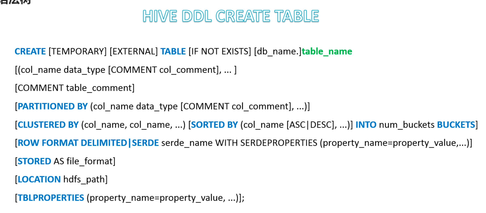
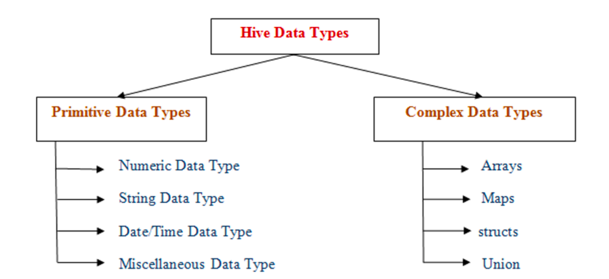
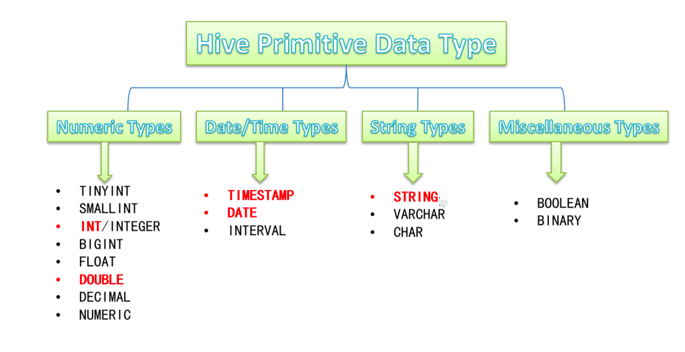
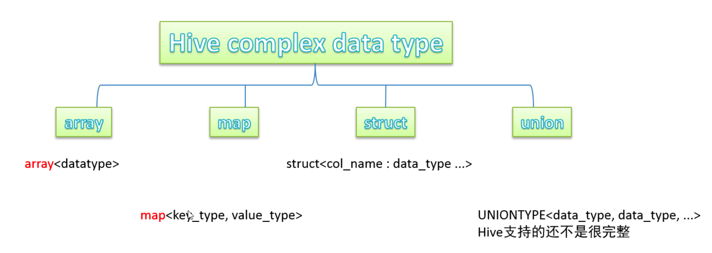
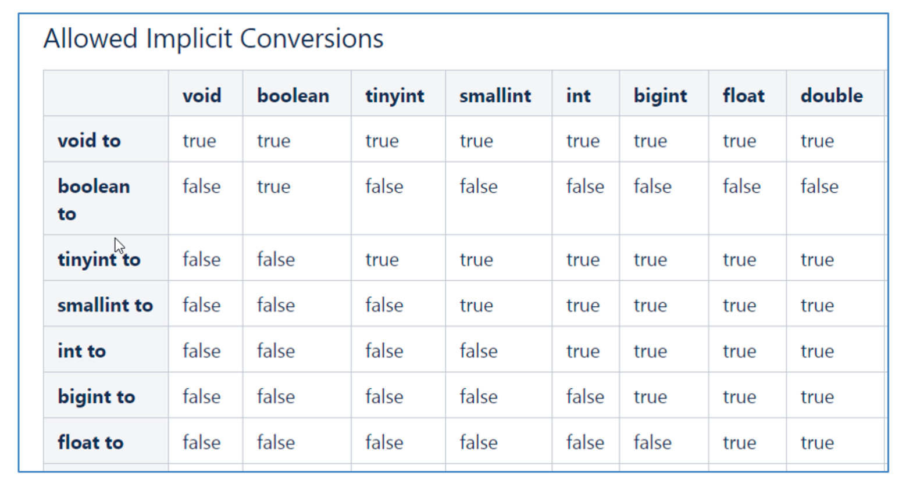

# SQL中DDL语法的作用

## 数据定义语言 

（Data Definition Language， DDL），是SQL语言集中对数据库内部的对象进行 **创建，删除，修改** 等的操作语言

这些数据库对象包括 database、table、view、index等

DDL核心语法由CREATE、ALTER、DROP三个所组成 DDL 不涉及表内部数据的操作

# Hive中DDL语法的使用

Hive SQL 与 标准SQL语法 大同小异，基本相通

基于Hive的设计、使用特点，HQL中**create语法 将是掌握 HIVE DDL语法的重中之重**

建表是否成功直接影响文件是否映射成功，进而影响后续是否可以基于SQL分析数据

# Hive SQL DDL 建表语法

完整语法树

 蓝色字体是关键字

[ ]  表示语法可选

｜ 表示使用的时候 语法二选一

建表语句中的语法顺序要和语法树中顺序保持一致

# Hive数据类型详解

## 整体概述

Hive数据类型指的是表中列的字段类型

整体分为两类

原生数据类型 复杂数据类型

原生数据类型包括：数值类型、时间日期类型、字符串类型、杂项数据类型

复杂数据类型包括：array数组、map映射、struct结构、union联合体

## 原生数据类型

## 复杂数据类型

## 注意事项

1. HiveSQL中，数据类型英文字母大小写不敏感

2. 除SQL数据类型外，还支持Java数据类型，比如String

3. 复杂数据类型的使用通常需要和分隔符指定语法配合使用

4. 如果定义的数据和文件不一致，Hive会尝试隐式转换，但是不保证成功

# 类型转换

## 隐式转换

与标准SQL类似，HQL支持隐式转换和显式转换

## 显式转换

CAST函数

例如 

CAST('100' as INT)会转换成100整数值

如果转换失败，返回NULL

