# SerDe

## 是什么

SerDe是 Serialize、Deserializer 的简称

目的是用于序列化和反序列化


序列化就是对象转换为字节码的过程

反序列化就是字节码转换为对象的过程


hive**使用SerDe读取和写入表行对象**。


需要注意的是，key部分在读取的时候会被忽略，而在写入时key始终是常数。

基本上行对象存储在value中

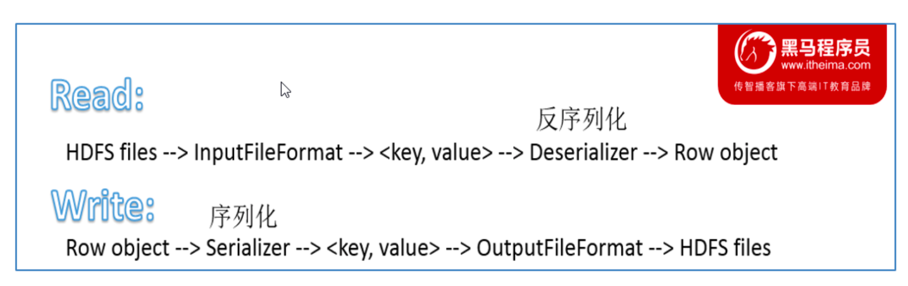


## 如何查看信息

可以通过 desc formatted tablename 查看表相关的SerDe信息

默认如下

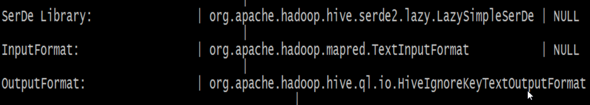


# Hive读写文件机制

## **Hive读取文件机制**

首先调用InputFormat（默认TextInputFormat）

返回一条一条kv键值对记录（默认是一行对应一条记录）

然后调用SerDe（默认LazySimpleSerDe）的Deserializer

将一条记录中的value根据分隔符切分为各个字段


## **Hive写文件机制**

将Row写入文件时

首先调用SerDe（默认LazySimpleSerDe）的Serializer将对象转换成字节序列

然后调用OutputFormat将数据写入HDFS文件中


# SerDe相关语法

## ROW FORMAT

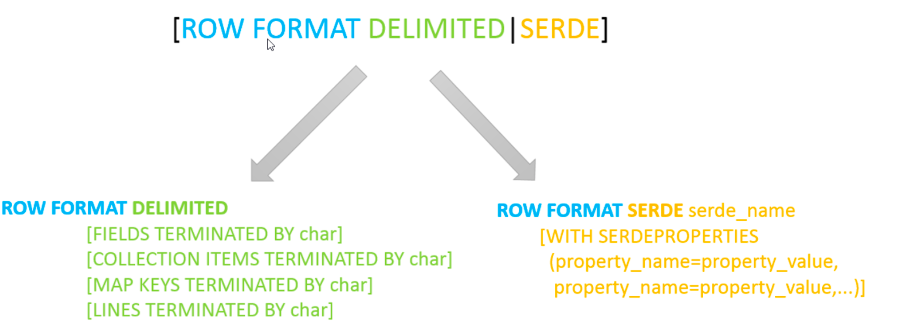

这一行代表的是读写文件、序列化SerDe相关的语法

1.使用哪个SerDe类进行序列化

2.如何指定分隔符


## ROW FORMAT DELIMITED 默认 

ROW FORMAT DELIMITED = 使用默认的serde类（LazySimpleSerDe）来处理

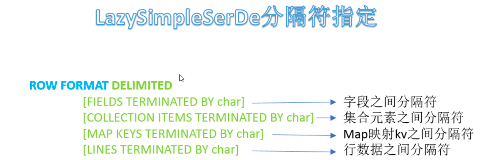


### 默认分割符

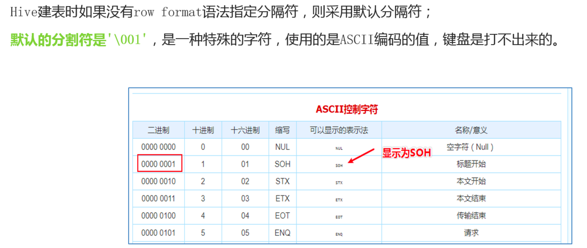

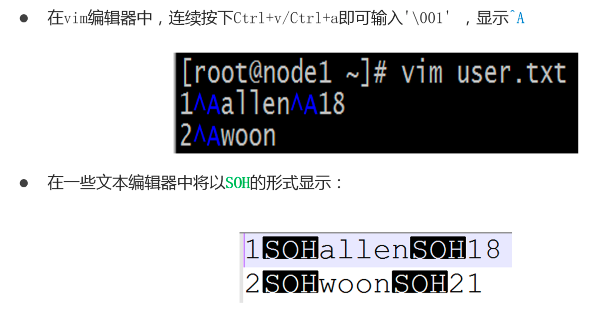

## ROW FORMAT SERDE 自定义

ROW FORMAT SERDE = 使用自定义的serde类来处理


# Hive数据存储路径

## 默认设置

Hive表默认存储路径是由${HIVE_HOME}/conf/hive-site.xml

配置文件的hive.metastore.warehouse.dir属性指定

默认值是：/user/hive/warehouse


## LOCATION 指定存储路径

在Hive建表的时候，可以通过location语法来更改数据在HDFS上的存储路径，使得建表加载数据更加灵活方便。

**语法：LOCATION '<hdfs_location>'。**

对于已经生成好的数据文件，使用location指定路径将会很方便。


# 实操练习

## 基础数据类型使用

要求在Hive中建表映射成功该文件

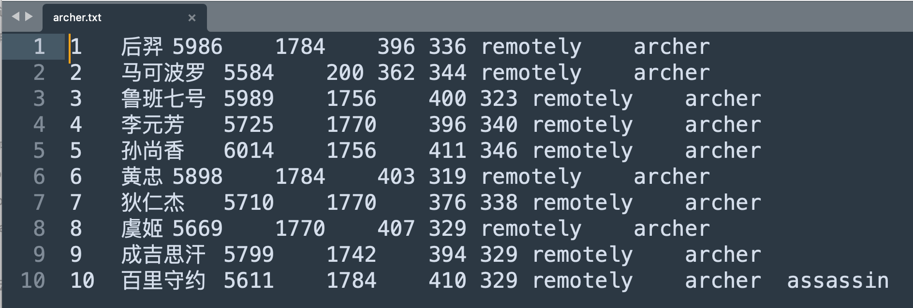


字段含义：id、name（英雄名称）、hp_max（最大生命）、mp_max（最大法力）、attack_max（最高物攻）、defense_max（最大物防）、attack_range（攻击范围）、role_main（主要定位）、role_assist（次要定位）。


字段都是基本类型，字段的顺序需要注意一下。字段之间的分隔符是制表符，需要使用row format语法进行指定。

```hive
--创建数据库并切换使用
create database itcast;
use itcast;

--ddl create table
create table t_archer(
    id int comment "ID",
    name string comment "英雄名称",
    hp_max int comment "最大生命",
    mp_max int comment "最大法力",
    attack_max int comment "最高物攻",
    defense_max int comment "最大物防",
    attack_range string comment "攻击范围",
    role_main string comment "主要定位",
    role_assist string comment "次要定位"
) comment "王者荣耀射手信息"
row format delimited fields terminated by "\t";
```


建表成功之后，在Hive的默认存储路径下就生成了表对应的文件夹，把archer.txt文件上传到对应的表文件夹下。

```
hadoop fs -put archer.txt  /user/hive/warehouse/honor_of_kings.db/t_archer
```


执行查询操作，可以看出数据已经映射成功。

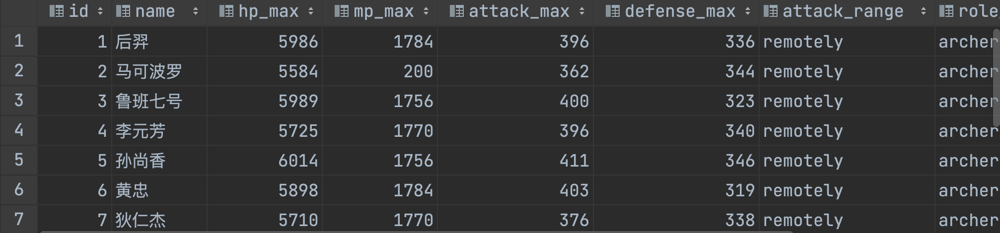


## 复杂数据类型使用

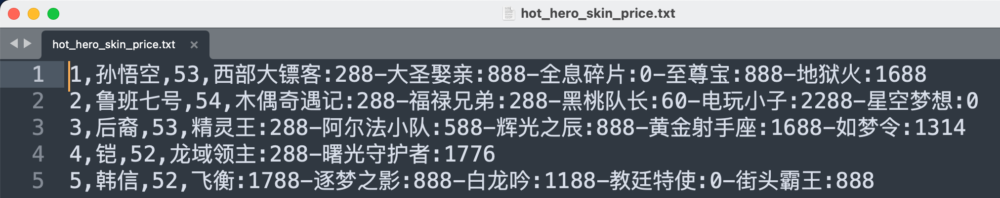


字段：id、name（英雄名称）、win_rate（胜率）、skin_price（皮肤及价格）

分析一下：前3个字段原生数据类型、最后一个字段复杂类型map。需要指定字段之间分隔符、集合元素之间分隔符、map kv之间分隔符。


```hive
--复杂数据类型建表练习
create table t_hot_hero_skin_price(
    id int,
    name string,
    win_rate int,
    skin_price map<string, int> -- 注意这个复杂类型
)row format delimited
fields terminated by ',' --指定字段分隔符
collection items terminated by '-' --指定集合元素之间分隔符
map keys terminated by ':'; --指定map元素 key value之间的分隔符
```

建表成功后，把hot_hero_skin_price.txt文件上传到对应的表文件夹下。


```
hadoop  fs  -put hot_hero_skin_price.txt  /user/hive/warehouse/honor_of_kings.db/t_hot_hero_skin_price  
```

执行查询操作，可以看出数据已经映射成功。


执行结果

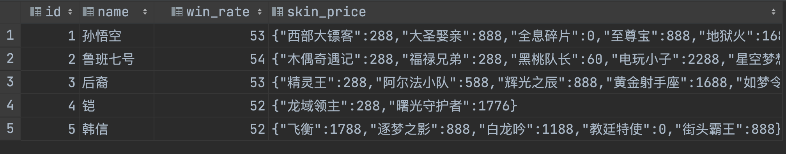


## 默认分隔符使用

源文件：

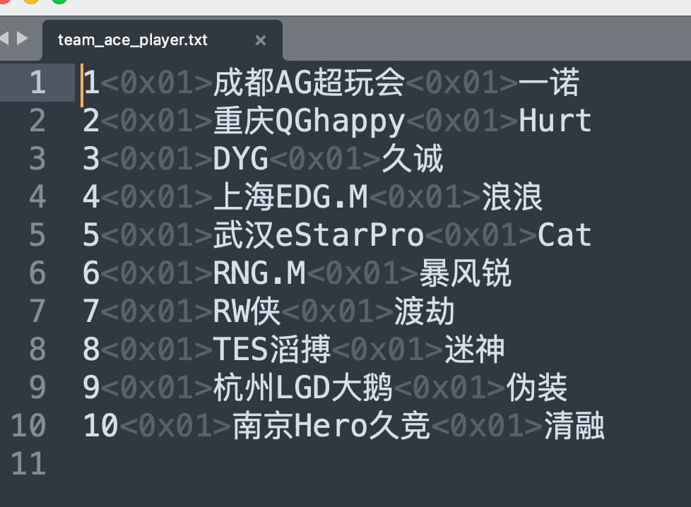

已经使用了默认分隔符  \001


```hive
create table t_team_ace_player_location(
    id int,
    team_name string,
    ace_player_name string
);
```


直接建表就行

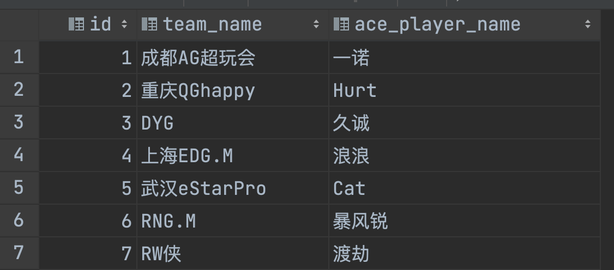


## 指定数据存储路径

```hive
create table t_team_ace_player_location2(
       id int,
       team_name string,
       ace_player_name string
) location '/data'; --使用location关键字指定本张表数据在hdfs上的存储路径

```

执行完后

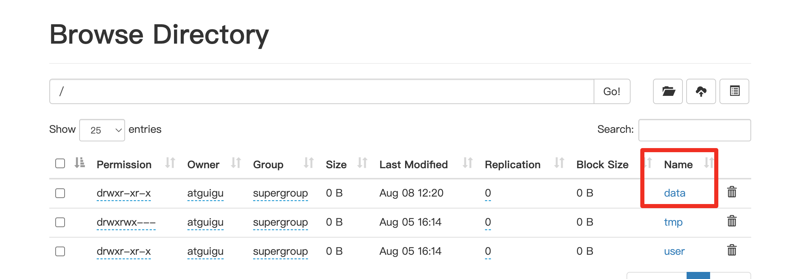

可以把文件仍在这里了

