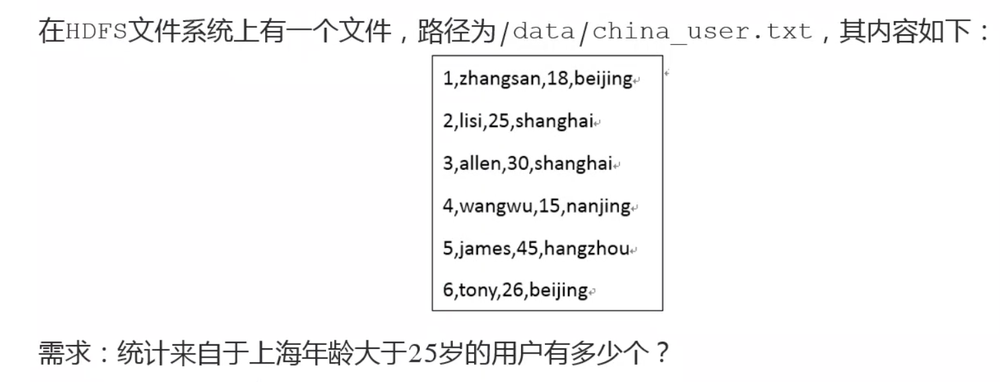
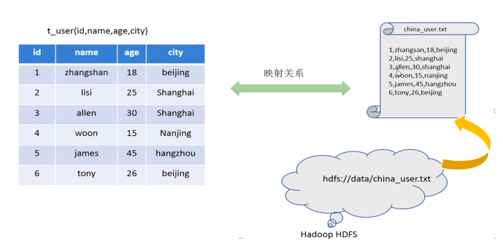
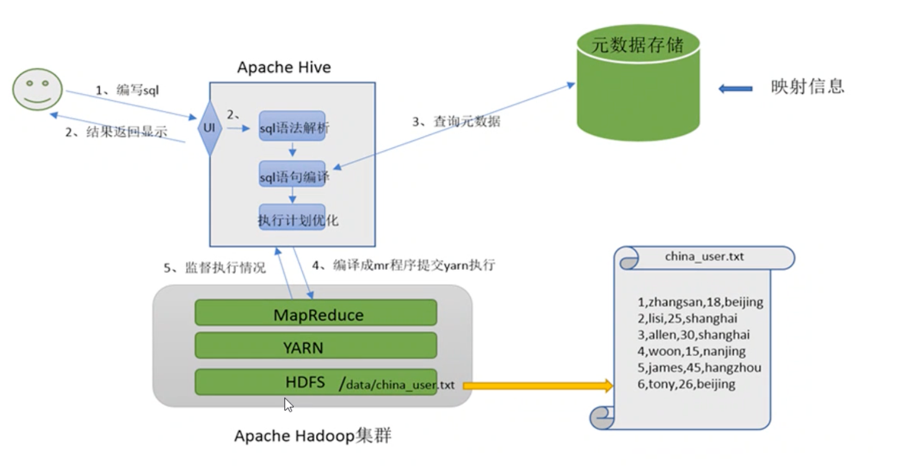

# Hive的介绍

## 什么是Hive

Apache Hive 是一款建立在Hadoop之上的**开源数据仓库系统**，可以将存储在Hadoop文件中的 结构化、半结构化数据文件 映射为 一张数据库表。

基于表提供了一种类似SQL的查询模型，称为**Hive查询语言（HQL）**，用于访问和分析存储在Hadoop文件中的 **大型数据集**。

Hive的核心

将HQL转换为MapReduce程序，然后将程序提交到Hadoop集群运行

Hive由Facebook实现，并开源

## Hive的好处？为啥用

**1.直接使用MR弊端**

使用Hadoop MR直接处理 学习成本太高需要掌握java

MR进行复杂查询逻辑开发难度大。

**2.使用Hive好处**

使用Hive类SQL语法，学习成本低

避免直接写MR，减少开发学习成本

支持自定义函数，功能扩展方便

背靠Hadoop，擅长海量数据计算

## Hive和MR的关系

一个数据仓库软件，需要具备 **存储数据、分析数据**

存储数据Hive利用HDFS存储数据，利用MapReduce查询分析

Hive最大魅力在于

用户专注于写HQL，Hive就可以自动转换为M R程序并进行分析

# 模拟实现Hive功能

如果 要求 用户编写SQL语句，Hive自动转换成MR程序，处于HDFS上存储结构化数据，如何实现？

## Hive映射是什么？

在数学上是一种对应关系

Hive中能够写sql处理的前提是，针对表，而不是针对文件

所以要将 文件和表 之间的对应关系 描述清楚

映射信息 专业的叫法 叫做**元数据信息** metadata

## 映射信息记录

1.表对应着哪个文件（位置信息）

2.表的列对应着文件哪一个字段（顺序信息）

3.文件字段之间的分隔符是什么

## 总结

Hive能将数据文件映射为一张表，这个映射指的是：

文件和表之间的对应关系

Hive软件本身承担了什么功能职责：

SQL语法解析编译成MR程序

## 最终效果

