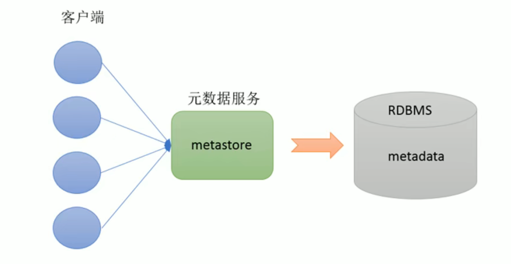
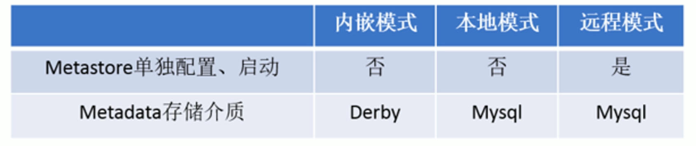
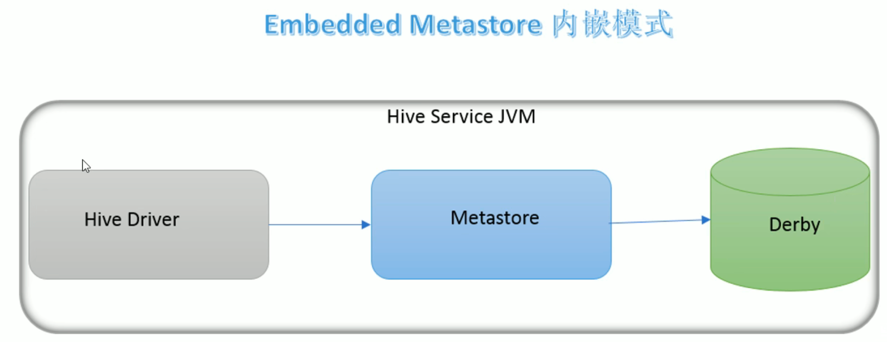
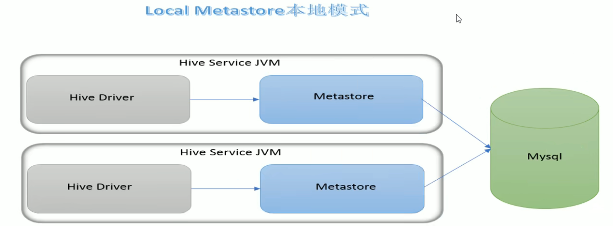
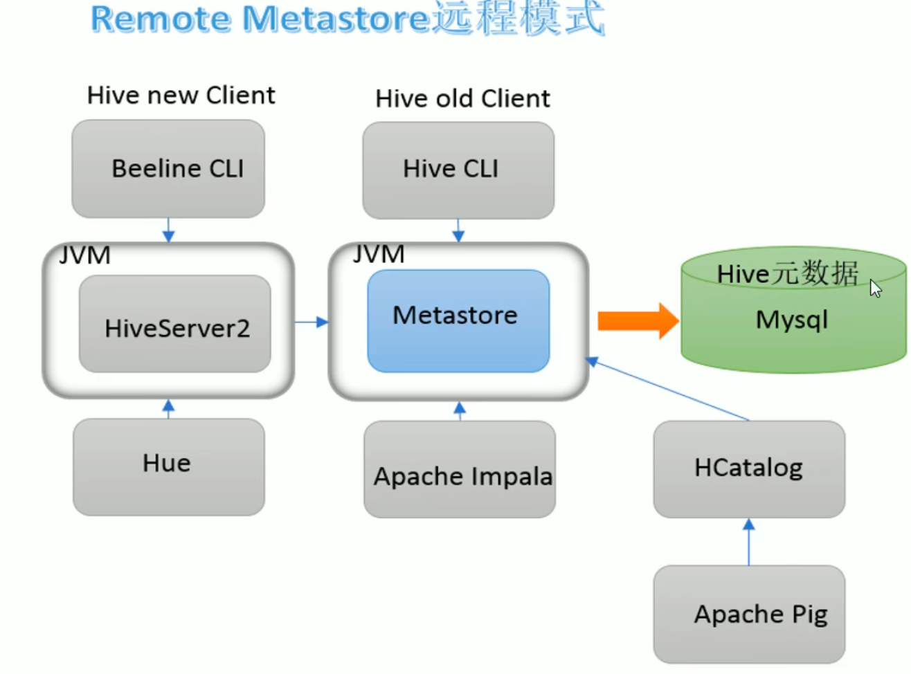

# Hive元数据

## 是什么

元数据，又称为Metadata、数据中介、中继数据

为描述数据的数据，主要是描述数据属性的信息，用来支持如指示存储位置、历史数据、资源查找、文件记录等功能

## Hive Metadata

包含用Hive创建的database、table、表的位置、类型、属性、字段顺序类型等元信息

元数据存储在关系型数据库中。如Hive内置的derby、或者第三方如Mysql等

## Hive Metastore

既元数据服务

Metastore服务的作用是管理metadata元数据，对外暴露服务地址，让各种客户端通过连接metastore服务，由，metastore再去连接Mysql数据库来存储元数据

有了metastore服务，就可以有多个客户端同时连接，而且这些客户端不需要知道Mysql数据库的用户名和密码，只需要连接metastore服务即可。某种程度上也保证了hive元数据的安全

# MetaStore配置方式

服务配置三种模式：内嵌模式、本地模式、远程模式

内嵌模式：直接解压运行，适合测试

本地模式：将内嵌模式Metadata的移动到Mysql中

远程模式：企业推荐模式，metastore单独配置单独启动，Metadata存储在Mysql

## 内嵌模式

是metastore默认的部署模式

元数据存储在内置Derby数据库，并且Derby数据库和metastore服务都嵌入在主HiveServer进程中，当启动HiveServer进程时，Derby和metastore都会启动。不需要额外启动metastore服务。

一次只能支持一个用户，适用于测试，不适用于生产环境

## 本地模式

Metastore服务与主HiveServer进程在同一进程中运行，但是存储元数据的数据库在单独进程中运行，并且可以在单独的主机上。

metastore服务将通过JDBC与metastore数据库进行通信。

本地模式采用外部数据库用来存储元数据，推荐使用Mysql

hive根据hive.metastore.uris 参数值来判断，如果为空，则为本地模式

缺点是，每次启动一次hive服务，都内置启动了一个metastore

## 远程模式

远程模式 metastore服务在自己单独的JVM下运行，不再HiveServer中JVM运行。如果其他进程希望与MetaStore通信，则可以使用Thrift Network API进行通信

远程模式下 需要配置hive.metastore.uris 参数 来指定 metastore服务运行的机器ip和端口，并且需要单独手动启动metastore服务。元数据也采用外部数据库来存储元数据，推荐使用Mysql。

在生产环境中，建议使用远程模式配置Metastore。这种情况下 其他依赖hive的软件都可以通过metastore访问hive。还可以完全屏蔽数据库层，带来了更好的可管理性

