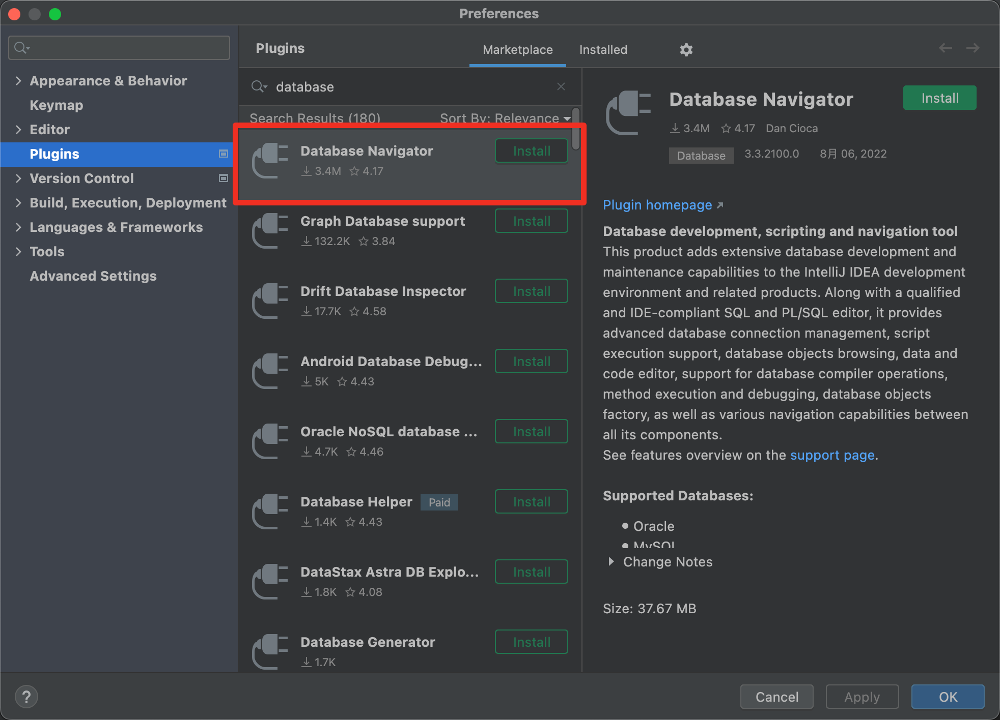
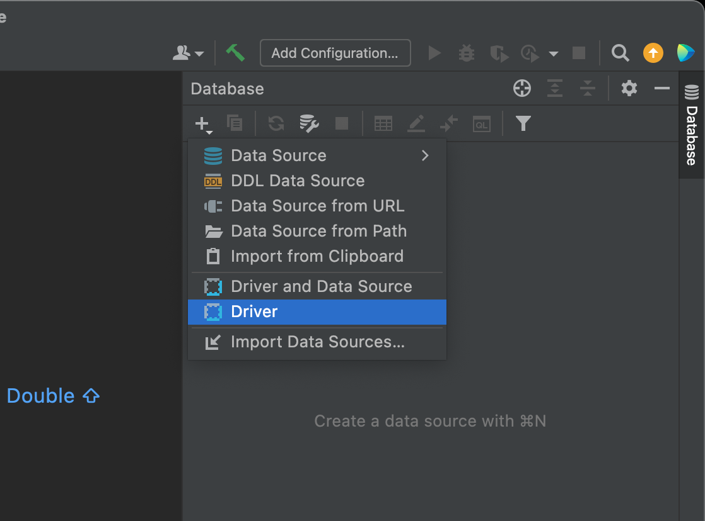
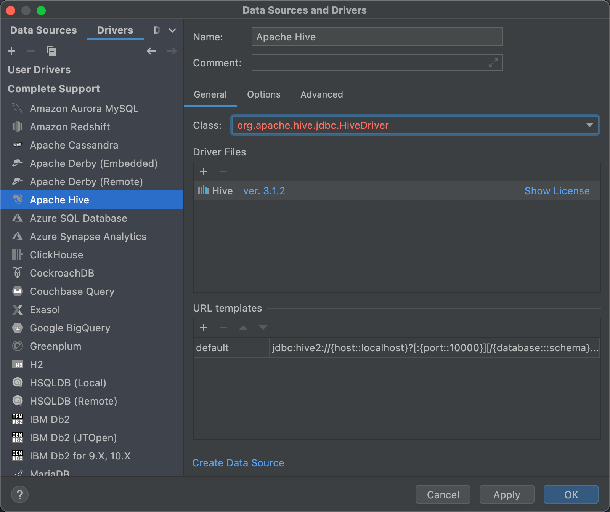
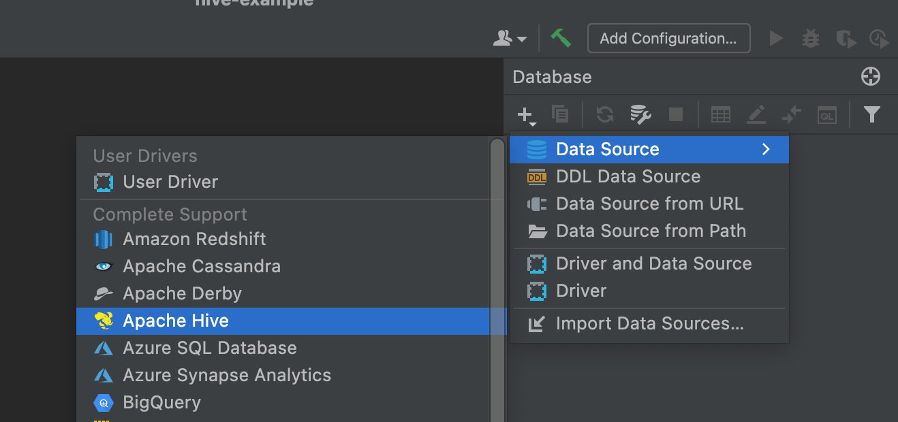
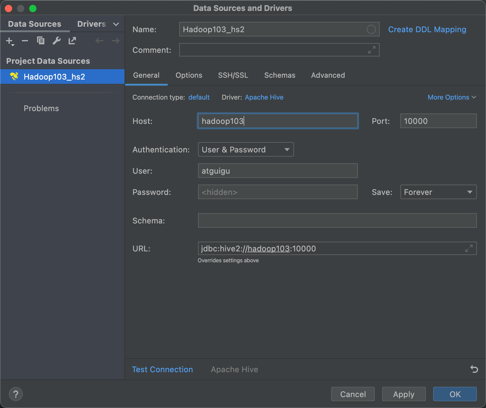
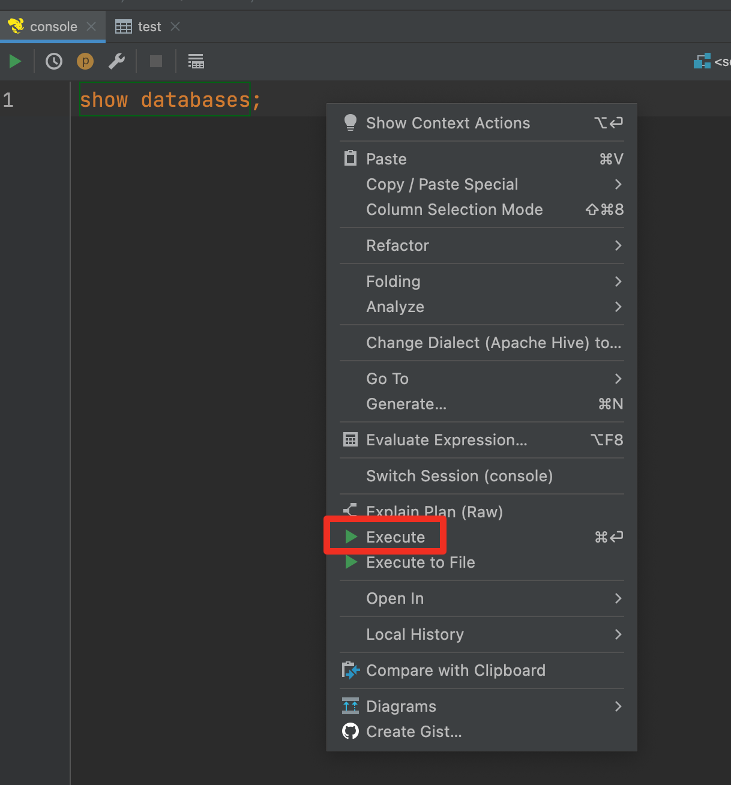
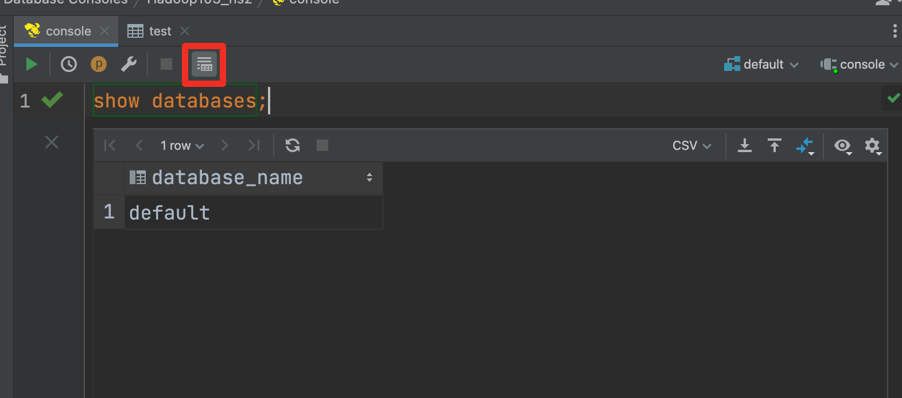

# Hive常见开发方式

## 1、Hive CLI、Beeline CLI

Hive自带的命令行客户端

优点：不需要额外安装

缺点：编写SQL环境恶劣，无有效显示，无语法高亮，误操作概率高

## 2、文本编辑器

sublime、Emacs、EditPlus、UltraEdit、VsCode

有些不支持作为客户端连接Hive服务，但支持SQL语法环境，在编辑器中开发SQL，复制到Hive CLI执行；

有些安装插件作为客户端直连Hive服务

## 3、Hive可视化工具

Intellij IDEA、DataGrip、Dbeaver、SQuirrel SQL Client等

可以在Windows Mac平台中 通过 JDBC连接HiveServer2的图形界面工具；

很优雅

# Intellij IDEA 配置过程

0.添加Database插件

1.进入后 点击database 配置驱动

2. 选择相对应版本驱动

   

3.添加数据源

4.配置

5.执行语句

6.将表设置显示在语句下方

