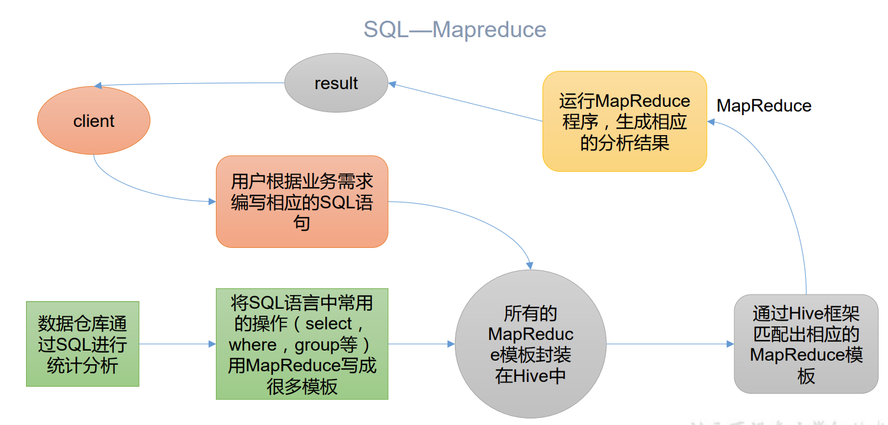

# 是什么

## 简介

由 Facebook 开源用于解决海量结构化日志的数据统计工具。 

Hive 是基于 Hadoop 的一个数据仓库工具，可以将结构化的数据文件映射为一张表，并提供类 SQL 查询功能。

## 本质

Hive 本质：将 HQL 转化成 MapReduce 程序（可以看成是一个MR的客户端）

（1）Hive 处理的数据存储在 HDFS 

（2）Hive 分析数据底层的实现是 MapReduce 

（3）执行程序运行在 Yarn 上

