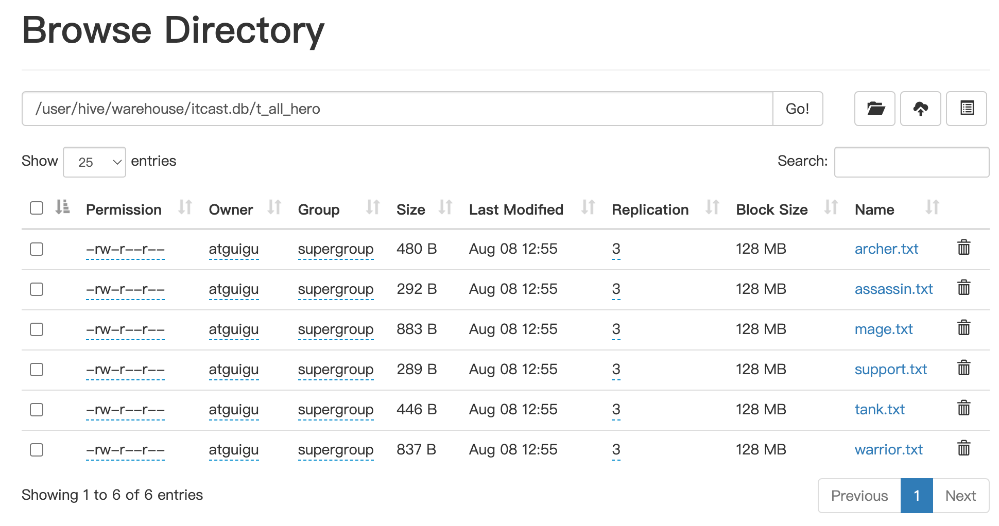
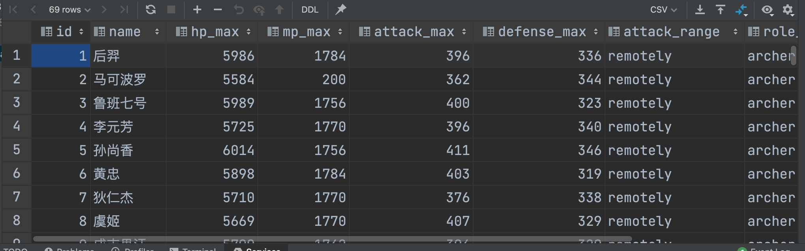
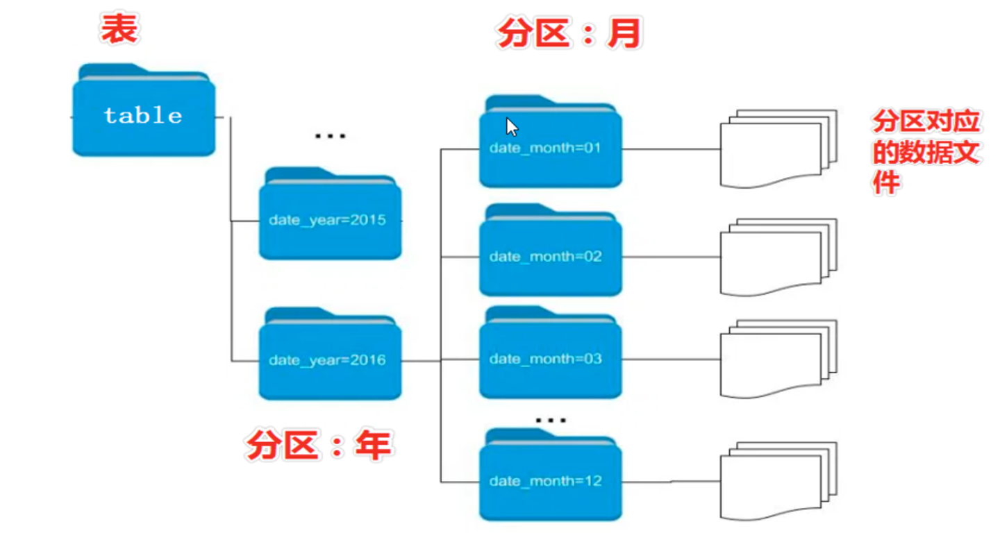
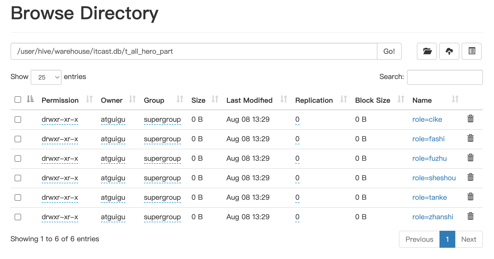

# 引出

## 现有需求

现有6份数据文件，分别记录了《王者荣耀》中6种位置的英雄相关信息。现要求通过建立一张表**t_all_hero**，把6份文件同时映射加载。

```hive
create table t_all_hero(
       id int,
       name string,
       hp_max int,
       mp_max int,
       attack_max int,
       defense_max int,
       attack_range string,
       role_main string,
       role_assist string
)
row format delimited
fields terminated by "\t";

select * from t_all_hero;
```

移动文件



查看结果




## 添加需求

现要求查询role_main主要定位是射手并且hp_max最大生命大于6000的有几个，sql语句如下：

```
select  *count*(*) from t_all_hero where role_main="archer" and hp_max >6000;  
```

思考一下：where语句的背后需要进行全表扫描才能过滤出结果，对于hive来说需要扫描表下面的每一个文件。

如果数据文件特别多的话，效率很慢也没必要。

本需求中，只需要扫描archer.txt文件即可，如何优化可以加快查询，减少全表扫描呢？


# 分区表

## 介绍

当Hive表对应的数据量大、文件多时，为了避免查询时全表扫描数据，Hive支持根据用户指定的字段进行分区

分区的字段可以是日期、地域、种类等具有标识意义的字段。

比如把一整年的数据根据月份划分12个月（12个分区），后续就可以查询指定月份分区的数据，尽可能避免了全表扫描查询。



# 静态分区

## 单分区

### 创建语法

CREATE TABLE

partitioned by


```hive
--注意分区表创建语法规则
--分区字段不能已经是表中已经有的字段
create table t_all_hero_part(
       id int,
       name string,
       hp_max int,
       mp_max int,
       attack_max int,
       defense_max int,
       attack_range string,
       role_main string,
       role_assist string
)
partitioned by (role string)
row format delimited
fields terminated by "\t";
```


### 数据加载

静态分区指的是 分区的属性是由用户在加载数据的时候**手动指定**的

语法如下

```hive
load data [local] inpath 'filepath' into table tablename partition(分区字段='分区值')
```

local参数用于指定加载的数据来自本地文件还是hdfs文件系统

如果从本地上传要加local，如果在hdfs不用加local


案例：

```hive
load data local inpath '/home/atguigu/hivedata/archer.txt' into table t_all_hero_part partition(role='sheshou');
load data local inpath '/home/atguigu/hivedata/assassin.txt' into table t_all_hero_part partition(role='cike');
load data local inpath '/home/atguigu/hivedata/mage.txt' into table t_all_hero_part partition(role='fashi');
load data local inpath '/home/atguigu/hivedata/support.txt' into table t_all_hero_part partition(role='fuzhu');
load data local inpath '/home/atguigu/hivedata/tank.txt' into table t_all_hero_part partition(role='tanke');
load data local inpath '/home/atguigu/hivedata/warrior.txt' into table t_all_hero_part partition(role='zhanshi');
```


看hdfs里，发现表下创建了多个文件夹



### 数据扫描

这个时候，只需要扫描一个分区文件，会节省很多时间，避免了全表扫描

```hive
select  *count*(*) from t_all_hero_part where role="sheshou" and hp_max >6000;  
```


## 双分区

### 创建语法

```hive
create table t_user_province_city (
    id int,
    name string,
    age int
)partitioned by (
    province string,
    city string
    );
```

注意分区的先后顺序，大的在前面，小的在后面


### 数据加载

```hive
load data inpath '/hivedata/user.txt' into table t_user_province_city partition(province='zhejiang' ,city='hangzhou');
load data inpath '/hivedata/user.txt' into table t_user_province_city partition(province='zhejiang' ,city='ningbo');
load data inpath '/hivedata/user.txt' into table t_user_province_city partition(province='shanghai' ,city='pudong');
```


### 数据扫描

使用分区进行过滤，避免了全表扫描，提高了查询效率

```hive
select  count(*) from t_user_province_city where province="zhejiang" and city="hangzhou";  
```


# 动态分区

动态分区指的是分区的字段值 是基于查询结果自动推断出来的

核心语法是 insert+select

启动hive动态分区，需要在hive绘画中设置两个参数


```bash
#开启动态分区功能
set hive.exec.dynamic.partition=true;

#指定动态分区模式，分为 nonstick非严格模式 和 strict严格模式
#strict严格模式要求至少有一个分区为静态分区
set hive.exec.dynamic.partition.mode=nonstrict;
```


## 创建语法

```hive
create table t_all_hero_part_dynamic(
    id int,
    name string,
    hp_max int,
    mp_max int,
    attack_max int,
    defense_max int,
    attack_range string,
    role_main string,
    role_assist string
)
partitioned by (role string)
row format delimited
fields terminated by "\t";
```


## 数据加载

```hive
Insert into table t_all_hero_part_dynamic partition(role) 

Select tmp.*,tmp.role_main from t_all_hero tmp;
```


**Insert into** **table** t_all_hero_part_dynamic **partition(**role**)** 

把数据插入新表 role为分区

先选择tmp全部，在选择tmp.role_main ，从 t_all_hero表 临时称呼为tmp


注意顺序不能选错 一定是先选择全列 再选择分区列