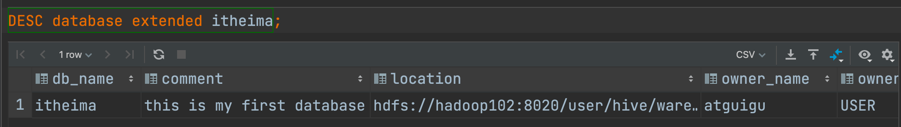
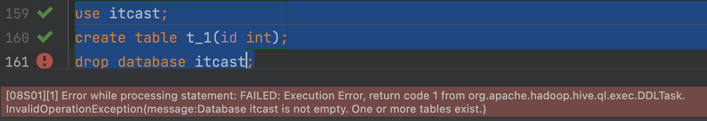
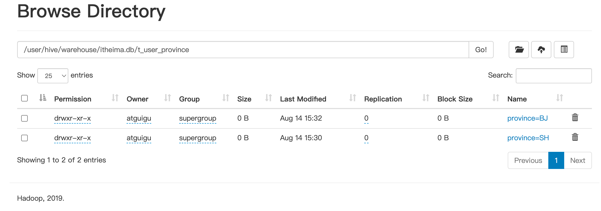
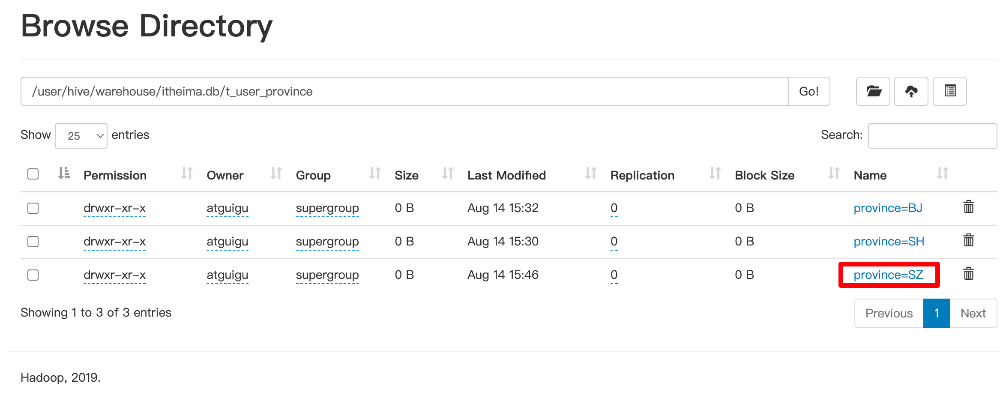
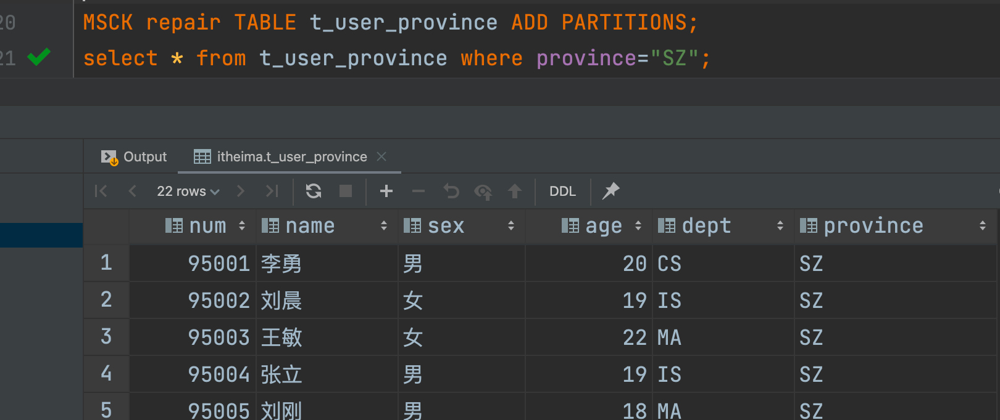
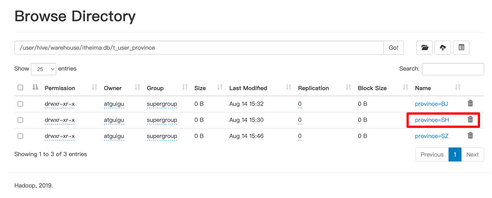
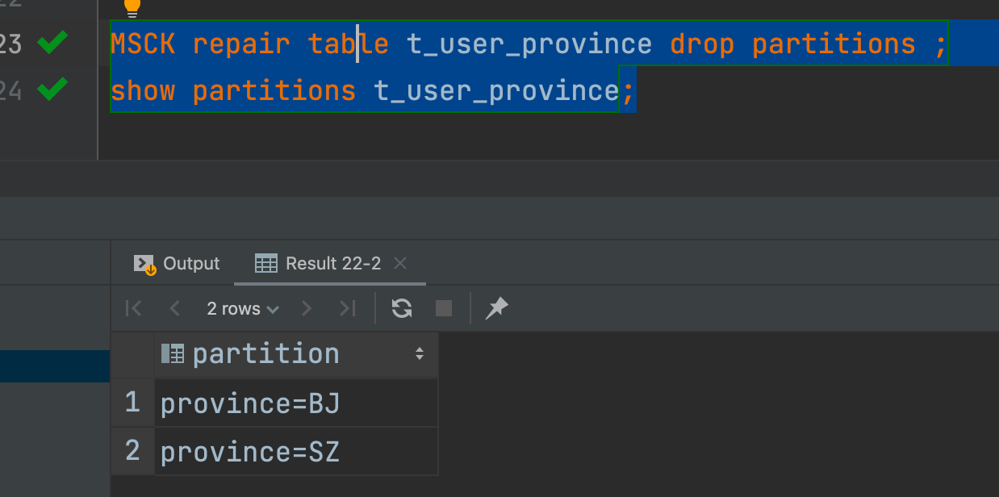

# 数据库DDL操作

## 创建数据库

### 语法

Hive中DATABASE的概念和RDBMS中类似，我们称之为数据库。在Hive中， DATABASE和SCHEMA是可互换的，使用DATABASE或SCHEMA都可以。

```hive
CREATE (DATABASE|SCHEMA) [IF NOT EXISTS] database_name 
[COMMENT database_comment] 
[LOCATION hdfs_path] 
[WITH DBPROPERTIES (property_name=property_value, ...)];
```

**COMMENT**：数据库的注释说明语句

**LOCATION**：指定数据库在HDFS存储位置，默认/user/hive/warehouse

**WITH DBPROPERTIES**：用于指定一些数据库的属性配置。


### 案例

```hive
create database if not exists itheima
comment "this is my first db"
with dbproperties ('createdBy'='AllenWoon');
```


## 查看数据库

### 语法

Hive中的**DESCRIBE DATABASE**语句用于显示Hive中数据库的名称，其注释（如果已设置）及其在文件系统上的位置等信息。

```hive
DESCRIBE DATABASE/SCHEMA [EXTENDED] db_name;
```

**EXTENDED**：用于显示更多信息。


### 案例




## 使用数据库

### 语法

Hive中的**USE** **DATABASE**语句用于选择特定的数据库,切换当前会话使用哪一个数据库进行操作。

```hive
USE database_name;
```


## 删除数据库

### 语法

Hive中的**DROP DATABASE**语句用于删除（删除）数据库。

默认行为是RESTRICT，这意味着仅在数据库为空时才删除它。要删除带有表的数据库，我们可以使用**CASCADE**。

```hive
DROP (DATABASE|SCHEMA) [IF EXISTS] database_name [RESTRICT|CASCADE];
```


### 用法




## 更改数据库

### 语法

Hive中的**ALTER DATABASE**语句用于更改与Hive中的数据库关联的元数据。

```hive
--更改数据库属性
ALTER (DATABASE|SCHEMA) database_name SET DBPROPERTIES (property_name=property_value, ...);

--更改数据库所有者
ALTER (DATABASE|SCHEMA) database_name SET OWNER [USER|ROLE] user_or_role;

--更改数据库位置
ALTER (DATABASE|SCHEMA) database_name SET LOCATION hdfs_path;
```


# Table DDL操作

## 查看表元数据信息

### 语法

Hive中的**DESCRIBE table**语句用于显示Hive中表的元数据信息。

```hive
describe formatted [db_name.]table_name; 
describe extended [db_name.]table_name;
```

如果指定了EXTENDED关键字，则它将以Thrift序列化形式显示表的所有元数据。

如果指定了FORMATTED关键字，则它将以表格格式显示元数据。


## 删除表

### 语法

DROP TABLE删除该表的元数据和数据。

如果已配置垃圾桶（且未指定PURGE），则该表对应的数据实际上将移动到.Trash/Current目录，而元数据完全丢失。删除EXTERNAL表时，该表中的数据不会从文件系统中删除，只删除元数据。

如果指定了PURGE，则表数据不会进入.Trash/Current目录，跳过垃圾桶直接被删除。

因此如果DROP失败，则无法挽回该表数据。


```hive
DROP TABLE [IF EXISTS] table_name [PURGE];    -- (Note: PURGE available in Hive 0.14.0 and later)
```


## 清空表

### 语法

从表中删除所有行。可以简单理解为清空表的所有数据但是保留表的元数据结构。

如果HDFS启用了垃圾桶，数据将被丢进垃圾桶，否则将被删除。

```hive
TRUNCATE [TABLE] table_name;
```


## 修改表信息

```hive
--1、更改表名
ALTER TABLE table_name RENAME TO new_table_name;

--2、更改表属性
ALTER TABLE table_name SET TBLPROPERTIES (property_name = property_value, ... );
--更改表注释
ALTER TABLE student SET TBLPROPERTIES ('comment' = "new comment for student table");

--3、更改SerDe属性
ALTER TABLE table_name SET SERDE serde_class_name [WITH SERDEPROPERTIES (property_name = property_value, ... )];
ALTER TABLE table_name [PARTITION partition_spec] SET SERDEPROPERTIES serde_properties;
ALTER TABLE table_name SET SERDEPROPERTIES ('field.delim' = ',');

--移除SerDe属性
ALTER TABLE table_name [PARTITION partition_spec] UNSET SERDEPROPERTIES (property_name, ... );

--4、更改表的文件存储格式 该操作仅更改表元数据。现有数据的任何转换都必须在Hive之外进行。
ALTER TABLE table_name  SET FILEFORMAT file_format;

--5、更改表的存储位置路径
ALTER TABLE table_name SET LOCATION "new location";

--6、更改列名称/类型/位置/注释
CREATE TABLE test_change (a int, b int, c int);
// First change column a's name to a1.
ALTER TABLE test_change CHANGE a a1 INT;
// Next change column a1's name to a2, its data type to string, and put it after column b.
ALTER TABLE test_change CHANGE a1 a2 STRING AFTER b;
// The new table's structure is:  b int, a2 string, c int.
// Then change column c's name to c1, and put it as the first column.
ALTER TABLE test_change CHANGE c c1 INT FIRST;
// The new table's structure is:  c1 int, b int, a2 string.
// Add a comment to column a1
ALTER TABLE test_change CHANGE a1 a1 INT COMMENT 'this is column a1';

--7、添加/替换列
--使用ADD COLUMNS，您可以将新列添加到现有列的末尾但在分区列之前。
--REPLACE COLUMNS 将删除所有现有列，并添加新的列集。
ALTER TABLE table_name ADD|REPLACE COLUMNS (col_name data_type,...);
```


# Partition DDL操作

## 添加分区

ADD PARTITION

add partition 会更改表元数据，但不会加载数据，如果分区位置不存在数据，查询时不会返回结果

因此要保证增加的分区位置路径下，数据已经存在，或者增加完分区后再倒入分区数据

```hive
1.增加分区
ALTER TABLE table_name ADD PARTITION (dt='20170101') location 'xxxxx'
-一次添加一个分区


ALTER TABLE table_name
ADD PARTITION (dt='2008-0808', country='us') location 'xxxxxx'
ADD PARTITION (dt='2008-0809', country='us') location 'xxxxxx'
```


案例+ 导入数据

```hive
ALTER TABLE t_user_province ADD PARTITION (province='BJ');
load data inpath '/hivedata/students.txt' into table t_user_province partition(province = 'BJ');
```


## 重命名分区

rename partition

```hive
--2、重命名分区
ALTER TABLE table_name PARTITION partition_spec RENAME TO PARTITION partition_spec;
ALTER TABLE table_name PARTITION (dt='2008-08-09') RENAME TO PARTITION (dt='20080809');
```


## 删除分区

删除表的分区。这将删除该分区的数据和元数据。

```hive
--3、删除分区
ALTER TABLE table_name DROP [IF EXISTS] PARTITION (dt='2008-08-08', country='us');
ALTER TABLE table_name DROP [IF EXISTS] PARTITION (dt='2008-08-08', country='us') PURGE; --直接删除数据 不进垃圾桶

```


## 修改分区

```hive
--5、修改分区
--更改分区文件存储格式
ALTER TABLE table_name PARTITION (dt='2008-08-09') SET FILEFORMAT file_format;
--更改分区位置
ALTER TABLE table_name PARTITION (dt='2008-08-09') SET LOCATION "new location";

```


## MSCK Partition

msck = metastore check

Hive将每个表的分区列表信息存储在其metastore中。但是，如果将新分区直接添加到HDFS（例如通过使用hadoop fs -put命令）或从HDFS中直接删除分区文件夹，则除非用户ALTER TABLE table_name ADD/DROP PARTITION在每个新添加的分区上运行命令，否则metastore（也就是Hive）将不会意识到分区信息的这些更改。MSCK是metastore check的缩写，表示元数据检查操作，可用于元数据的修复。

```hive
--4、修复分区
MSCK [REPAIR] TABLE table_name [ADD/DROP/SYNC PARTITIONS];
```


MSCK默认行为ADD PARTITIONS，使用此选项，它将把HDFS上存在但元存储中不存在的所有分区添加到metastore。

DROP PARTITIONS选项将从已经从HDFS中删除的metastore中删除分区信息。

SYNC PARTITIONS选项等效于调用ADD和DROP PARTITIONS。

如果存在大量未跟踪的分区，则可以批量运行MSCK REPAIR TABLE，以避免OOME（内存不足错误）。

```hive
--4、修复分区
MSCK [REPAIR] TABLE table_name [ADD/DROP/SYNC PARTITIONS];
```


### 案例

**创建一张分区表，直接使用HDFS命令在表文件夹下创建分区文件夹并上传数据，此时在Hive中查询是无法显示表数据的，因为metastore中没有记录，使用MSCK ADD PARTITIONS进行修复。**




新建一个分区 把数据硬传上去



直接修复




**针对分区表，直接使用HDFS命令删除分区文件夹，此时在Hive中查询显示分区还在，因为metastore中还没有被删除，使用MSCK DROP PARTITIONS进行修复。**



删除这个

进行修复




# Show 语句

Show相关的语句提供了一种查询Hive metastore的方法。可以帮助用户查询相关信息。比如我们最常使用的查询当前数据库下有哪些表 show tables.

## 显示所有数据库

SCHEMAS和DATABASES的用法 功能一样

```
show databases;
show schemas;
```

## 显示当前数据库所有表/视图/物化视图/分区/索引

```
show tables;
SHOW TABLES [IN database_name]; --指定某个数据库
```

## 显示当前数据库下所有视图

```
Show Views;
SHOW VIEWS 'test_*'; -- show all views that start with "test_"
SHOW VIEWS FROM test1; -- show views from database test1
SHOW VIEWS [IN/FROM database_name];
```

## 显示当前数据库下所有物化视图

```
SHOW MATERIALIZED VIEWS [IN/FROM database_name];
```

## 显示表分区信息

分区按字母顺序列出，不是分区表执行该语句会报错

```
show partitions table_name;
show partitions itheima.student_partition;
```

## 显示表/分区的扩展信息

```
SHOW TABLE EXTENDED [IN|FROM database_name] LIKE table_name;
show table extended like student;
describe formatted itheima.student;
```

## 显示表的属性信息

```
SHOW TBLPROPERTIES table_name;
show tblproperties student;
```

## 显示表、视图的创建语句

```
SHOW CREATE TABLE ([db_name.]table_name|view_name);
show create table student;
```

## 显示表中的所有列，包括分区列。

```
SHOW COLUMNS (FROM|IN) table_name [(FROM|IN) db_name];
show columns  in student;
```

## 显示当前支持的所有自定义和内置的函数

```
show functions;
```

Describe desc

## 查看表信息

```
desc extended table_name;
```

## 查看表信息（格式化美观）

```
desc formatted table_name;
```

## 查看数据库相关信息

```
describe database database_name;
```

