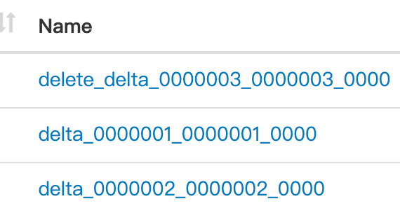
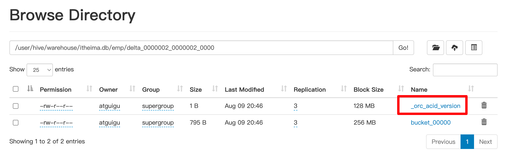
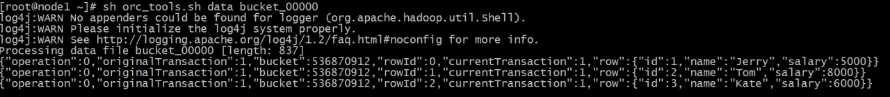
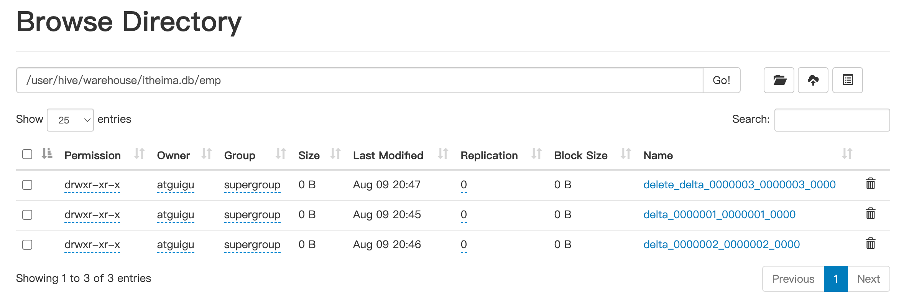

# 实现原理

Hive的文件是存储在HDFS上的，而HDFS上又不支持对文件的任意修改

只能是采取另外的手段来完成。用HDFS文件作为原始数据（基础数据），用delta保存事务操作的记录**增量数据**

正在执行中的事务，是以一个staging开头的文件夹维护的，执行结束就是delta文件夹。

每次执行一次事务操作都会有这样的一个delta增量文件夹;

当访问Hive数据时，根据HDFS原始文件和delta增量文件做合并，查询最新的数据。


INSERT语句会直接创建delta目录

DELETE目录的前缀是 delete_delta

UPDATE语句采用了split-update特性，**先删除 后插入**


## delta文件夹命名格式



**delta_minWID_maxWID_stmtID**

即delta前缀、写事务的ID范围、以及语句ID；

删除时前缀是delete_delta，里面包含了要删除的文件；

Hive会为写事务（INSERT、DELETE等）创建一个写事务ID（Write ID），该ID在表范围内唯一；

语句ID（Statement ID）则是当一个事务中有多条写入语句时使用的，用作唯一标识。


## delta文件夹里

每个事务的delta文件夹下，都有两个文件

### _orc_acid_version

内容是2,即当前ACID版本号是2。和版本1的主要区别是UPDATE语句采用了split-update特性，即先删除、后插入。这个文件不是ORC文件，可以下载下来直接查看。



### bucket_00000

bucket_00000文件则是写入的数据内容。如果事务表没有分区和分桶，就只有一个这样的文件。文件都以ORC格式存储，底层二级制，需要使用ORC TOOLS查看，详见附件资料。



**operation：**0 表示插入，1 表示更新，2 表示删除。由于使用了split-update，UPDATE是不会出现的，所以delta文件中的operation是0 ， delete_delta 文件中的operation是2。

**originalTransaction、currentTransaction：**该条记录的原始写事务ID，当前的写事务ID。

**rowId：**一个自增的唯一ID，在写事务和分桶的组合中唯一。

**row：**具体数据。对于DELETE语句，则为null，对于INSERT就是插入的数据，对于UPDATE就是更新后的数据。


## 合并器(Compactor)

随着表的修改操作，创建了越来越多的delta增量文件，就需要合并以保持足够的性能。

合并器Compactor是一套在Hive Metastore内运行，支持ACID系统的后台进程。

所有合并都是在后台完成的，不会阻止数据的并发读、写。

合并后，系统将等待所有旧文件的读操作完成后，删除旧文件。

合并操作分为两种，minor compaction（小合并）、major compaction（大合并）：

小合并会将一组delta增量文件重写为单个增量文件，默认触发条件为10个delta文件；（只针对delta）

大合并将一个或多个增量文件和基础文件重写为新的基础文件，默认触发条件为delta文件相应于基础文件占比，10%。（重写新文件）


# 事务表

## 局限性

虽然Hive支持了具有ACID语义的事务，但是在使用起来，并没有像在MySQL中使用那样方便，有很多限制；

1.尚不支持BEGIN，COMMIT和ROLLBACK，所有语言操作都是自动提交的；

2.表文件存储格式仅支持ORC（STORED AS ORC）；

3.需要配置参数开启事务使用；

4.外部表无法创建为事务表，因为Hive只能控制元数据，无法管理数据；

5.表属性参数transactional必须设置为true；

6.必须将Hive事务管理器设置为org.apache.hadoop.hive.ql.lockmgr.DbTxnManager才能使用ACID表；

7.事务表不支持LOAD DATA ...语句。


## 设置参数

Client端：

```hive
--可以使用set设置当前session生效 也可以配置在hive-site.xml中）
set hive.support.concurrency = true; --Hive是否支持并发
set hive.enforce.bucketing = true; --从Hive2.0开始不再需要  是否开启分桶功能
set hive.exec.dynamic.partition.mode = nonstrict; --动态分区模式  非严格
set hive.txn.manager = org.apache.hadoop.hive.ql.lockmgr.DbTxnManager;
```


服务端：

```hive
set hive.compactor.initiator.on = true; --是否在Metastore实例上运行启动压缩合并
set hive.compactor.worker.threads = 1; --在此metastore实例上运行多少个合并程序工作线程。
```


## 案例

```hive
--Hive中事务表的创建使用
--1、开启事务配置（可以使用set设置当前session生效 也可以配置在hive-site.xml中）
set hive.support.concurrency = true; --Hive是否支持并发
set hive.enforce.bucketing = true; --从Hive2.0开始不再需要  是否开启分桶功能
set hive.exec.dynamic.partition.mode = nonstrict; --动态分区模式  非严格
set hive.txn.manager = org.apache.hadoop.hive.ql.lockmgr.DbTxnManager; --
set hive.compactor.initiator.on = true; --是否在Metastore实例上运行启动压缩合并
set hive.compactor.worker.threads = 1; --在此metastore实例上运行多少个压缩程序工作线程。


--事务表的创建
CREATE TABLE emp (id int, name string, salary int)
STORED AS ORC TBLPROPERTIES ('transactional' = 'true');

--事务表 insert  -->delta文件
INSERT INTO emp VALUES
(1, 'Jerry', 5000),
(2, 'Tom',   8000),
(3, 'Kate',  6000);

select * from emp;

--再次insert  --->delta文件
INSERT INTO emp VALUES(4, 'Allen', 8000);

--执行delete --> delete-delta文件
delete from emp where id =2;

--显示有关当前运行的压缩和最近的压缩历史
Show Compactions;

```





# UpdateDelete操作

## 概述

Hive是基于Hadoop的数据仓库，是面向分析支持分析工具。

将已有的结构化数据文件映射成为表，然后提供SQL分析数据的能力。

因此在Hive中常见的操作就是分析查询select操作。

Hive早期是不支持update和delete语法的，因为Hive所处理的数据都是已经存在的的数据、历史数据。

后续Hive支持了相关的update和delete操作，不过有很多约束。详见Hive事务的支持。


## 案例

update delete 一定是事务表才行


```hive
--Hive中事务表的创建使用
--1、开启事务配置（可以使用set设置当前session生效 也可以配置在hive-site.xml中）
set hive.support.concurrency = true; --Hive是否支持并发
set hive.enforce.bucketing = true; --从Hive2.0开始不再需要  是否开启分桶功能
set hive.exec.dynamic.partition.mode = nonstrict; --动态分区模式  非严格
set hive.txn.manager = org.apache.hadoop.hive.ql.lockmgr.DbTxnManager; --
set hive.compactor.initiator.on = true; --是否在Metastore实例上运行启动压缩合并
set hive.compactor.worker.threads = 1; --在此metastore实例上运行多少个压缩程序工作线程。


--2.创建Hive事务表
create table trans_student(
    id int,
    name String,
    age int
)stored as orc TBLPROPERTIES('transactional'='true');
describe formatted trans_student;

--3、针对事务表进行insert update delete操作
insert into trans_student (id, name, age)
values (1,"allen",18);

select *
from trans_student;

describe formatted trans_student;

update trans_student
set age = 20
where id = 1;

delete from trans_student where id =1;

select *
from trans_student;


show tables;

select * from student_local;

update student_local
set  age= 35
where num =95001;
```

