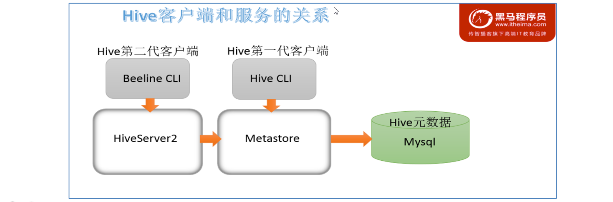
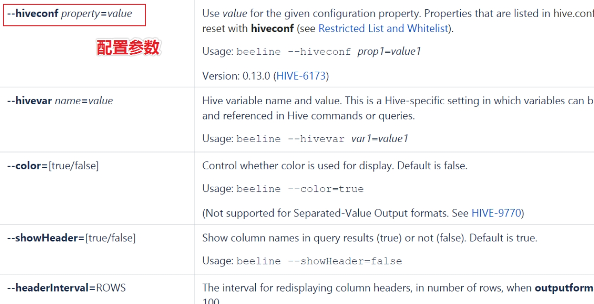
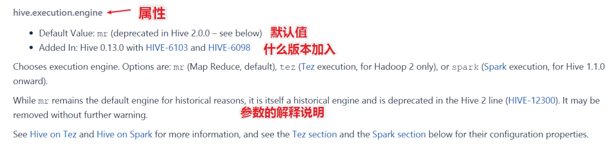

# CLIs and Commands

## Hive CLI

$HIVE_HOME/bin/hive是一个shellUtil,通常称之为hive的第一代客户端或者旧客户端，主要功能有两个：

一：用于以**交互式**或**批处理模式**运行**Hive查询**，注意，此时作为客户端，需要并且能够访问的是Hive metastore服务，而不是hiveserver2服务。

二：用于hive相关**服务的启动**，比如metastore服务。


### **Batch Mode 批处理模式**

​		当使用**-e或-f选项**运行$ HIVE_HOME / bin / hive时，它将以批处理模式执行SQL命令。所谓的批处理可以理解为一次性执行，执行完毕退出。


-e 后面衔接一个sql语句 执行完退出

-f 衔接一个sql文件并批量执行

```shell
$HIVE_HOME/bin/hive -f /root/hive.sql
```

-i 进入交互模式前运行初始化脚本

-S -e 执行语句后的输出到文件里

```shell
$HIVE_HOME/bin/hive -S -e 'select * from itheima.student' > a.txt
```


### Interactive Shell 交互式模式

​		所谓交互式模式可以理解为客户端和hive服务一直保持连接，除非手动退出客户端。


### 启动Hive服务

比如启动metastore服务和hiveserver2服务的启动

```shell
$HIVE_HOME/bin/hive --hiveconf hive.root.logger=DEBUG,console

$HIVE_HOME/bin/hive --service metastore
$HIVE_HOME/bin/hive --service hiveserver2
```


## Beeline CLI

$HIVE_HOME/**bin/beeline**被称之为第二代客户端或者新客户端，是一个JDBC客户端，是官方强烈推荐使用的Hive命令行工具，和第一代客户端相比，性能加强安全性提高。Beeline在嵌入式模式和远程模式下均可工作。

在嵌入式模式下，它运行嵌入式Hive(类似于Hive CLI)；

**远程模式下beeline通过Thrift连接到单独的HiveServer2服务上**，这也是官方推荐在生产环境中使用的模式。



beeline支持的参数非常多，可以通过官方文档进行查询

[https://cwiki.apache.org/confluence/display/Hive/HiveServer2+Clients#HiveServer2Clients-Beeline%E2%80%93NewCommandLineShell](https://cwiki.apache.org/confluence/display/Hive/HiveServer2+Clients%23HiveServer2Clients-Beeline–NewCommandLineShell)





常见的使用方式如下所示，在启动hiveserver2服务的前提下使用beeline远程连接：


```shell
[root@node3 ~]# /export/server/hive/bin/beeline 
Beeline version 3.1.2 by Apache Hive
beeline> ! connect jdbc:hive2://node1:10000
Connecting to jdbc:hive2://node1:10000
Enter username for jdbc:hive2://node1:10000: root
Enter password for jdbc:hive2://node1:10000: 
Connected to: Apache Hive (version 3.1.2)
Driver: Hive JDBC (version 3.1.2)
Transaction isolation: TRANSACTION_REPEATABLE_READ
0: jdbc:hive2://node1:10000>
```

登陆的用户需要有hdfs访问权限


# Configuration Properties配置属性

​		Hive作为一款复杂的数据仓库软件，除了一些默认的属性行为之外，还支持用户配置属性进行修改，使得在某些场景下满足用户的需求。

​		作为用户我们需要掌握两件事：

​		一是：Hive有哪些属性支持修改，修改了有什么功能；

​		二是：Hive支持哪种方式进行修改，修改是临时生效还是永久生效的。

**Hive配置属性的规范列表是在**HiveConf.Java类中管理的，因此请参考该HiveConf.java文件，以获取Hive当前使用的发行版中可用的配置属性的完整列表。

从Hive 0.14.0开始，会从HiveConf.java类中直接生成配置模板文件hive-default.xml.template，它是当前版本配置及其默认值的可靠来源。

详细的配置参数大全可以参考Hive官网配置参数，在页面使用ctrl+f进行搜索。

https://cwiki.apache.org/confluence/display/Hive/Configuration+Properties




## Hive-site.xml

​		在$HIVE_HOME/conf路径下，可以添加一个hive-site.xml文件，把需要定义修改的配置属性添加进去，这个配置文件会影响到这个Hive安装包的任何一种服务启动、客户端使用方式，可以理解为是Hive的全局配置。

​		比如我们指定使用MySQL作为Hive元数据的存储介质，那么就需要把Hive连接MySQL的相关属性配置在hive-site.xml文件中，这样不管是本地模式还是远程模式启动，不管客户端本地连接还是远程连接，都将访问同一个元数据存储介质，大家使用的元数据都是一致的。


## hiveconf命令行参数

​		hiveconf是一个命令行的参数，用于在使用Hive CLI或者Beeline CLI的时候指定配置参数。这种方式的配置在整个的会话session中有效，会话结束，失效。

​		比如在启动hive服务的时候，为了更好的查看启动详情，可以通过hiveconf参数修改日志级别：

```
$HIVE_HOME/bin/hive --hiveconf hive.root.logger=DEBUG,console
```


## set命令

​		在Hive CLI或Beeline中使用set命令为set命令之后的所有SQL语句设置配置参数，这个也是会话级别的。

​		这种方式也是用户日常开发中使用最多的一种配置参数方式。因为Hive倡导一种：谁需要、谁配置、谁使用的一种思想，避免你的属性修改影响其他用户的修改。

```
#启用hive动态分区，需要在hive会话中设置两个参数：
set hive.exec.dynamic.partition=true;
set hive.exec.dynamic.partition.mode=nonstrict;
```


## 服务特定配置文件

​		您可以设置特定metastore的配置值hivemetastore-site.xml中，并在HiveServer2特定的配置值hiveserver2-site.xml中。

​		Hive Metastore服务器读取$ HIVE_CONF_DIR或类路径中可用的hive-site.xml以及hivemetastore-site.xml配置文件。

​		HiveServer2读取$ HIVE_CONF_DIR或类路径中可用的hive-site.xml以及hiveserver2-site.xml。

​		如果HiveServer2以嵌入式模式使用元存储，则还将加载hivemetastore-site.xml。


## 总结

配置文件的优先顺序如下，后面的优先级越高：

​		hive-site.xml-> hivemetastore-site.xml-> hiveserver2-site.xml->' -hiveconf'命令行参数

从Hive 0.14.0开始，会从HiveConf.java类中直接生成配置模板文件hive-default.xml.template，它是当前版本配置变量及其默认值的可靠来源。

​		hive-default.xml.template 位于安装根目录下的conf目录中，并且 hive-site.xml 也应在同一目录中创建。

从 Hive 0.14.0开始， 您可以使用SHOW CONF命令显示有关配置变量的信息。


配置方式的优先级顺序，优先级依次递增：

​		set参数生命>hiveconf命令行参数>hive-site.xml配置文件。

即set参数声明覆盖命令行参数hiveconf，命令行参数覆盖配置文件hive-site.xml设定。


**日常的开发使用中，如果不是核心的需要全局修改的参数属性，建议大家使用set命令进行设置。**

另外，Hive也会读入Hadoop的配置，因为Hive是作为Hadoop的客户端启动的，Hive的配置会覆盖Hadoop的配置。