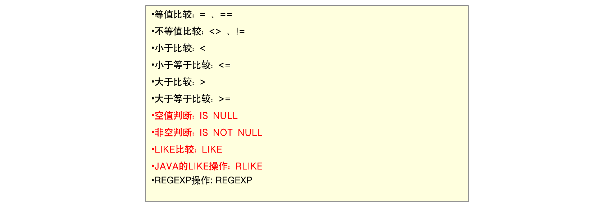
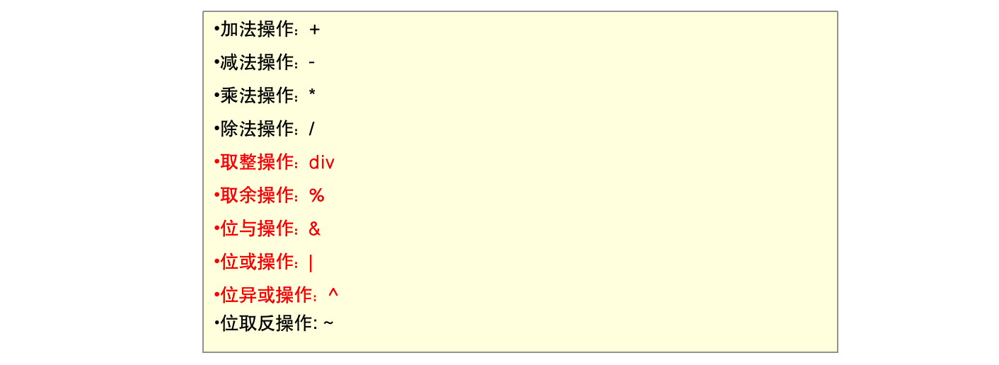
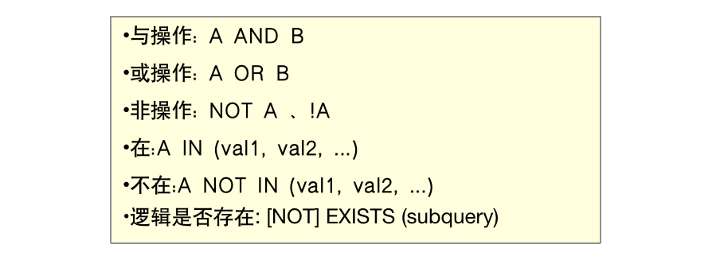

# 概述

整体上，Hive支持的运算符可以分为三大类：关系运算、算术运算、逻辑运算。


## 查看说明

官方参考文档：https://cwiki.apache.org/confluence/display/Hive/LanguageManual+UDF也可以使用下述方式查看运算符的使用方式。

```HIVE
--显示所有的函数和运算符
show functions;

--查看运算符或者函数的使用说明
describe function count;

--使用extended 可以查看更加详细的使用说明
describe function extended count;
```


## 测试环境准备

在Hive中创建一个空表dual，用于测试各种运算符的功能。

```hive
--1、创建表dual
create table dual(id string);

--2、加载一个文件dual.txt到dual表中
--dual.txt只有一行内容：内容为一个空格
load data inpath '/hivedata/dual.txt' into table dual;

--3、在select查询语句中使用dual表完成运算符、函数功能测试
select 1+1 from dual;
```


# 关系运算符

关系运算符是二元运算符，执行的是两个操作数的比较运算。

每个关系运算符都返回boolean类型结果（TRUE或FALSE）。



```Hive
--1、Hive中关系运算符
--is null空值判断
select 1 from dual where 'itcast' is null; 空

--is not null 非空值判断
select 1 from dual where 'itcast' is not null; 1

--like比较： _表示任意单个字符 %表示任意数量字符
--否定比较： NOT A like B
select 1 from dual where 'itcast' like 'it_'; 空 (判断是不是有关系 单语法不对)
select 1 from dual where 'itcast' like 'it%'; 1
select 1 from dual where not 'itcast' like 'hadoo_';  1 (判断是不是没关系)

--rlike：确定字符串是否匹配正则表达式，是REGEXP_LIKE()的同义词。
select 1 from dual where 'itcast' rlike '^i.*t$';
select 1 from dual where '123456' rlike '^\\d+$';  --判断是否全为数字
select 1 from dual where '123456aa' rlike '^\\d+$';

--regexp：功能与rlike相同 用于判断字符串是否匹配正则表达式
select 1 from dual where 'itcast' regexp '^i.*t$';

```


# 算数运算符

算术运算符操作数必须是数值类型。 

分为一元运算符和二元运算符： 一元运算符,只有一个操作数; 

二元运算符有两个操作数,运算符在两个操作数之间。



```
--2、Hive中算术运算符
--取整操作: div  给出将A除以B所得的整数部分。例如17 div 3得出5。
select 17 div 3;

--取余操作: %  也叫做取模  A除以B所得的余数部分
select 17 % 3;

--位与操作: &  A和B按位进行与操作的结果。 与表示两个都为1则结果为1
select 4 & 8 from dual;  --4转换二进制：0100 8转换二进制：1000
select 6 & 4 from dual;  --4转换二进制：0100 6转换二进制：0110
--位或操作: |  A和B按位进行或操作的结果  或表示有一个为1则结果为1
select 4 | 8 from dual;
select 6 | 4 from dual;
--位异或操作: ^ A和B按位进行异或操作的结果 异或表示两个不同则结果为1select 4 ^ 8 from dual;
select 6 ^ 4 from dual;

```


# 逻辑运算符



```Hive
--3、Hive逻辑运算符
--与操作: A AND B   如果A和B均为TRUE，则为TRUE，否则为FALSE。如果A或B为NULL，则为NULL。
select 1 from dual where 3>1 and 2>1;

--或操作: A OR B   如果A或B或两者均为TRUE，则为TRUE，否则为FALSE。
select 1 from dual where 3>1 or 2!=2;
--非操作: NOT A 、!A   如果A为FALSE，则为TRUE；如果A为NULL，则为NULL。否则为FALSE。
select 1 from dual where not 2>1;
select 1 from dual where !2=1;

--在:A IN (val1, val2, ...)  如果A等于任何值，则为TRUE。
select 1 from dual where 11 in(11,22,33);
--不在:A NOT IN (val1, val2, ...) 如果A不等于任何值，则为TRUE
select 1 from dual where 11 not in(22,33,44);

```


[NOT] EXISTS 

语法：SELECT … FROM table WHERE [NOT] EXISTS (subquery)

功能：将主查询的数据，放到子查询中做条件验证，根据验证结果（TRUE 或 FALSE）来决定主查询的数据结果是否得以保留。

```
--逻辑是否存在: [NOT] EXISTS (subquery)
--将主查询的数据，放到子查询中做条件验证，根据验证结果（TRUE 或 FALSE）来决定主查询的数据结果是否得以保留。
select A.* from A
where exists (select B.id from B where A.id = B.id);
```


# 其他运算符

**字符串拼接**


**复杂类型构造**


**复杂类型取值操作**


