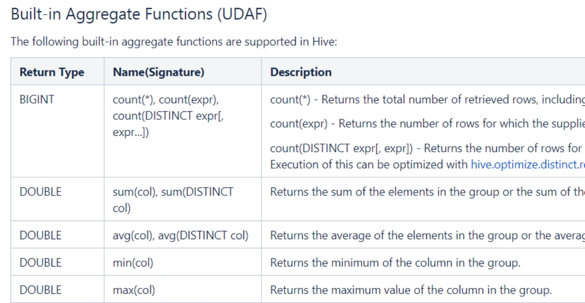
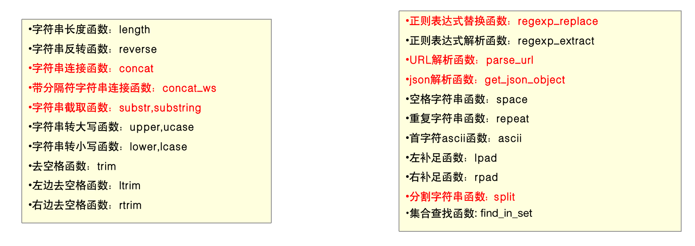
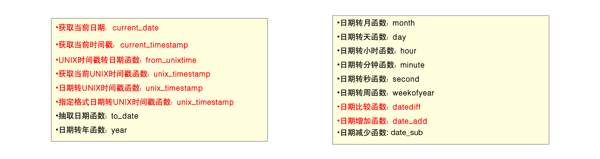
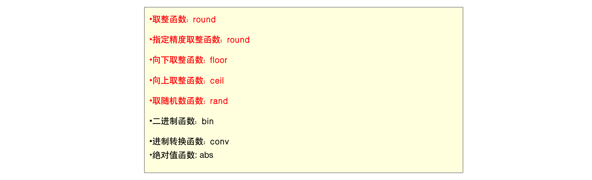
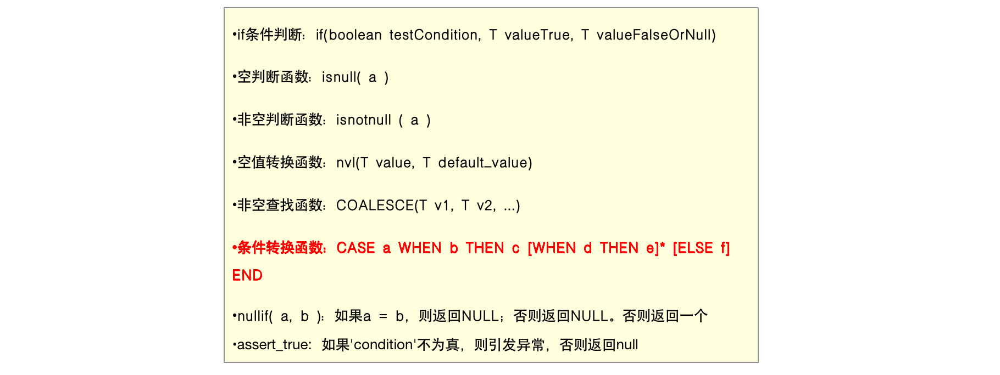
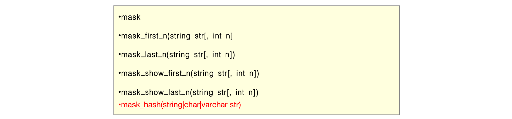
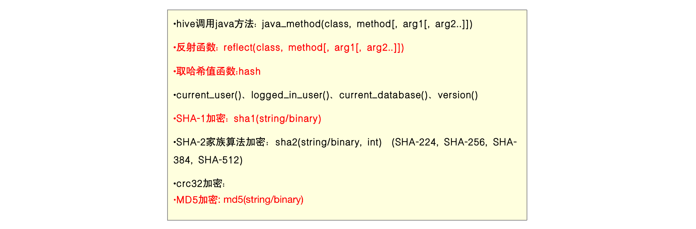
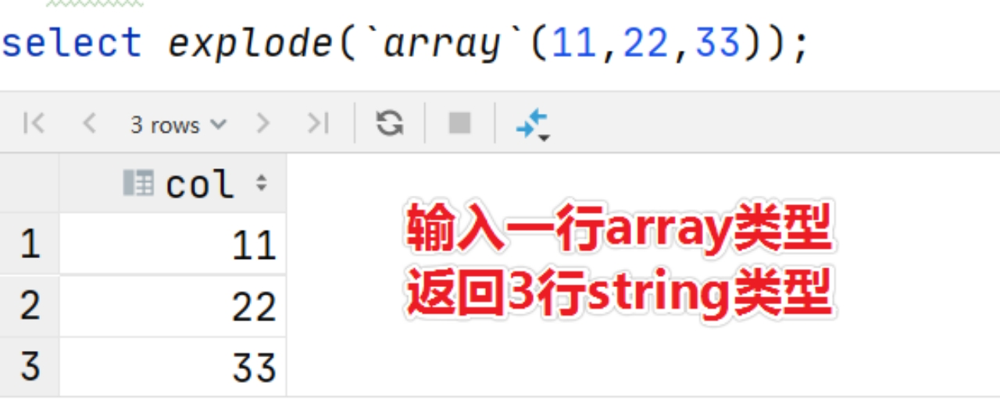
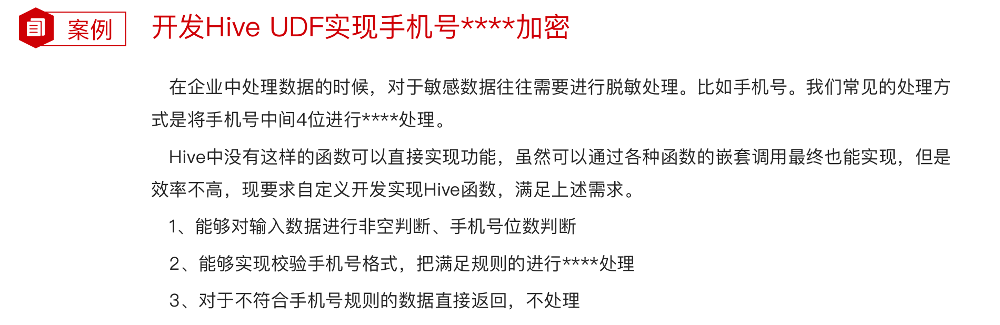
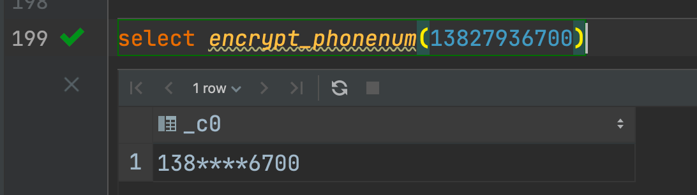

# 概述

Hive内建了不少函数，用于满足用户不同使用需求，提高SQL编写效率：

使用**show functions**查看当下可用的所有函数

通过**describe function extended funcname**来查看函数的使用方式。


## 分类标准

Hive的函数分为两大类：

**内置函数**（Built-in Functions）、**用户定义函数UDF**（User-Defined Functions）

内置函数可分为：数值类型函数、日期类型函数、字符串类型函数、集合函数、条件函数等

用户定义函数根据输入输出的行数可分为3类：UDF、UDAF、UDTF


## 用户自定义分类标准


UDF分类标准本来针对的是用户自己编写开发实现的函数。

UDF分类标准可以扩大到Hive的所有函数中：包括内置函数和用户自定义函数。


比如Hive官方文档中，针对聚合函数的标准就是内置的UDAF类型。




# 内置函数

内置函数（build-in）指的是Hive开发实现好，直接可以使用的函数,也叫做内建函数。

官方文档地址：https://cwiki.apache.org/confluence/display/Hive/LanguageManual+UDF

内置函数根据应用归类整体可以分为8大种类型，我们将对其中重要的，使用频率高的函数使用进行详细讲解。


## 字符串函数



```HIVE
------------String Functions 字符串函数------------
select concat("angela","baby");
--带分隔符字符串连接函数：concat_ws(separator, [string | array(string)]+)
select concat_ws('.', 'www', array('itcast', 'cn'));

--字符串截取函数：substr(str, pos[, len]) 或者  substring(str, pos[, len])
select substr("angelababy",-2); --pos是从1开始的索引，如果为负数则倒着数
select substr("angelababy",2,2);

--正则表达式替换函数：regexp_replace(str, regexp, rep)
select regexp_replace('100-200', '(\\d+)', 'num');

--正则表达式解析函数：regexp_extract(str, regexp[, idx]) 提取正则匹配到的指定组内容
select regexp_extract('100-200', '(\\d+)-(\\d+)', 2);

--URL解析函数：parse_url 注意要想一次解析出多个 可以使用parse_url_tuple这个UDTF函数
select parse_url('http://www.itcast.cn/path/p1.php?query=1', 'HOST');

--分割字符串函数: split(str, regex)
select split('apache hive', '\\s+');

--json解析函数：get_json_object(json_txt, path
--$表示json对象
select get_json_object('[{"website":"www.itcast.cn","name":"allenwoon"}, {"website":"cloud.itcast.com","name":"carbondata 中文文档"}]', '$.[1].website');
```


## 日期函数



```Hive
----------- Date Functions 日期函数 -----------------
--获取当前日期: current_date
select current_date();

--获取当前时间戳: current_timestamp
--同一查询中对current_timestamp的所有调用均返回相同的值。
select current_timestamp();

--获取当前UNIX时间戳函数: unix_timestamp
select unix_timestamp();

--日期转UNIX时间戳函数: unix_timestamp
select unix_timestamp("2011-12-07 13:01:03");

--指定格式日期转UNIX时间戳函数: unix_timestamp
select unix_timestamp('20111207 13:01:03','yyyyMMdd HH:mm:ss');

--UNIX时间戳转日期函数: from_unixtime
select from_unixtime(1618238391);
select from_unixtime(0, 'yyyy-MM-dd HH:mm:ss');

--日期比较函数: datediff  日期格式要求'yyyy-MM-dd HH:mm:ss' or 'yyyy-MM-dd'
select datediff('2012-12-08','2012-05-09');

--日期增加函数: date_add
select date_add('2012-02-28',10);

--日期减少函数: date_sub
select date_sub('2012-01-1',10);
```


## 数学函数



```hive
----Mathematical Functions 数学函数-------------
--取整函数: round  返回double类型的整数值部分 （遵循四舍五入）
select round(3.1415926);

--指定精度取整函数: round(double a, int d) 返回指定精度d的double类型
select round(3.1415926,4);

--向下取整函数: floor
select floor(3.1415926);
select floor(-3.1415926);

--向上取整函数: ceil
select ceil(3.1415926);
select ceil(-3.1415926);

--取随机数函数: rand 每次执行都不一样 返回一个0到1范围内的随机数
select rand();

--指定种子取随机数函数: rand(int seed) 得到一个稳定的随机数序列
select rand(2);
```


## 集合函数

```hive
-------Collection Functions 集合函数--------------
describe function extended sort_array;

--集合元素size函数: size(Map<K.V>) size(Array<T>)
select size(`array`(11,22,33));
select size(`map`("id",10086,"name","zhangsan","age",18));

--取map集合keys函数: map_keys(Map<K.V>)
select map_keys(`map`("id",10086,"name","zhangsan","age",18));

--取map集合values函数: map_values(Map<K.V>)
select map_values(`map`("id",10086,"name","zhangsan","age",18));

--判断数组是否包含指定元素: array_contains(Array<T>, value)
select array_contains(`array`(11,22,33),11);
select array_contains(`array`(11,22,33),66);

--数组排序函数:sort_array(Array<T>)
select sort_array(`array`(12,2,32));
```


## 条件函数

主要用于条件判断、逻辑判断转换这样的场合



```Hive
-----Conditional Functions 条件函数------------------
describe function extended assert_true;
--使用之前课程创建好的student表数据
select * from student limit 3;

--if条件判断: if(boolean testCondition, T valueTrue, T valueFalseOrNull)
select if(1=2,100,200);
select if(sex ='男','M','W') from student limit 3;

--空判断函数: isnull( a )
select isnull("allen");
select isnull(null);

--非空判断函数: isnotnull ( a )
select isnotnull("allen");
select isnotnull(null);

--空值转换函数: nvl(T value, T default_value) 把空值转换为一个指定的默认值
select nvl("allen","itcast");
select nvl(null,"itcast");

--非空查找函数: COALESCE(T v1, T v2, ...)
--返回参数中的第一个非空值；如果所有值都为NULL，那么返回NULL
select COALESCE(null,11,22,33);
select COALESCE(null,null,null,33);
select COALESCE(null,null,null);

--条件转换函数: CASE a WHEN b THEN c [WHEN d THEN e]* [ELSE f] END 有点类似switch
select case 100 when 50 then 'tom' when 100 then 'mary' else 'tim' end；
select case sex when '男' then 'male' else 'female' end from student limit 3;

--nullif( a, b ):
-- 果a = b，则返回NULL，否则返回一个
select nullif(11,11);
select nullif(11,12);

--assert_true(condition)
--如果'condition'不为真，则引发异常，否则返回null
SELECT assert_true(11 >= 0);
SELECT assert_true(-1 >= 0);

```


## 类型转换函数

主要用于显式的数据类型转换：

前提是要满足转换

```Hive
----Type Conversion Functions 类型转换函数-----------------
describe function extended cast;

--任意数据类型之间转换:cast
select cast(12.14 as bigint);
select cast(12.14 as string);
```


## 数据脱敏函数

主要完成对数据脱敏转换功能，屏蔽原始数据



```Hive
----Data Masking Functions 数据脱敏函数------------
describe function extended mask;

--mask
--将查询回的数据，大写字母转换为X，小写字母转换为x，数字转换为n。
select mask("abc123DEF");
select mask("abc123DEF",'-','.','^'); --自定义替换的字母

--mask_first_n(string str[, int n]
--对前n个进行脱敏替换
select mask_first_n("abc123DEF",4);

--mask_last_n(string str[, int n])
select mask_last_n("abc123DEF",4);

--mask_show_first_n(string str[, int n])
--除了前n个字符，其余进行掩码处理
select mask_show_first_n("abc123DEF",4);

--mask_show_last_n(string str[, int n])
select mask_show_last_n("abc123DEF",4);

--mask_hash(string|char|varchar str)
--返回字符串的hash编码。
select mask_hash("abc123DEF");

```


## 杂项函数



```Hive
----- Misc. Functions 其他杂项函数---------------
describe function extended surrogate_key;

--如果你调用的java方法所在的jar包不是hive自带的，可以使用add jar添加进来
--hive调用java方法: java_method(class, method[, arg1[, arg2..]])
select java_method("java.lang.Math","max",11,22);

--反射函数: reflect(class, method[, arg1[, arg2..]])
select reflect("java.lang.Math","max",11,22);

--取哈希值函数:hash
select hash("allen");

--current_user()、logged_in_user()、current_database()、version()

--SHA-1加密: sha1(string/binary)
select sha1("allen");

--SHA-2家族算法加密：sha2(string/binary, int)  (SHA-224, SHA-256, SHA-384, SHA-512)
select sha2("allen",224);
select sha2("allen",512);

--crc32加密:
select crc32("allen");

--MD5加密: md5(string/binary)
select md5("allen");
```


# 用户自定义函数

用户自定义函数简称UDF，源自于英文user-defined function。

根据函数输入输出的行数可以分为3类，分别是：

UDF（User-Defined-Function）普通函数，一进一出

UDAF（User-Defined Aggregation Function）聚合函数，多进一出

UDTF（User-Defined Table-Generating Functions）表生成函数，一进多出


## UDF普通函数

UDF 普通函数特点是一进一出，也就是输入一行输出一行。

比如round这样的取整函数，接收一行数据，输出的还是一行数据。


## UDAF聚合函数

UDAF 聚合函数，A所代表的单词就是Aggregation聚合的意思。多进一出，也就是输入多行输出一行。

比如count、sum这样的函数。


```HIve
select sex from student;

select collect_set(sex) from student;
select collect_list(sex) from student;
```


## UDTF表生成函数

UDTF 表生成函数，T所代表的单词是Table-Generating表生成的意思。

特点是一进多出，也就是输入一行输出多行。

这类型的函数作用返回的结果类似于表，同时，UDTF函数也是我们接触比较少的函数。比如explode函数。




# UDF自定义案例




## 实现步骤

写一个java类，继承UDF，并重载evaluate方法，方法中实现函数的业务逻辑；

重载意味着可以在一个java类中实现多个函数功能；

程序打成jar包，上传HS2服务器本地或者HDFS;

客户端命令行中添加jar包到Hive的classpath： hive>add JAR /xxxx/udf.jar;

注册成为临时函数（给UDF命名）：create temporary function 函数名 as 'UDF类全路径';HQL中使用函数。


## 开发环境准备

IDEA中创建Maven工程，添加下述pom依赖，用于开发Hive UDF；

完整pom.xml请参考课程附件资料

```xml
<dependencies>
    <dependency>
        <groupId>org.apache.hive</groupId>
        <artifactId>hive-exec</artifactId>
        <version>3.1.2</version>
    </dependency>
    <dependency>
        <groupId>org.apache.hadoop</groupId>
        <artifactId>hadoop-common</artifactId>
        <version>3.1.4</version>
    </dependency>
</dependencies>


```


## 代码编写

```java
package cn.itcast.hive.udf;

import org.apache.commons.lang.StringUtils;
import org.apache.hadoop.hive.ql.exec.UDF;

import java.util.regex.Matcher;
import java.util.regex.Pattern;

/**
 * @description: hive自定义函数UDF 实现对手机号中间4位进行****加密
 * @author: Itcast
 */
public class EncryptPhoneNumber extends UDF {
    /**
     * 重载evaluate方法 实现函数的业务逻辑
     * @param phoNum  入参：未加密手机号
     * @return 返回：加密后的手机号字符串
     */
    public String evaluate(String phoNum){
        String encryptPhoNum = null;
        //手机号不为空 并且为11位
        if (StringUtils.isNotEmpty(phoNum) && phoNum.trim().length() == 11 ) {
            //判断数据是否满足中国大陆手机号码规范
            String regex = "^(1[3-9]\\d{9}$)";
            Pattern p = Pattern.compile(regex);
            Matcher m = p.matcher(phoNum);
            if (m.matches()) {//进入这里都是符合手机号规则的
                //使用正则替换 返回加密后数据
                encryptPhoNum = phoNum.trim().replaceAll("(\\d{3})\\d{4}(\\d{4})","$1****$2");
            }else{
                //不符合手机号规则 数据直接原封不动返回
                encryptPhoNum = phoNum;
            }
        }else{
            //不符合11位 数据直接原封不动返回
            encryptPhoNum = phoNum;
        }
        return encryptPhoNum;
    }
}

```

编译 输出jar包


## 添加进hive

```HIVE
add jar /opt/hivedata/hive-udf-1.0-SNAPSHOT.jar;
create temporary function encrypt_phonenum as 'cn.itcast.hive.udf.EncryptPhoneNumber';
```


## 测试




