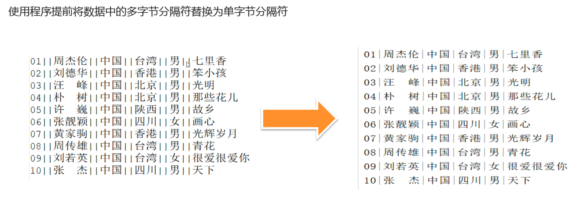

# 默认规则

​		Hive默认序列化类是LazySimpleSerDe，其只支持使用单字节分隔符（char）来加载文本数据，例如逗号、制表符、空格等等，默认的分隔符为”\001”。根据不同文件的不同分隔符，我们可以通过在创建表时使用 row format delimited 来指定文件中的分割符，确保正确将表中的每一列与文件中的每一列实现一一对应的关系。


## 案例


## 特殊案例


这种分隔符是不能用默认的LazySingleFormat


这种情况也是不能用的，因为中间的日期 也有空格，会造成错误分割


# 解决方案

## 替换分隔符




直接解决数据问题


## SerDe正则加载

除了使用最多的LazySimpleSerDe，Hive该内置了很多SerDe类；

官网地址：https://cwiki.apache.org/confluence/display/Hive/SerDe多种SerDe用于解析和加载不同类型的数据文件，常用的有ORCSerDe 、RegexSerDe、JsonSerDe等。


RegexSerDe用来加载特殊数据的问题，使用正则匹配来加载数据。根据正则表达式匹配每一列数据。

https://cwiki.apache.org/confluence/display/Hive/GettingStarted#GettingStarted-ApacheWeblogData


**RegexSerDe解决多字节分隔符**


重新建表

```hive
--如果表已存在就删除表
drop table if exists singer;
--创建表
create table singer(
		id string,--歌手id
    name string,--歌手名称
    country string,--国家
    province string,--省份
    gender string,--性别
    works string)--作品
--指定使用RegexSerde加载数据
ROW FORMAT SERDE 'org.apache.hadoop.hive.serde2.RegexSerDe'
WITH SERDEPROPERTIES ("input.regex" = "([0-9]*)\\|\\|(.*)\\|\\|(.*)\\|\\|(.*)\\|\\|(.*)\\|\\|(.*)");

--加载数据
load data local inpath '/root/hivedata/test01.txt' into table singer;
```


```hive
--如果表存在，就删除表
drop table if exists apachelog;
--创建表
create table apachelog(
    ip string,      --IP地址
    stime string,    --时间
    mothed string,  --请求方式
    url string,     --请求地址
    policy string,  --请求协议
    stat string,    --请求状态
    body string     --字节大小
)
--指定使用RegexSerde加载数据
ROW FORMAT SERDE 'org.apache.hadoop.hive.serde2.RegexSerDe'
--指定正则表达式
WITH SERDEPROPERTIES (
"input.regex" = "([^ ]*) ([^}]*) ([^ ]*) ([^ ]*) ([^ ]*) ([0-9]*) ([^ ]*)"
) stored as textfile ;

load data local inpath '/root/hivedata/apache_web_access.log' into table apachelog;

```


## 自定义InputFormat

Hive中也允许使用自定义InputFormat来解决以上问题，通过在自定义InputFormat，来自定义解析逻辑实现读取每一行的数据。


与MapReudce中自定义InputFormat一致，继承TextInputFormat

```Java
/**
* @ClassName UserInputFormat
* @Description TODO 用于实现自定义InputFormat，读取每行数据
* @Create By     Itcast
*/

public class UserInputFormat extends TextInputFormat {
@Override
	public RecordReader<LongWritable, Text> getRecordReader(InputSplit genericSplit, JobConf job,
  Reporter reporter) throws IOException {
    reporter.setStatus(genericSplit.toString());
    UserRecordReader reader = new UserRecordReader(job,(FileSplit)genericSplit);
    return reader;
  }
}

```

与MapReudce中自定义RecordReader一致，实现RecordReader接口，实现next方法

```java
/**
* Read a lin
*/
public synchronized boolean next(LongWritable key, Text value) throws IOException {
  while (getFilePosition() <= end) {
    key.set(pos);
    int newSize = in.readLine(value, maxLineLength, Math.max(maxBytesToConsume(pos), maxLineLength));
    String str = value.toString().replaceAll("\\|\\|", "\\|");
    value.set(str);
    pos += newSize;
    if (newSize == 0) {
      return false;
    }
    if (newSize < maxLineLength) {
      return true;
    }
    LOG.info("Skipped line of size " + newSize + " at pos " + (pos - newSize));
  }
  return false;
}

```

打成jar包，添加到Hive的classpath中

add jar /export/server/hive-3.1.2-bin/lib/HiveUserInputFormat.jar;

创建表时，指定InputFormat为自定义的InputFormat

```hive
--如果表已存在就删除表
drop table if exists singer;
--创建表
create table singer(
  id string,--歌手id
  name string,--歌手名称
  country string,--国家
  province string,--省份
  gender string,--性别
  works string)
  --指定使用分隔符为|
row format delimited fields terminated by '|'
--指定使用自定义的类实现解析
stored as
inputformat 'bigdata.itcast.cn.hive.mr.UserInputFormat'
outputformat 'org.apache.hadoop.hive.ql.io.HiveIgnoreKeyTextOutputFormat';

--加载数据
load data local inpath '/root/hivedata/test01.txt' into table singer;
```

