# 分析需求

业务需求中，经常需要对用户的访问、用户的来源进行分析，用于支持运营和决策。   

例如对用户访问的页面进行统计分析，分析热门受访页面的Top10，观察大部分用户最喜欢的访问最多的页面等。

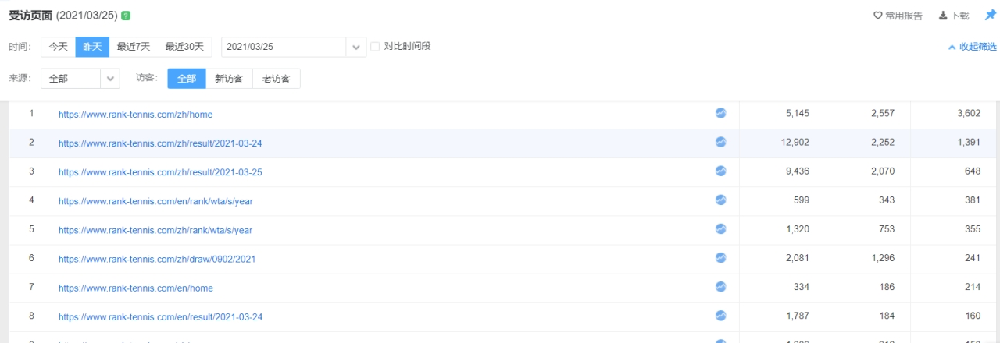

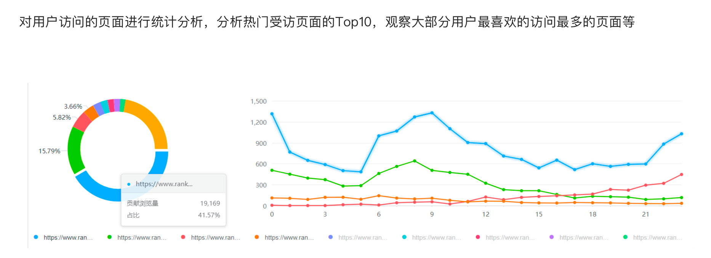

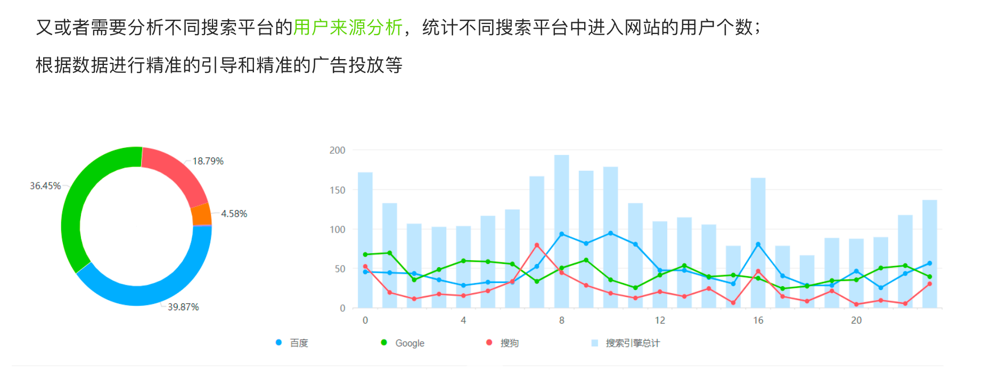

# 数据格式

​    要想实现上面的受访分析、来源分析等业务，必须在实际处理数据的过程中，对用户访问的URL和用户的来源URL进行解析处理，获取用户的访问域名、访问页面、用户数据参数、来源域名、来源路径等信息。

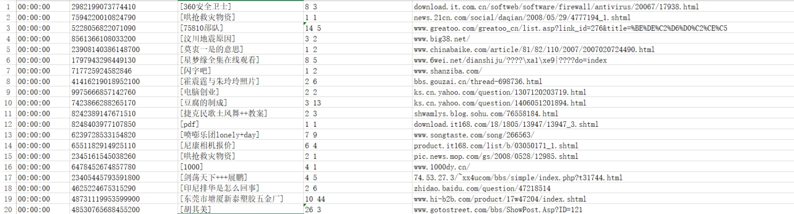

## URL组成

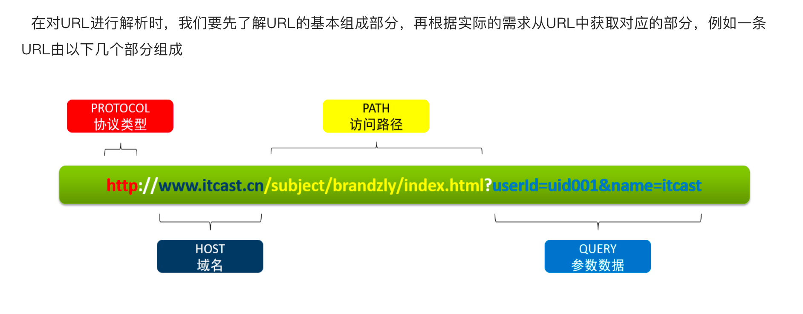

## 函数

 Hive中为了实现对URL的解析，专门提供了解析URL的函数parse_url和parse_url_tuple；在show functions中可以看到对应函数。

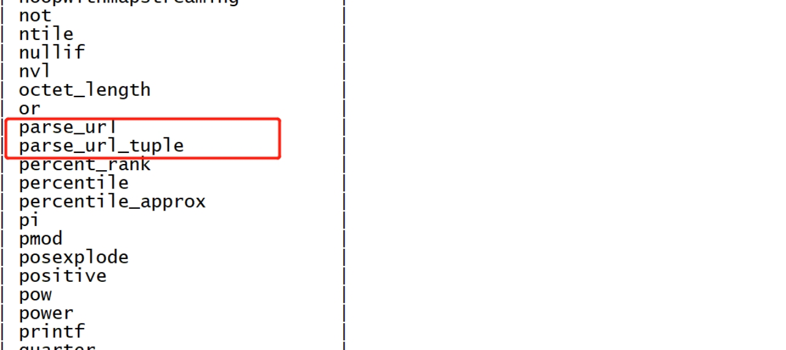


# 案例

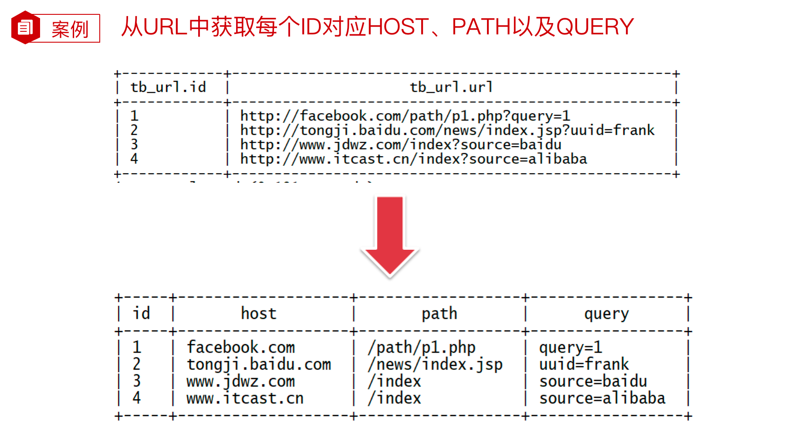

# parse_url函数

​      parse_url函数是Hive中提供的最基本的url解析函数，可以根据指定的参数，从URL解析出对应的参数值进行返回，函数为普通的一对一函数类型。

## 语法

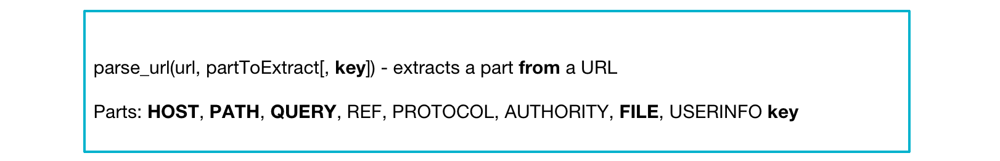

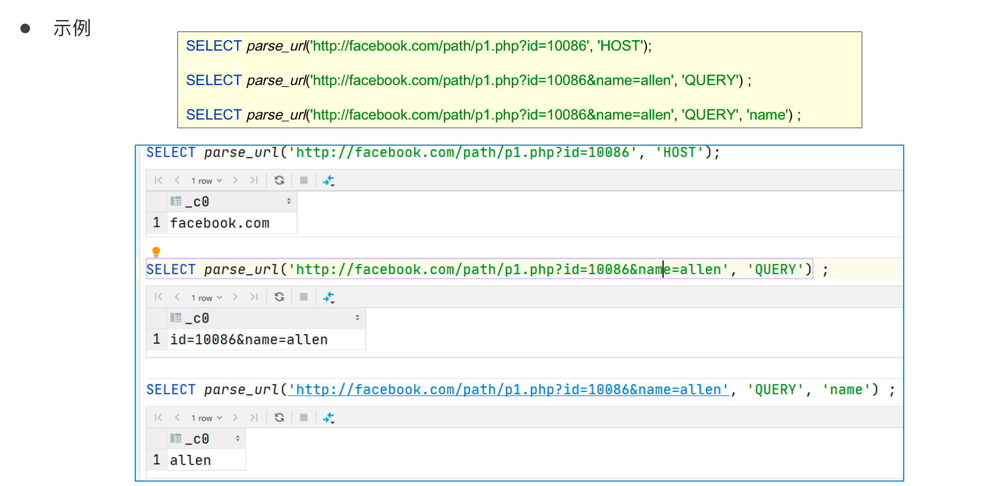


## 弊端

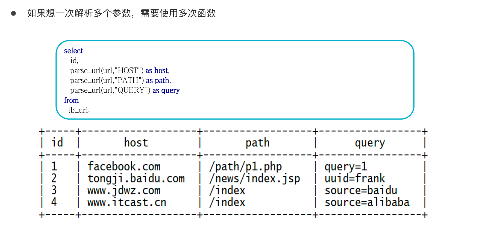

# parse_url_tuple函数

​      parse_url_tuple函数是Hive中提供的基于parse_url的url解析函数，可以通过一次指定多个参数，从URL解析出多个参数的值进行返回多列，函数为特殊的一对多函数类型，即通常所说的UDTF函数类型。

## 语法

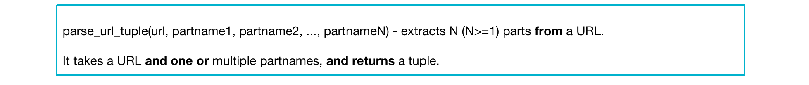


## 案例

**建表**

```Hive
drop table if exists tb_url;
--建表
create table tb_url(
	id int,
  url string
)row format delimited
fields terminated by '\t';
--加载数据
load data local inpath '/root/hivedata/url.txt' into table tb_url;

select * from tb_url;
```

```hive
select parse_url_tuple(url, "HOST", "PATH") as (host,path) from tb_url;
```

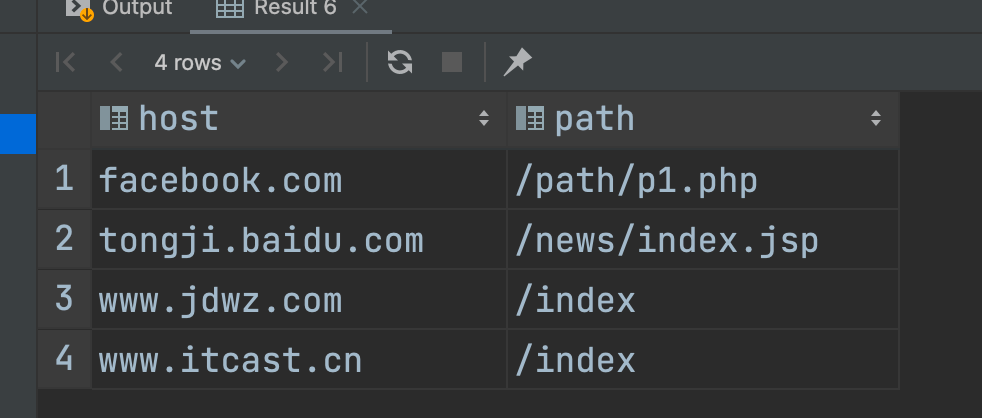

```hive
select parse_url_tuple(url, "PROTOCOL" ,"HOST", "PATH") as (protocol, host,path) from tb_url;
```

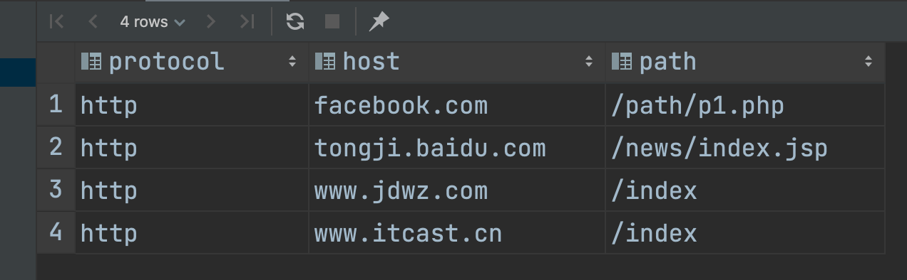


## 踩坑

当执行以下SQL语句，将id与host、path、query等共同查询时报错

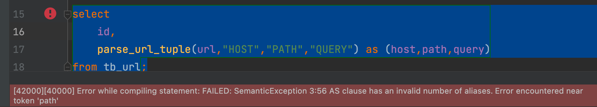


原因：

 Hive中的一对多的UDTF函数可以实现高效的数据转换，但是也存在着一些使用中的问题，UDTF函数对于很多场景下有使用限制，例如：select时不能包含其他字段、不能嵌套调用、不能与group by等放在一起调用等等。


UDTF函数的调用方式，主要有以下两种方式：

方式一：直接在select后单独使用

方式二：与Lateral View放在一起使用


## 侧视图

 Lateral View是一种特殊的语法，主要用于搭配UDTF类型功能的函数一起使用，用于解决UDTF函数的一些查询限制的问题。    

侧视图的原理是将UDTF的结果构建成一个类似于视图的表，然后将原表中的每一行和UDTF函数输出的每一行进行连接，生成一张新的虚拟表。

这样就避免了UDTF的使用限制问题。

使用lateral view时也可以对UDTF产生的记录设置字段名称，产生的字段可以用于group by、order by 、limit等语句中，不需要再单独嵌套一层子查询。    

一般只要使用UDTF，就会固定搭配lateral view使用。

官方链接：https://cwiki.apache.org/confluence/display/Hive/LanguageManual+LateralView


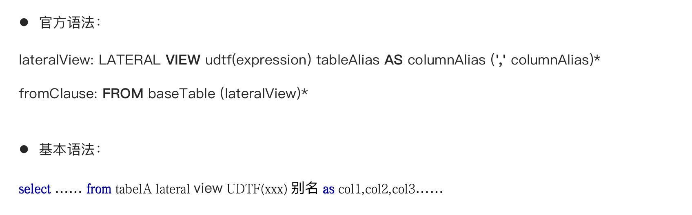


## 侧视图测试

### 单个laterview

```hive
select
       a.id as id,
       b.host as host,
       b.path as path,
       b.query as query
from tb_url a
lateral view parse_url_tuple(url,"HOST","PATH","QUERY") b as host,path,query;
```

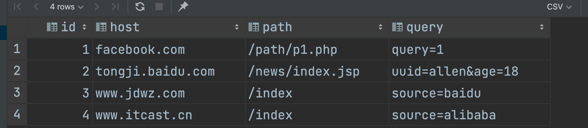

### 多个laterview

```hive
select
    a.id as id,
    b.host as host,
    b.path as path,
    c.query as query,
    c.protocol as protocol
from tb_url a
    lateral view parse_url_tuple(url,"HOST","PATH") b as host,path
    lateral view parse_url_tuple(url,"QUERY","PROTOCOL") c as query,protocol;
```

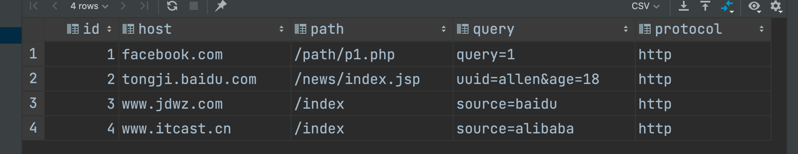


如果UDTF不产生数据时，这时侧视图与原表关联的结果将为空

如果加上outer关键字以后，就会保留原表数据，类似于outer join

```hive
select
  id,
  url,
  col1
from tb_url
lateral view outer explode(array()) et as col1;

```

