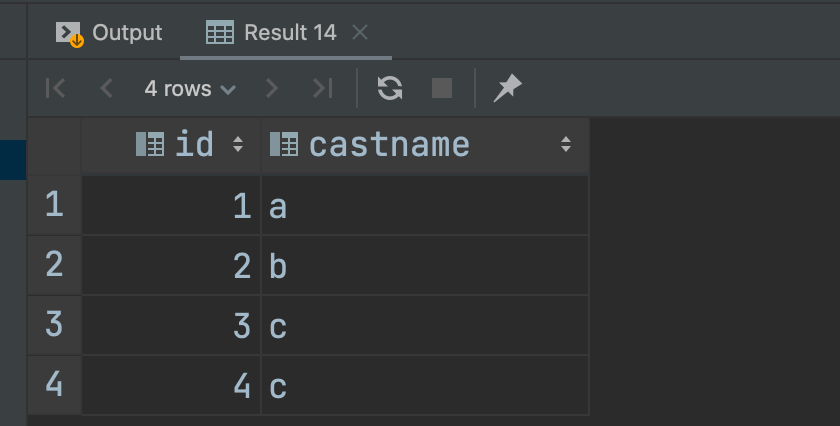
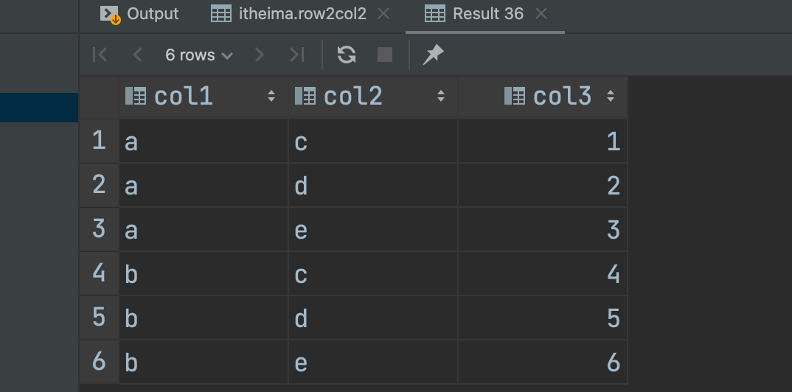

# Case When语法

```hive
select
    id,
    case
        when id < 2 then 'a'
        when id = 2 then 'b'
        else 'c'
    end as castName --作为新的一列
from tb_url;
```




# 多行转多列


**导入表**

```Hive
create table row2col1(
    col1 string,
    col2 string,
    col3 int
)row format delimited fields terminated by '\t';

load data inpath '/hivedata/r2c1.txt' into table row2col1;

select * from row2col1;
```


**代码实现**

```Hive
select
    col1 as col1,
    max(case col2 when 'c' then col3 else 0 end) as c,
    max(case col2 when 'd' then col3 else 0 end) as d,
    max(case col2 when 'e' then col3 else 0 end) as e
from row2col1
group by col1;
```


# 多行转单列

**导入表**


```Hive
create table row2col2(
     col1 string,
     col2 string,
     col3 int
)row format delimited fields terminated by '\t';

load data inpath '/hivedata/r2c2.txt' into table row2col2;
select * from row2col2;
```

## concat_ws函数


## collect_set函数/collect_list


list是可以重复的


注意 concat 函数，传入的参数只认string 或 string[]

可以通过 describe function extended concat_ws查看


```Hive
select
    col1,
    col2,
    concat_ws(',', collect_set(cast(col3 as string))) as col3
from row2col2 group by col1,col2;
```


# 多列转多行


**载入表**

```HIVE
create table col2row1(
    col1 string,
    col2 int,
    col3 int,
    col4 int
)
row format delimited fields terminated by '\t';

load data inpath '/hivedata/c2r1.txt' into table col2row1;
select * from col2row1
```


## union 关键字

注意结果去重


## union all 关键字


**实现**

```Hive
select col1, 'c' as col2, col2 as col3 from col2row1
Union all
select col1, 'd' as col2, col3 as col3 from col2row1
union all
select col1, 'e' as col2, col4 as col3 from col2row1;
```




# 单列转多行


**加载表**

```HIVE
create table col2row2(
    col1 string,
    col2 string,
    col3 string
)row format delimited fields terminated by '\t';

load data inpath '/hivedata/c2r2.txt' into table col2row2;

select * from col2row2;
```


## explode函数


```HIVE
select
    col1,
    col2,
    lv.col3
from col2row2
lateral view
    explode(split(col3, ',')) lv as col3;
```


