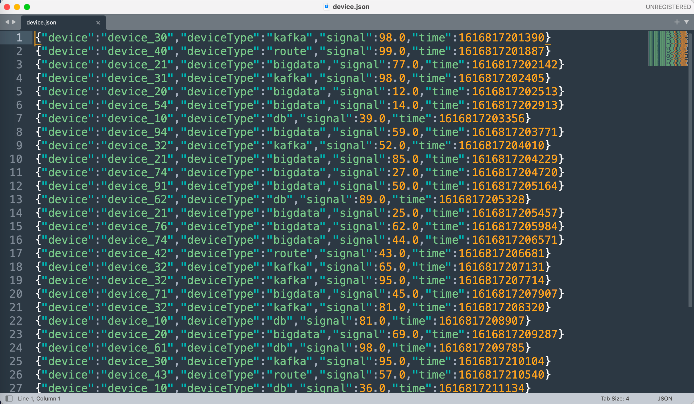
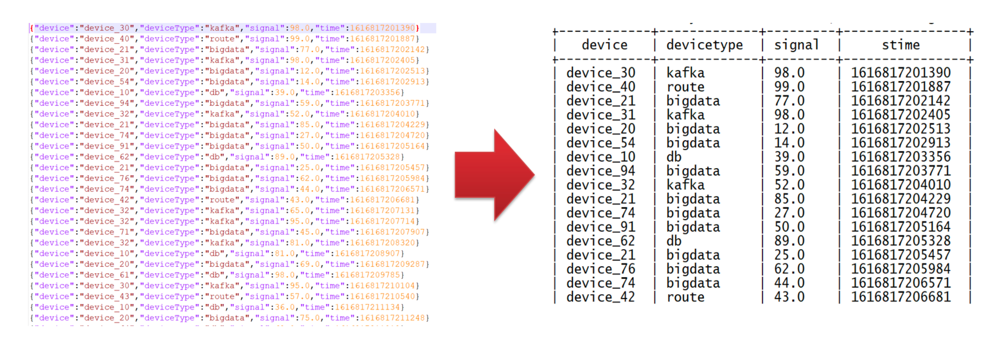
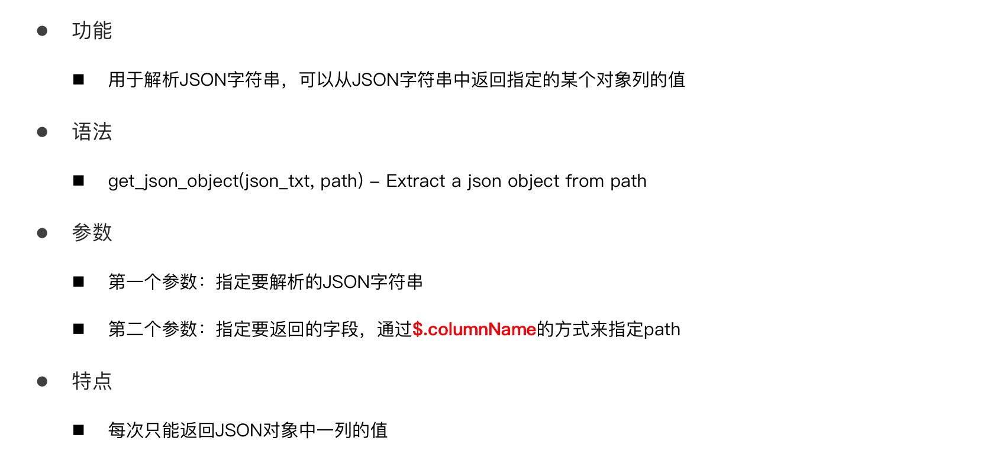

# JSON

JSON数据格式是数据存储及数据处理中最常见的结构化数据格式之一，很多场景下公司都会将数据以JSON格式存储在HDFS中，当构建数据仓库时，需要对JSON格式的数据进行处理和分析，那么就需要在Hive中对JSON格式的数据进行解析读取。


# 案例数据集







# 两种处理方式

 Hive中为了实现JSON格式的数据解析，提供了两种解析JSON数据的方式，在实际工作场景下，可以根据不同数据，不同的需求来选择合适的方式对JSON格式数据进行处理。


## JSON函数处理

**get_json_object、json_tuple**

这两个函数都可以实现将JSON数据中的每个字段独立解析出来，构建成表


### get_json_object




### json_tuple


## JSON Serde加载数据

**JSON Serde**

建表时指定Serde，加载JSON文件到表中，会自动解析为对应的表格式


# 函数实际操作

## 加载数据

```Hive
create table tb_json_test1(
    json string
);

load data inpath '/hivedata/device.json' into table tb_json_test1;
```


## get_json_object

```Hive
select
    get_json_object(json, '$.device') as device,
    get_json_object(json, '$.deviceType') as deviceType,
    get_json_object(json, '$.signal') as signal,
    get_json_object(json, '$.time') as stime
from tb_json_test1;
```


## json_tuple

```Hive
select
    json_tuple(json, 'device', 'deviceType', 'signal', 'time') as (device,deviceType,signal,stime)
from tb_json_test1;
```


**搭配侧视图使用**

```Hive
select
    json,b.device,b.deviceType,b.signal,b.stime
from tb_json_test1
lateral view json_tuple(json, 'device', 'deviceType', 'signal', 'time') b
    as device,deviceType,signal,stime;
```


# **JSON Serde实际操作**

```Hive
create table tb_json_test2(
    device string,
    devicetype string,
    signal double,
    `time` string
)row format serde 'org.apache.hive.hcatalog.data.JsonSerDe'
stored as textfile;

load data inpath '/hivedata/device.json' into table tb_json_test2;

select * from tb_json_test2;
```


