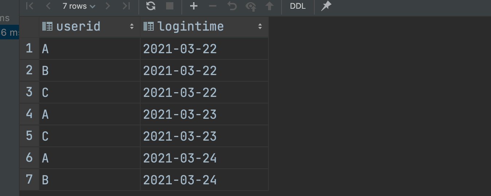
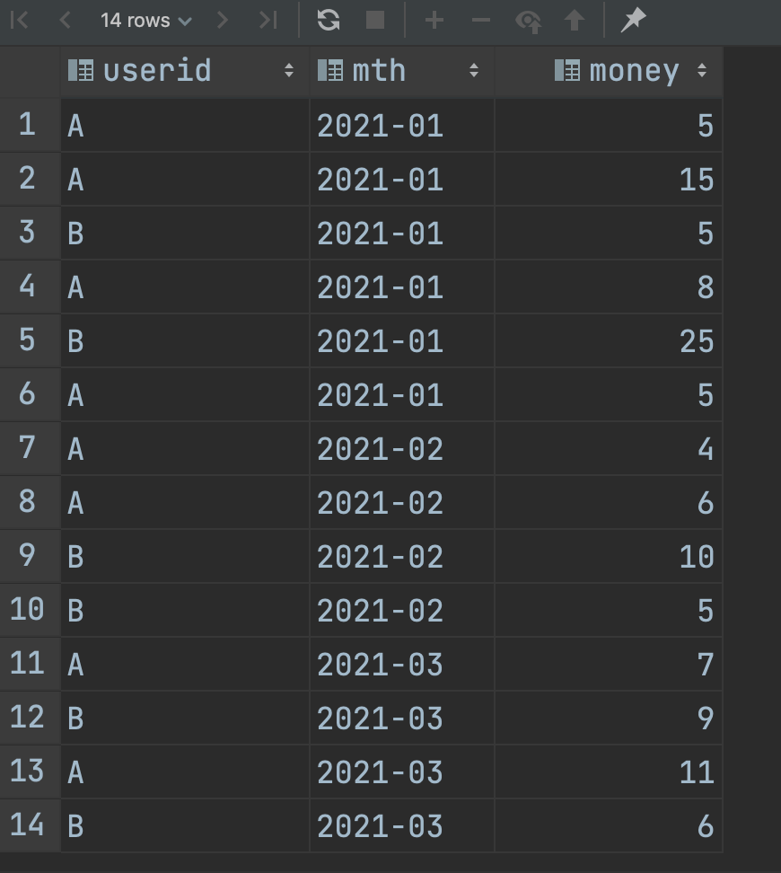
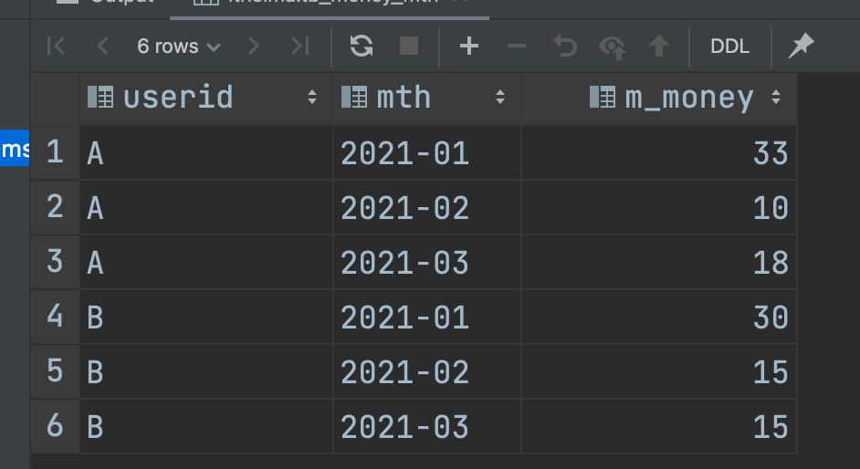

# 案例：统计连续N次登陆的用户


即 统计连续登陆两天的用户，只要用户ID相等，并且登陆日期之间相差一天即可


## 数据加载

```HIVE
create table tb_login(
    userid string,
    logintime string
)row format delimited fields terminated by '\t';

load data inpath '/hivedata/login.log' into table tb_login;

select * from tb_login;
```




## 自连接，笛卡尔积

笛卡尔积：每一行都会与另一行进行连接

```hive
select
    a.userid,
    a.logintime,
    b.userid,
    b.logintime
from tb_login a, tb_login b;
```


进行筛选

```hive
select
    a.userid as a_userid,
    a.logintime as a_logintime,
    b.userid as b_userid,
    b.logintime as b_logintime
from tb_login a, tb_login b where a.userid = b.userid
and cast(substr(a.logintime,9,2) as int) - 1 = cast(substr(b.logintime,9,2) as int);
```


这种方式，有点累，如果是找连续三天、四天 就不好做了


## 窗口函数实现

### 窗口函数lead


```Hive
select
    userid,
    logintime,
    date_add(logintime, 1) as nextday,
    lead(logintime, 1, 0) over (partition by userid order by logintime) as nextlogin
from tb_login;
```


加上判断条件

```HIVE
with t1 as(
select
    userid,
    logintime,
    date_add(logintime, 1) as nextday,
    lead(logintime, 1, 0) over (partition by userid order by logintime) as nextlogin
from tb_login)
select distinct userid from t1 where nextlogin = nextday;
```


连续三天


# 案例：级联累加求和


m_money统计一个月的

t_money统计截止到当前月的金额


方案一：分组统计每个用户每个月的消费金额，然后构建自连接，根据条件分组聚合

方案二：分组统计每个用户，每个月的消费金额，然后使用窗口聚合函数实现


## 数据加载

```hive
create table tb_money(
    userid string,
    mth string,
    money int
)row format delimited fields terminated by '\t';

load data inpath '/hivedata/money.tsv' into table tb_money;
select * from tb_money;
```




## 统计月总支出

先把每个月的总支出统计

```Hive
create table tb_money_mtn as
select
    userid,
       mth,
       sum(money) as m_money
from tb_money
group by userid,mth;
```




## 自连接分组聚合

```HIVE
select
   a.*,b.*
from tb_money_mtn a join tb_money_mtn b on a.userid = b.userid;
```


```HIVE
select
   a.userid,
    a.mth,
       max(a.m_money) as current_mth_money,
       sum(b.m_money) as accumulate_money
from tb_money_mtn a join tb_money_mtn b on a.userid = b.userid
where b.mth <= a.mth
group by a.userid, a.mth
order by a.userid, a.mth;
```


## 窗口函数


```HIVE
select
    userid,
       mth,
       m_money,
       sum(m_money) over (partition by userid order by mth) as t_money
from tb_money_mtn;
```


# 案例：分组TopN问题


## 数据加载

```Hive
create table tb_emp(
    empno string,
    ename string,
    job string,
    managerid string,
    hiredate string,
    salary double,
    bonus double,
    deptno string
) row format delimited fields terminated by '\t';
load data inpath '/hivedata/emp.txt' into table tb_emp;
```

## 窗口序列函数


## **分组并排名**

```Hive
select *,
row_number() over (partition by deptno order by salary desc) as rank
from tb_emp;
```


保留前两位

```Hive
with t1 as (
    select 
  	*,
    row_number() over (partition by deptno order by salary desc) as rank
    from tb_emp
)
select * from t1 where t1.rank < 3;
```

