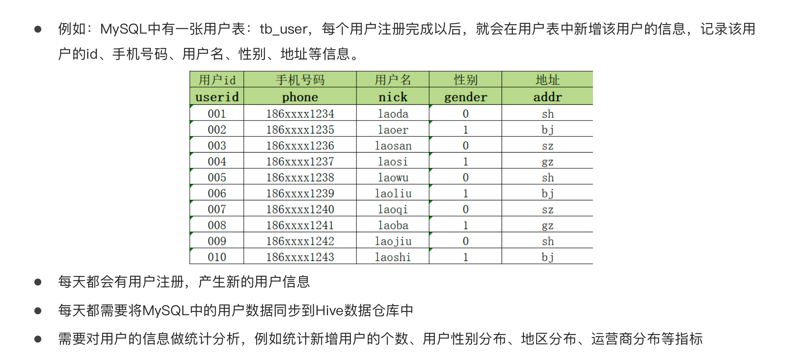

# 数据同步问题





# 导入数据

## 导入原表

```HIVE
create table dw_zipper(
    userid string,
    phone string,
    nick string,
    gender int,
    addr string,
    starttime string,
    endtime string
)row format delimited fields terminated by '\t';

load data inpath '/hivedata/zipper.txt' into table dw_zipper;

select * from dw_zipper
```


注意：endtime无穷大 表示数据暂时没有被更改，仍然生效


## 导入增量表

```hive
load data inpath '/hivedata/update.txt' into table dw_zipper_update;
```


## 合并数据

1.旧数据和新数据 根据userid left join


左连接后由于增量表只有008的userid符合要求（更新的值），是成功连接的，其他都为null值（没更新的值）

2.拉链关键

```
if(b.userid is null or a.endtime < '9999-12-31', a.endtime, date_sub(b.starttime,1)) as endtime
```

判断不用更新：

b.userid is null  表示不用更新的

a.endtime < '9999-12-31' 最新时间在此之前，不需要更改

如果满足条件，则返回原来的endtime，就不需要更新


如果不满足条件，把旧数据的endtime改为新数据开始starttime-1


完整代码：

```HIVE
insert overwrite table tmp_zipper
select
    userid,
    phone,
    nick,
    gender,
    addr,
    starttime,
    endtime
from dw_zipper_update
union all
select
    a.userid,
       a.phone,
       a.nick,
       a.gender,
       a.addr,
       a.starttime,
       if(b.userid is null or a.endtime < '9999-12-31', a.endtime, date_sub(b.starttime,1)) as endtime
from dw_zipper a left join dw_zipper_update b
on a.userid = b.userid;
```

将旧数据插入更新表，并且更新旧数据里的时间


# 拉链表意义

能保留历史数据

随时更新新数据