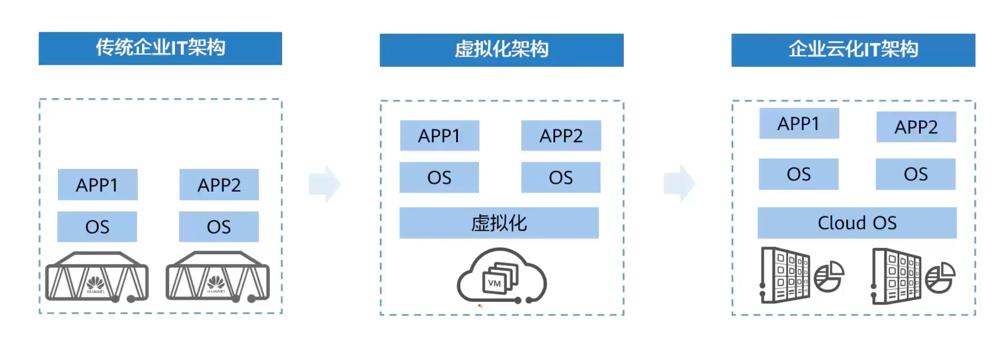
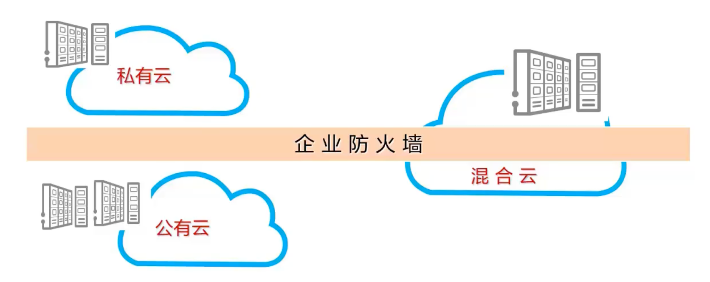
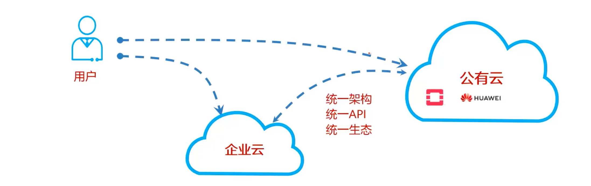
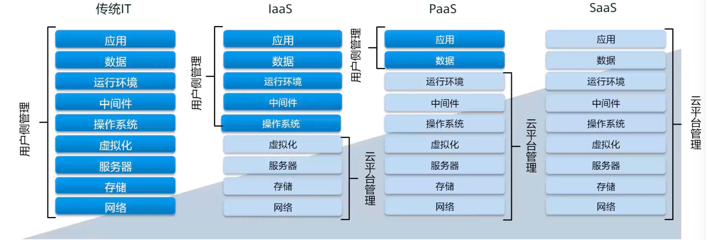

# 云计算背景

## 传统IT面临的挑战

1. 业务上线慢
2. 扩展困难
3. 可靠性不强
4. 生命周期管理复杂
5. IO瓶颈导致延迟
6. TCO居高不下

## 企业IT基础设施架构开始走向云化

**传统企业IT架构：**

服务器直接装服务系统，软件更硬件存在强耦合关系，硬件利用率低且运维较为复杂

**虚拟化架构：**

软硬件解耦，资源利用率上升，运维简单

**企业云架构：**

强调资源的整合与统一的架构，彻底消灭资源孤岛效应，更加自动化

# 云计算定义

“云”是网络、互联网的一种比喻说法，即互联网与建立互联网锁需要的底层基础设施的抽象体

“计算”指的是一台足够强大的计算机提供计算服务（功能，资源，存储）

云计算：通过互联网可以使用足够强大的计算机为用户提供服务，这种服务的使用量可以使用统一单位来描述

# 云计算的部署模式

## 私有云

云计算的基础设施由单一的组织拥有，并且仅仅为该组织运营

## 公有云

云服务运营商拥有云基础设施，并且为公众或者企业用户提供云服务。云计算基础设施由一个组织拥有并且向公众或大型的工业团体销售云计算服务。用户可以通过互联网像使用水电一样租用IT服务，比如华为云

有统一的API，适合给企业做混合云

## 混合云

云计算基础设施由两种或多种云组成，对外仍然表现成一个整体

# 云计算的服务模式

## Iaas

Iaas：infrastructure as a service 基础设施即服务

云平台提供基础设施，负责这些资源的维护，用户只要关心基础设施之上的运行

## Pass

Pass：platform as a service 平台即服务

云服务提供商还提供了平台资源，中间件，比如应用运行环境

## Sass

Sass：software as a service 软件即服务

云平台提供了所有的全部资源服务，以及它的维护，用户直接来用就行了，直接调用接口，比如人脸识别等

# 云计算的价值

1. 按需自助的服务

2. 广泛网络接入

   `网络`：资源在云端，一定要接入网络才能提供服务  `广泛`:无论在哪里，都可以接入

3. 资源池化

   你需要的资源，直接在资源池里获取就行了。

4. 快速部署，弹性扩容

   看业务，如果需求突然增大，可以申请。如果下降，可以还回

5. 可计量服务

# 云计算的8个通用点

1. 大规模

   云计算把IT资源集中化了，所以大规模了

2. 同质化

   标准化，根用水用电一样

3. 虚拟化

4. 弹性计算

   资源的快速供应和释放

5. 低成本软件

   规模到一定的程度后，就会减低使用成本

6. 先进安全技术

   公有云大了之后，什么鸟都有，要有足够的安全技术才能保证安全

7. 地理分布

   公有云的服务器 到处都有

8. 面向服务

