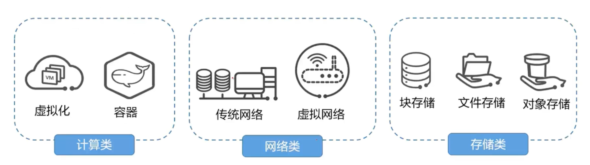
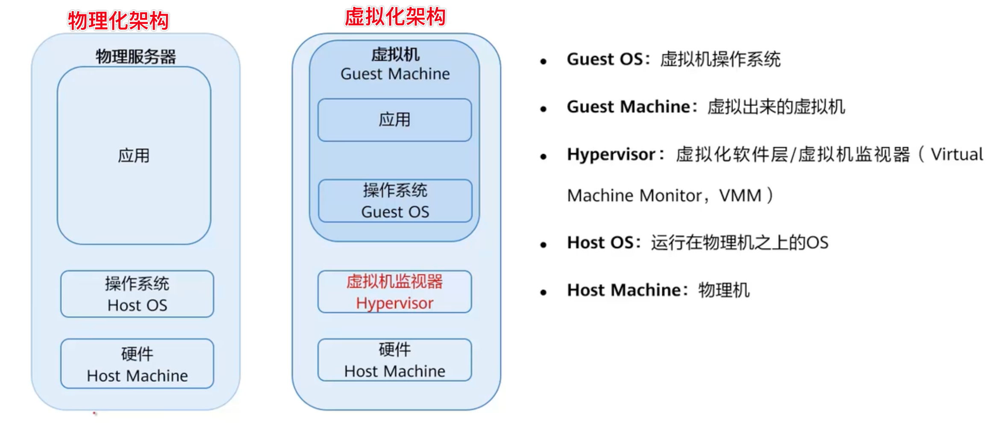
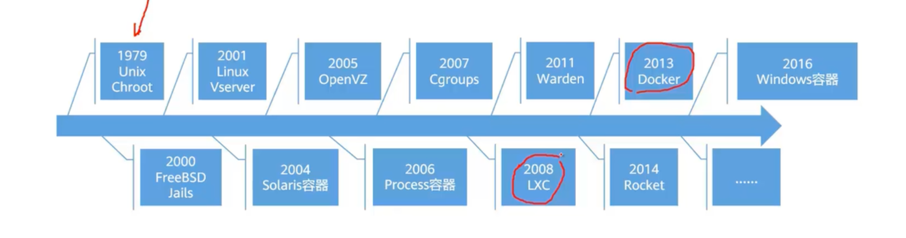
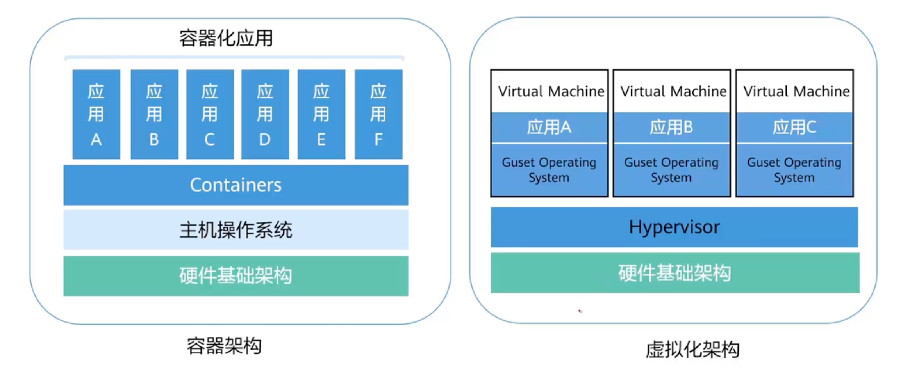
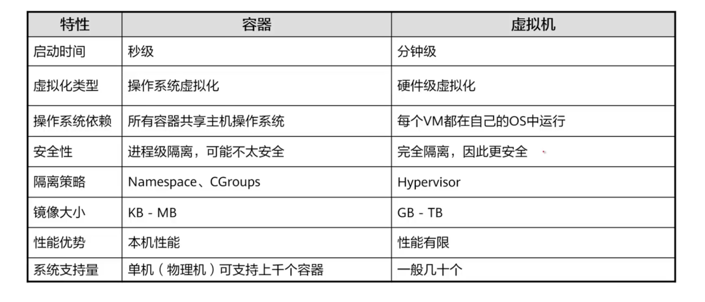

# 云计算基础技术概览

# 计算类技术

## 虚拟化

### 是什么

是什么：虚拟化技术可将单台物理服务器虚拟为多台虚拟机使用，多台虚拟机**共享该物理服务器的硬件资源**

虚拟化本质：虚拟化的本质就是将原先的物理设备进行逻辑化，转化成一个文件夹或文件，实现软硬件的结偶

### **虚拟机**

1. 虚拟机本质上是由磁盘文件和描述文件组成，封装在同一个文件夹中
2. 服务器上运行多个虚拟机，各自封装，互相隔离，即存在多个文件夹

### **虚拟化和云计算之间的关系**

虚拟化是实现云计算的核心技术，但不等于云计算，云计算的内容为度比虚拟化要大很多

### **虚拟化的特点**

分区：划分服务器，给虚拟机分配资源

隔离：虚拟机和虚拟机之间是隔离的，如果一个虚拟机受到了攻击，不会影响到其他虚拟机的运行

封装：虚拟机是文件的形式存在的

独立：相对于硬件是独立的，服务器与虚拟机不存在硬件绑定关系（软硬件解耦）

### 计算虚拟化中的重要概念

物理化架构：操作系统在硬件上运行，在操作系统上运行应用

虚拟化架构：在硬件上运行的是虚拟机监视器（虚拟化软件层），虚拟机监视器 1.可以将底层的物理机硬件进行虚拟化 2.对虚拟出来的虚拟硬件进行管理和监控。在虚拟机监视器上 安装操作系统。应用运行在虚拟机的操作系统中

### 我们身边的计算资源

内存资源、CPU、GPU（图形运算）

### 计算在云计算中的服务形态

在华为云里：

ECS 弹性服务器，本质上就是一台虚拟机

AS 弹性伸缩，可动态增减ECS数量（业务在淡季，需求下降，可释放几台ECS）

IMS 镜像服务，为ECS提供操作系统镜像（不同版本的系统）

## 容器

### 是什么

容器是一个标准化的单元，是一个轻量级别的、可移植的软件打包技术。它将软件代码及其相关依赖打包，使应用程序可以在任何一个计算介质中运行。简单来讲，容器就像一个标准化的盒子，能够装很多不同类型的东西，并且装完后能够塞进很多不同类型的柜子里

容器是操作系统级的虚拟化，沙箱技术，软件打包技术

主要包含两个东西

1. 容器的应用
2. 应用的运行环境：容器把运行环境直接封装在容器内部了，一次封装。到处运行。只要操作系统可以跑容器就行

### 容器的发展

1979年，Unix系统提出了一个Chroot的技术，是容器技术最早的源头，最早应用是切换工作目录，对系统的资源进行隔离使用

2008年，出现了LXC技术，linux container 一个比较完善的容器技术，打包到了linux内核里

2013年， 让大众视野使用起来的是Docker，他有自己的一整套完整的生态、标准、API等，迅速火热起来

### 容器和虚拟化的架构对比

容器架构的硬件基础架构：可以是虚拟机，也可以是物理机

容器可以在操作系统中运行多个，多个容器可以共享一个操作系统

虚拟化架构，每个虚拟机都有自己独立的操作系统，只是共享底层的硬件，这就是典型的差别。

容器因为只包含运行环境和应用，所以启动时间是秒级的，比虚拟机快很多

因为容器共享主机的操作系统，所以隔离性低，所以安全性也低

但是容器的大小只是略大于应用，很轻量，基本就在MB级别或更小。虚拟机就很重量级

### 容器在云计算中的服务形态

**云容器引擎：容器实例的一种**

作为CCE可以提供高度可扩展的，高性能的 企业级k8s集群

并且支持运行docker容器，可以轻松在华为云上部署

华为国内最早做k8s 技术成熟

**云容器实例：容器实例的一种**

提供了无服务容器引擎，不需要再管理服务器集群，就可以直接操作容器

**容器镜像服务：为容器实例提供镜像**

提供简单易用的镜像

可以配合CCE 和 CCI 协同使用，也可以单独的作为容器镜像仓库