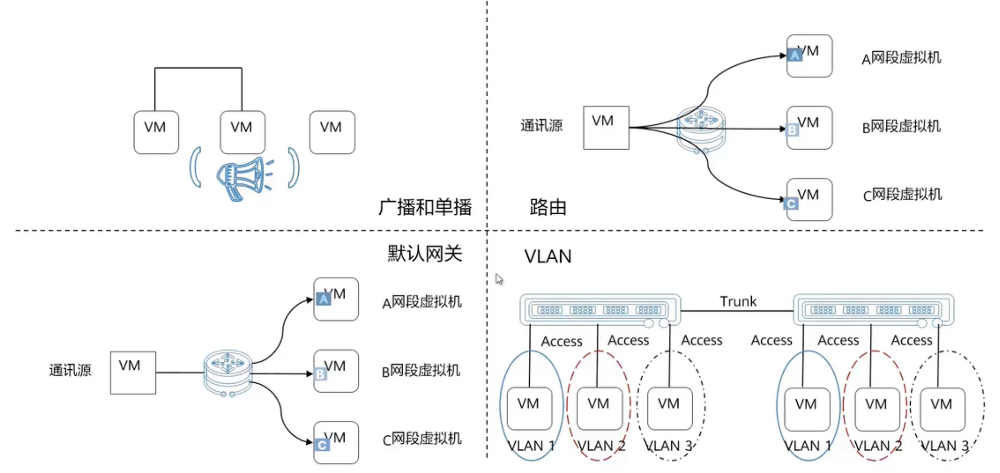
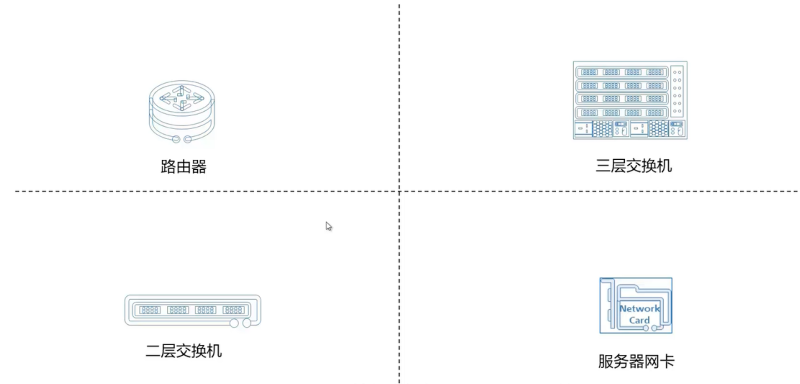
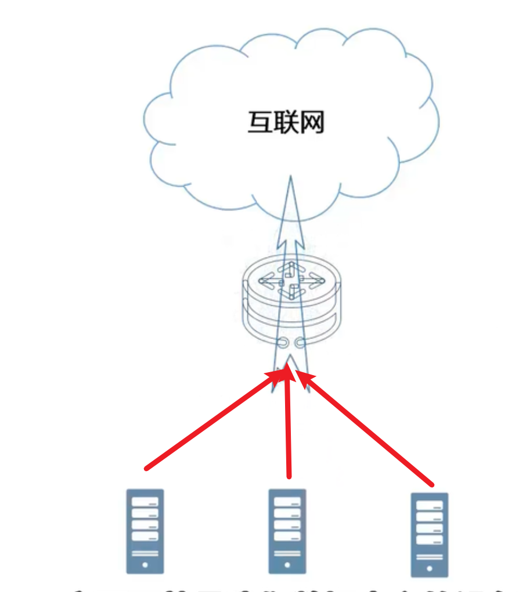
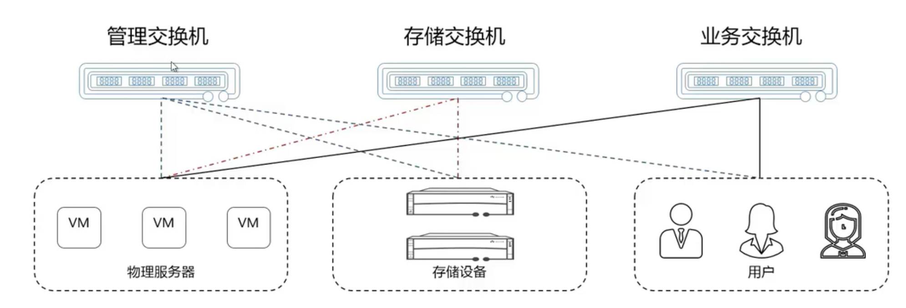
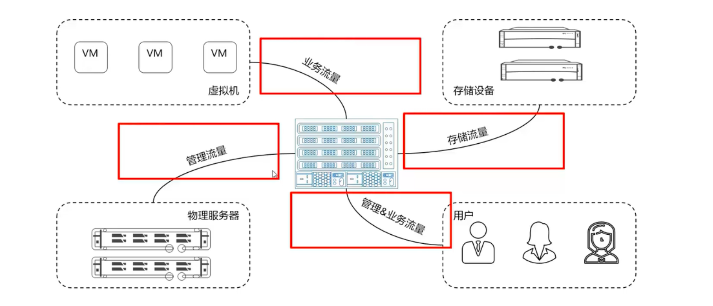
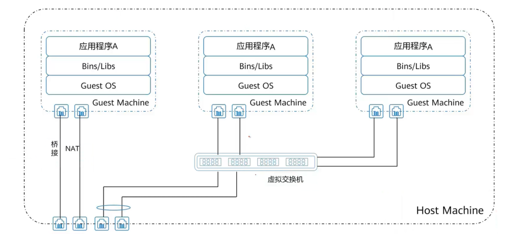
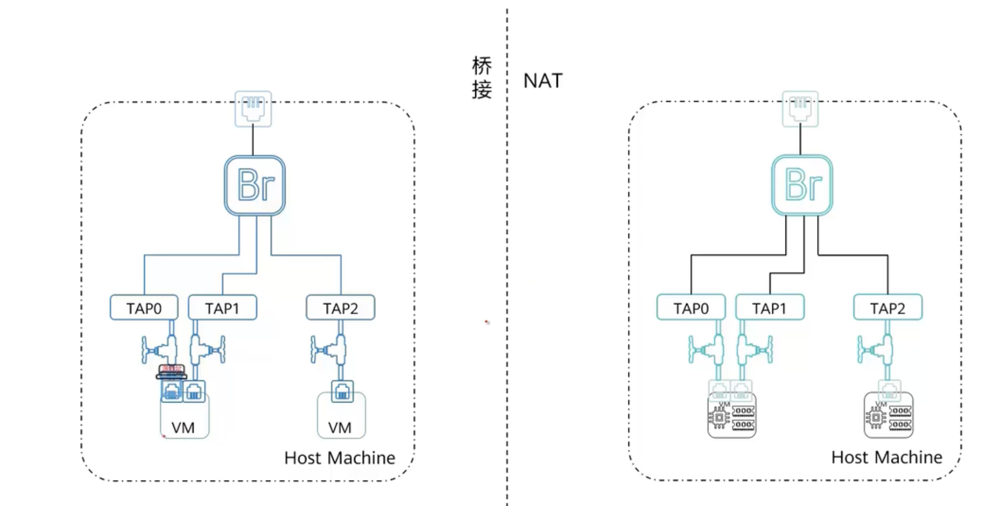
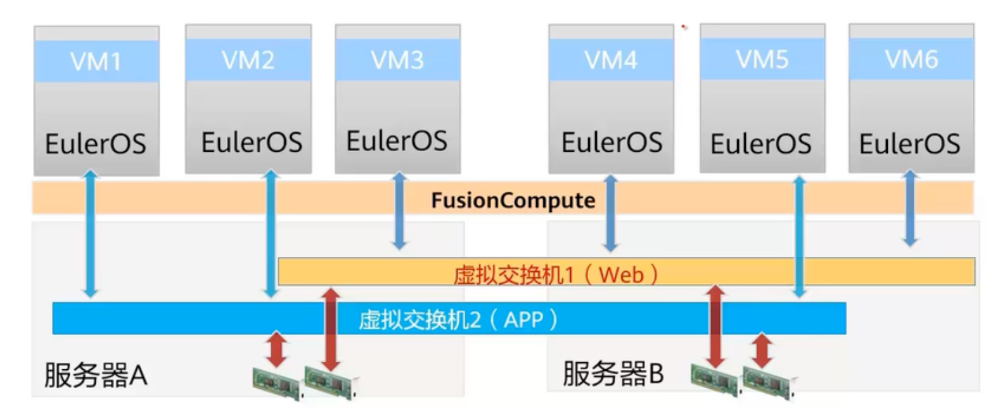
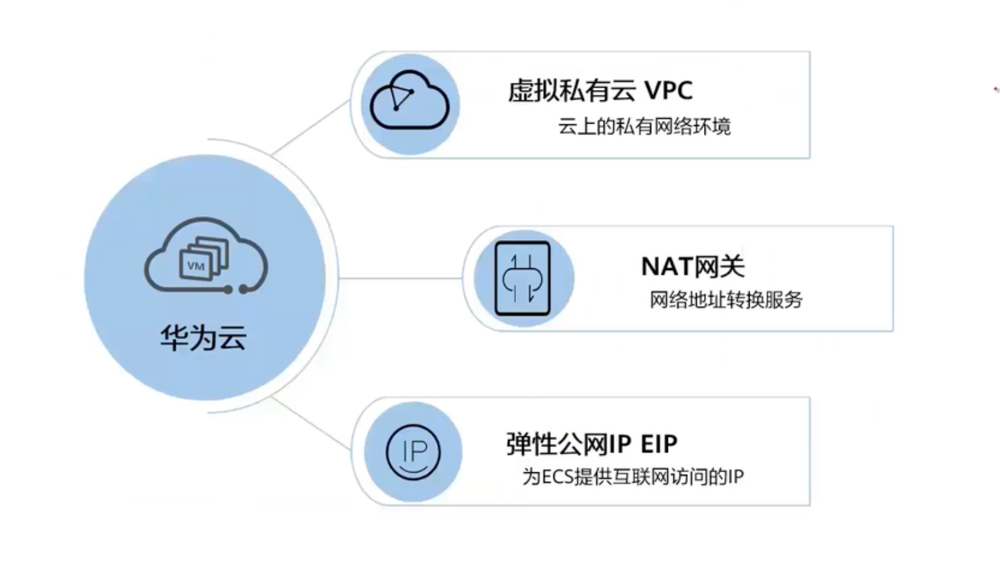

# 网络类

## 网络是什么

网络是设备间，虚拟机之间通信的桥梁

## 传统网络的基本概念

### 广播和单播

广播：把信息发给一个网络中的所有机子，一对所有人

单播：一对一的通信

### 路由

连接到不同的网段

通讯原发送消息来路由，路由查路由信息，将信息发送到不同的网段。所以路由的作用就是找正确的路

### 默认网关

通信可以分为：网段内的通信（不需要借助路由和网关）、网段之间的通信（要先发送消息给默认网关，默认网关再根据路由表信息发送信息给别的网段）

### VLAN

虚拟局域网，逻辑上的局域网，但是跟地理位置无关

VLAN是划分逻辑网段的，在同一个VLAN 里的机子，可以不借助路由

不同VLAN之间的通信，一定要借助路由

## 传统网络包含的设备

### 路由器

承载着云数据中心 和 外部互联网之间通信的桥梁作用

也负责网络跟网络之间通信的转发

### 二层交换机

二层交换机只能实现网段内数据的转发能力

不具备网段间数据的转发能力

业务会分成很个不同的部分，可以交换机来管理这几个不同的部分

### 三层交换机

如果业务之间有不同的网段，就不能使用二层交换机完成了

路由因为接口有限，并且速度较慢，也不合适合

所以可以采用三层交换机

三层交换机专门问ip设计，业务类型简单，有强大的二层包处理能力，又在一定程度上能完成第三层路由器的部分功能

### 网卡

用于连接不同设备的介质

因为有了网卡，设备之间才有了通信的可能。

## 虚拟网络的基本概念

虚拟机存在于一台物理服务器内部

桥接、NAT个人终端用户会使用，企业级虚拟化会使用虚拟交换机

### 桥接和NAT

桥接：IP地址是不会发生改变的，原来怎么样出去还是怎么样，桥接相当于连接了一个傻瓜交换机

NAT：地址会发生改变，通过网络地址转换来进行流量往外的操作，相当于桥接而言 缓解了IPV4地址不足的问题，并且一定程度上缓解外部的网络攻击，因为隐藏了地址

### 虚拟交换机

同桥接和NAT不同，前者是Linux操作系统的自身功能，而虚拟交换机是经过虚拟化技术处理之后产生的网络模型。但是同桥接和NAT一样，虚拟交换机也是为了解决虚拟机内部流量如何从所在物理服务器的物理网口出去的问题，常见的虚拟交换机模型有`OVS`、`EVS`等

在企业使用虚拟机的过程中。通常要兼顾流量，虚拟交换机可以监控和追踪流量。

OVS：OpenV Switch 标准的虚拟交换机，只在一台服务器生效

EVS：增强型虚拟交换机，是OVS的增强版

DVS：分布式虚拟交换机，只需要配置一次，就可以跨地理位置完成多个服务器之间虚拟机通信的需求

## 网络在云服务中的形态

