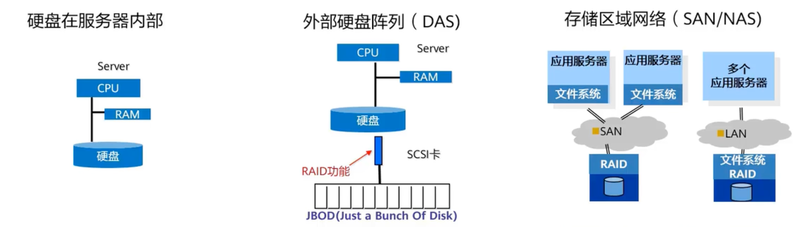

# 存储类

## 主流存储类型

###  块存储

最开始的云。计算和存储是合一的，这就是块存储，通过服务器本地的总线连接磁盘。但是服务器能连接的磁盘有限，总体都有所欠缺。随着数据量的增大，需要存储和计算分离，比如华为Oceanstore系列 存储阵列

存储阵列通过控制框和硬盘框的设计，控制框上面有多个机头，硬盘框上提供多个存储容量。服务器和存储阵列之间通过光纤，这就是现代企业的块存储。

**定义**

块存储是将裸磁盘空间整个映射给服务器使用，比如磁盘阵列里有5块硬盘，可以通过划分成N个逻辑盘，然后再映射给服务器，服务器侧完成分区、格式化、挂载后，就可以直接存放数据了。块存储时延最低

### 文件存储

现代办公的需求，需要多台设备同时连接同一个存储，比如FTP等，这就是文件存储

在存储测中，已经提前划分好文件系统了，创建好后，共享出去，通过协议沟通

**定义**

简单来讲，文件存储就好像是一个共享文件夹，文件系统已经存在，用户可以通过共享文件访问协议，直接将自己的数据放在文件存储上，常见的文件共享协议有NFS，CIFS等

### 对象存储

许多互联网应用通过公网访问存储，这时候需要支撑HTTP协议和HTTPS协议的对象存储，对象存储支持通过API的方式存储数据

**定义**

对象存储采用全新的存储架构设计，使其同时兼具块存储高效直接访问磁盘的特点和文件存储的分布式共享特点，因此它能够像文件存储那样，直接存放用户数据，而性能却好过文件存储

**使用场景**

同文件存储一样，对象存储被广泛使用于数据备份，图片视频类数据存储，网站托管等场景

## 企业存储的发展过程

### 硬盘在服务器内部

局限性：

1. 硬盘成为系统性能瓶颈
2. 有限硬盘槽位，容量小
3. 单硬盘存放数据，可靠性差
4. 存储空间利用率低
5. 本地存储，数据分散

### 外部磁盘阵列 DAS

在逻辑上把几个物理磁盘串联在一起，其目的的纯粹是为了增加磁盘的容量，并不提供数据安全保障。

**解决的问题：**

1. 有限硬盘槽位，容量小

2. 单硬盘存放数据，可靠性差

### 存储区域网络 SAN/NAS

通过网络让服务器连接到存储资源，这样的架构下，存储的容量和性能就被释放出来了

**解决的问题：**

1. 硬盘成为系统性能瓶颈

2. 有限硬盘槽位，容量小
3. 单硬盘存放数据，可靠性差
4. 存储空间利用率低
5. 本地存储，数据分散

## 什么是分布式存储技术

分布式存储是一种数据存储技术，通过网络使用企业中的每台机器上的磁盘空间，并将这些分散的存储资源构成一个虚拟的存储设备，数据分散地存储在企业的各个角落，提高了系统的可靠性、可用性和存储效率

使用分布式存储是“被迫的”，因为随着互联网的发展，数据几何级增长，海量的数据给本地存储带来了压力，急需其他手段分散存储压力，分布式存储和分布式文件系统应运而生。

分布式存储系统一般会采用多副本机制

## 存储在云计算中的服务形态

