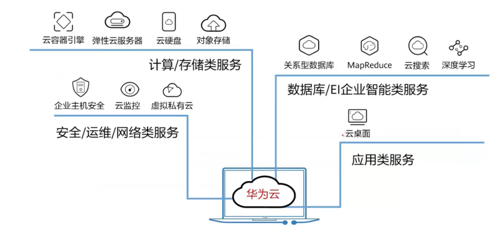
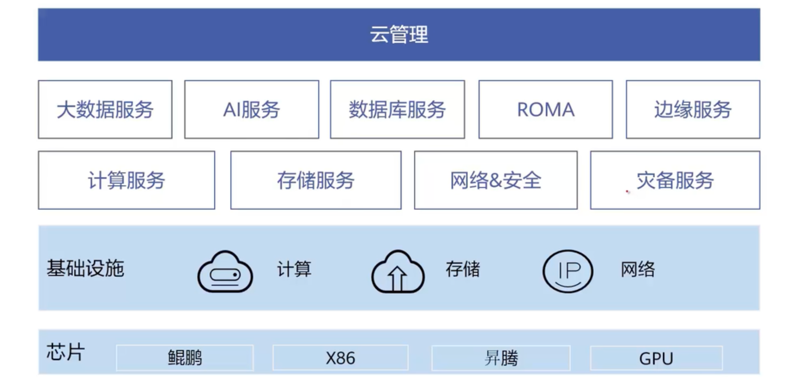
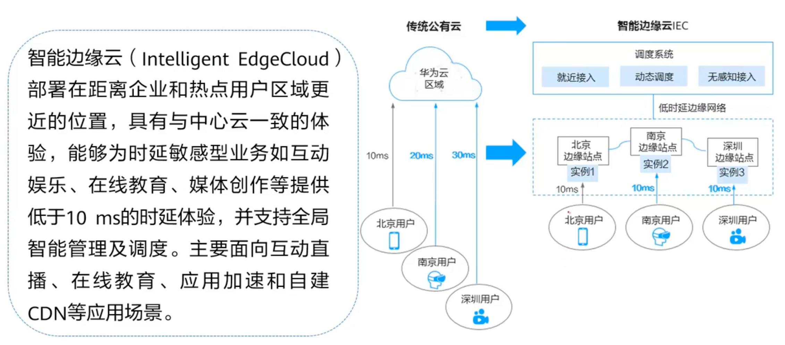
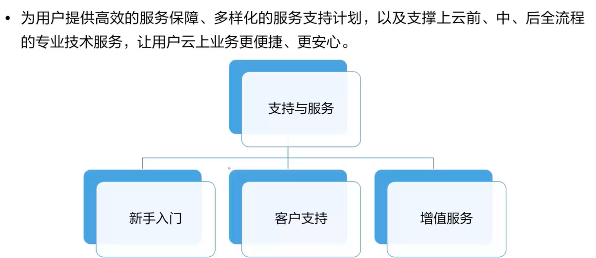
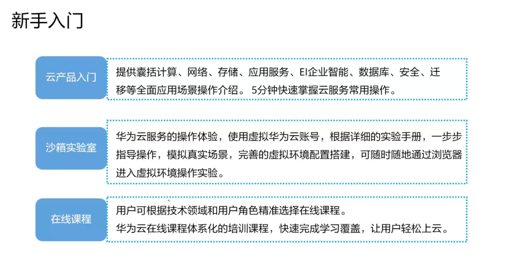
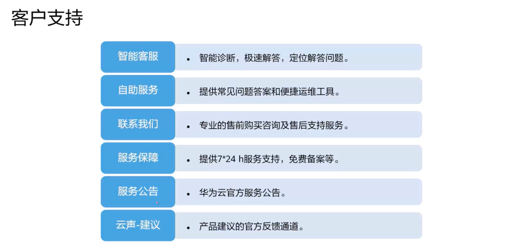
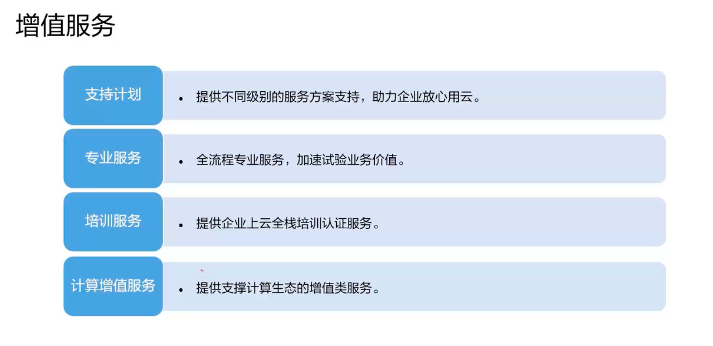

# 华为云交付

## 模式概览

### 公有云

共享资源服务，为个人和企业提供ICT服务

### 华为云Stack

华为云Stack是华为云为政企用户提供的，部署在客户本地数据中心的云基础设施

是一个全栈的，包括公有云和私有云，是一个混合云模式。提供协同、统一、安全三大价值

### 边缘云

部署在距离企业和热点用户区域更近的位置，具有中心云一致的体验

优点：降低时延

# 技术支持

