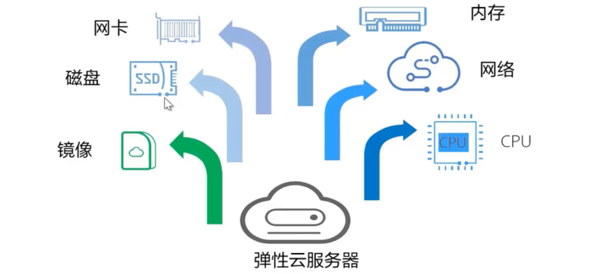

# 计算服务总览

# 弹性云服务器ECS

## 是什么

其实就是虚拟机。弹性云服务器是由CPU、内存、操作系统、云硬盘组成的基础计算组件。弹性云服务器创建成功后，可以像使用自己的本地C或物理P服务器一样，在云上使用弹性云服务器

技术上的呈现：虚拟化服务

## 优势

1. **弹性伸缩**

   1.1 自动调整计算资源

   1.2 灵活调整云服务器配置

   1.3 灵活的计费模式

2. **软硬结合**

   2.1 搭载专业的硬件设备

   2.2 随时获取虚拟化资源

3. **稳定可靠**

   3.1 丰富的磁盘种类

   3.2 高数据可靠性

   3.3 支持云服务器和云硬盘的备份和恢复

4. **安全保障**

   4.1 多种安全服务，多维度防护

   4.2 安全评估

   4.3 智能化进程管理

   4.4 漏洞扫描

## 架构

## 应用场景

1. 网站应用

   

ELB：弹性负载均衡

用户访问的时候，有时候多有时候少，根据链路压力动态调整网路流向

2. 企业电商

推荐使用内存优化型

3. 图形渲染

推荐使用图形加速型

4. 数据分析

推荐使用磁盘增强型

5. 高性能计算

推荐使用高性能计算型

## 购买流程

## 访问方式

## 变更规格

