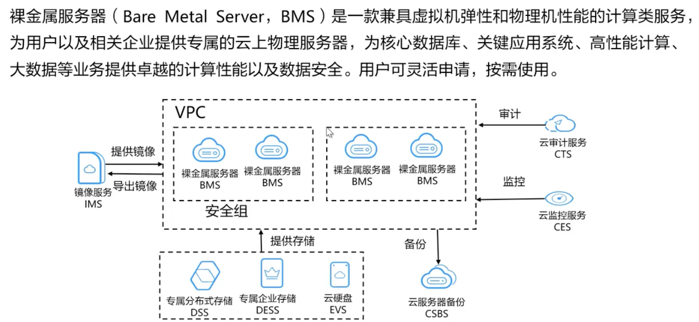
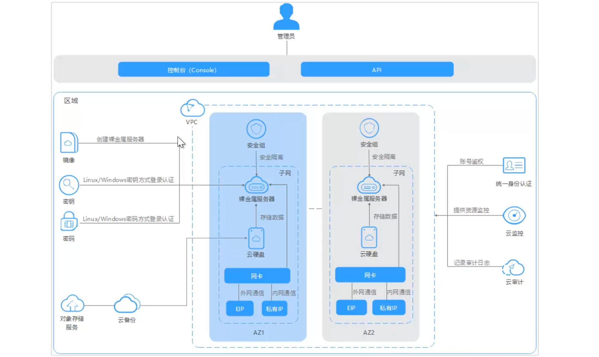
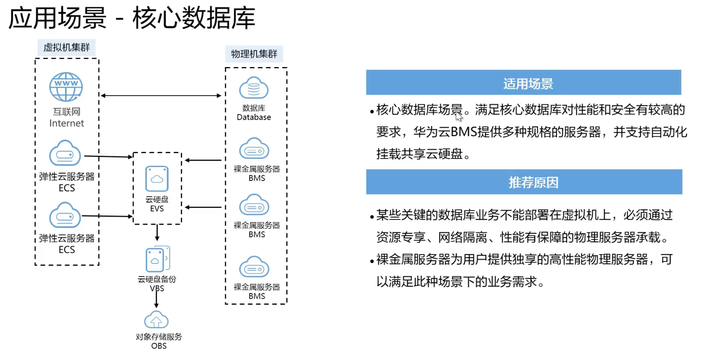
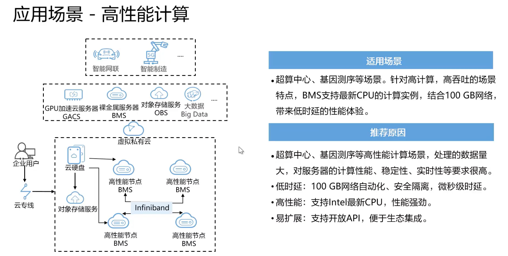
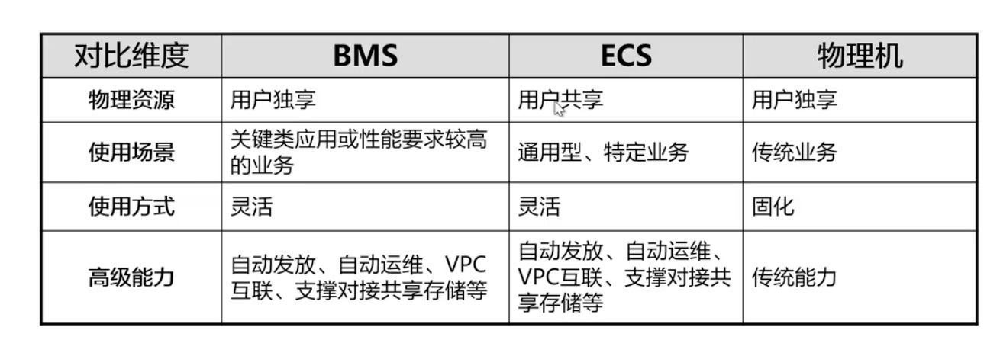
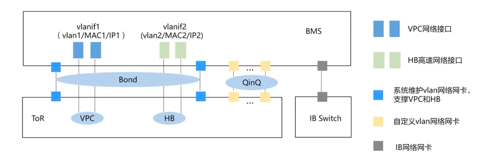
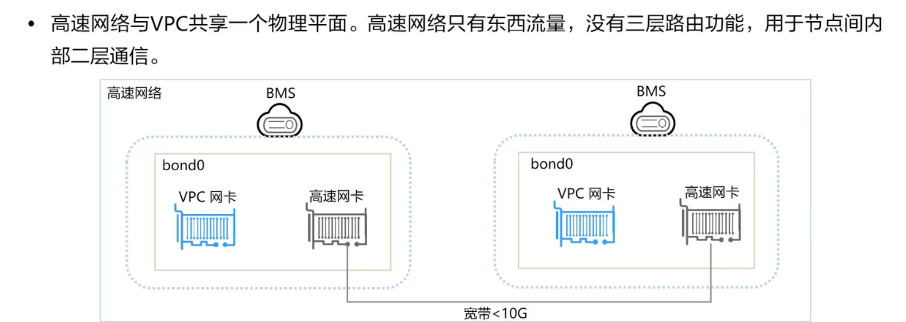
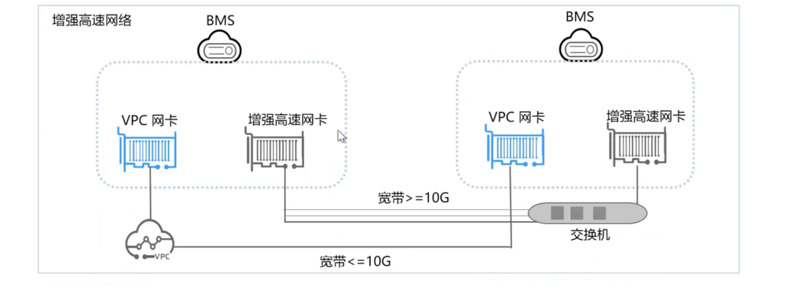
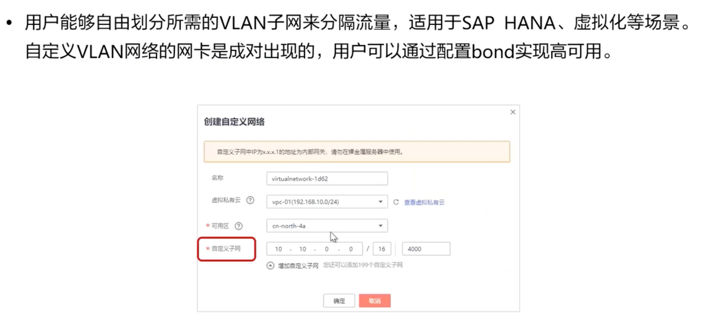
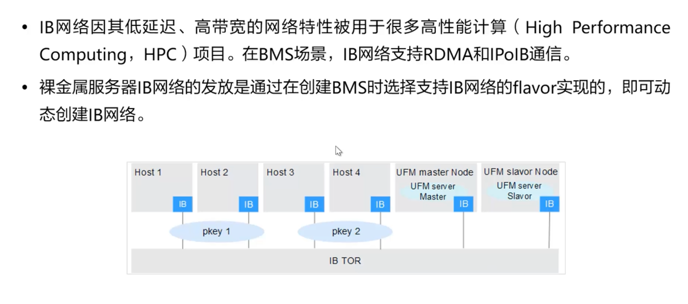

# 裸金属服务器 BMS

## 是什么

直接租用一台物理机服务器

毕竟虚拟机实际的流畅度和实际的性能还是有点不太聪明

比ECS贵很多，但是比实际买一台物理机还是便宜的

## BMS的优势

1. 安全可靠

   1.1 用户专属，支持VPC、安全组隔离

   1.2 支持主机安全相关组件集成

   1.3 支持硬盘备份恢复能力

   1.4 支持对接专属存储

2. 性能卓越

   2.1 无虚拟化开销和性能损失

   2.2 支持云存储、云网络访问性能

   2.3 满足关键业务部署密度和性能诉求

3. 敏捷的部署效率

   3.1 支持云磁盘作为系统盘快速发放

   3.2 支持自助式资源生命周期管理和运维

4. 云服务和解决方案快速集成

   4.1 支持公有云云服务的快速机型

   4.2 业务云化解决方案集成和加速业务云化上线效率

性能极强、更加可靠、价格优势

## 架构

## 应用场景

## BMS vs ECS vs 物理服务器

## BMS网络

裸金属服务有五种网络类型，分别是虚拟私有云、高速网络、增强高速网络、自定义VLAN网络和IB网络，五种网络之间相互隔离不互通

### 高速网络

属于裸金属服务器的内部网络，为同一可用区内的裸金属服务器之间提供带宽不受限制的网络。如果用户需要部署高吞吐量或者要求低延迟的任务，可以创建高速网络

这个网络里，只有BMS和BMS之间的传输

### 增强高速网络

增强高速网络通过云数据 中心实现内网互联，可以提供高质量、高速度、低延迟的内网环境

多了VPC网卡互联

### 自定义VLAN

### IB网络

低延迟、无阻塞、价格贵

