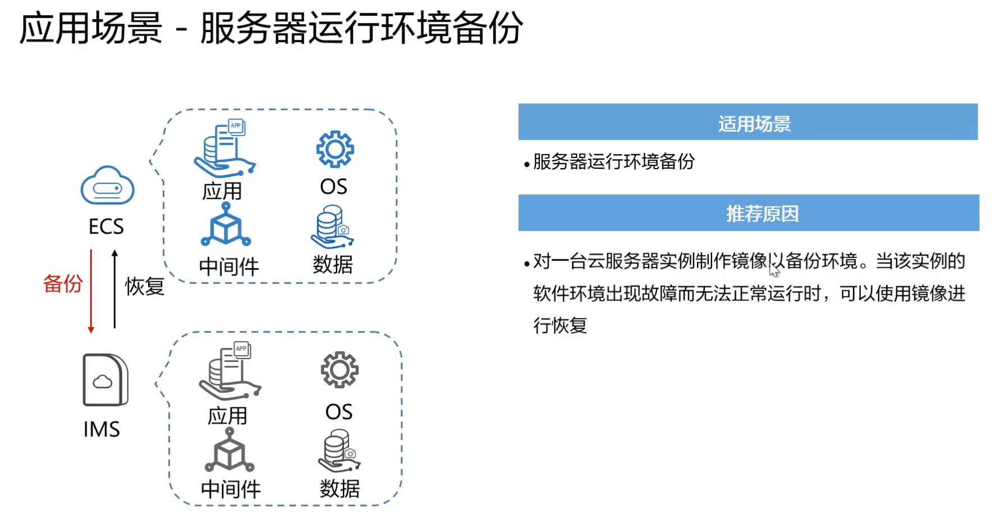

# 镜像服务

## 是什么

镜像服务 Image Management Service 提供镜像的生命周期管理能力，用户可以灵活的使用公共镜像、私有镜像或共享镜像申请弹性云服务器和裸金属服务器。同时，用户还能通过已有的云服务器或使用外部镜像文件创建私有镜像，实现业务上云或云上迁移

生命周期管理：创建、删除、更新

不仅仅是操作系统，还有更多的高级操作

## 优势

1. 安全

2. 便捷

   

3. 统一

   

4. 灵活

   

## 产品类型

1. 公共镜像

   所有用户可见，包括操作系统以及预装的公共应用

2. 私有镜像

   用户基于弹性云服务器创建的个人镜像，仅用户自己可见

3. 共享镜像

   接受其他用户共享的私有镜像，作为自己的镜像进行使用

4. 市场镜像

   市场镜像是提供预装操作系统、应用环境和各类软件的优质第三方镜像

## 应用场景

## 如何创建私有镜像

## IMS的使用

