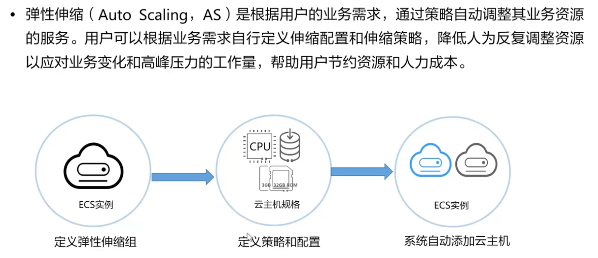
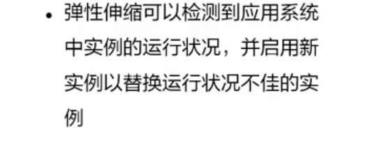
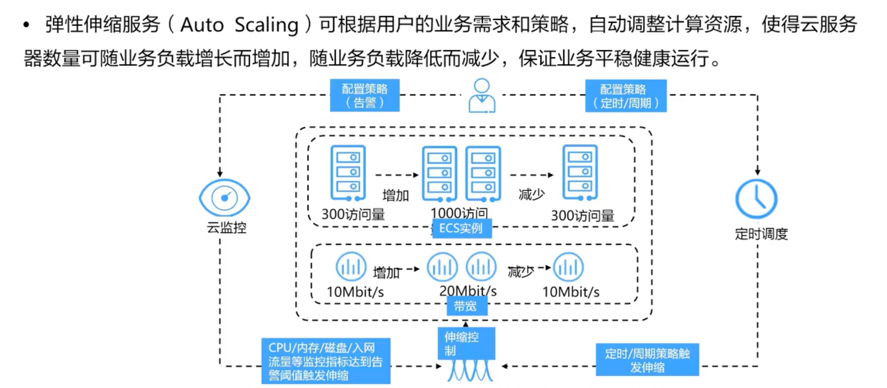
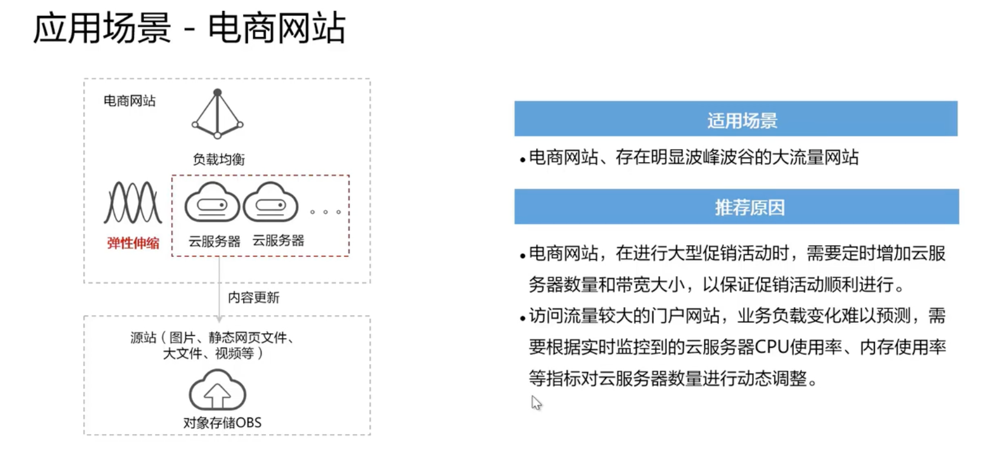
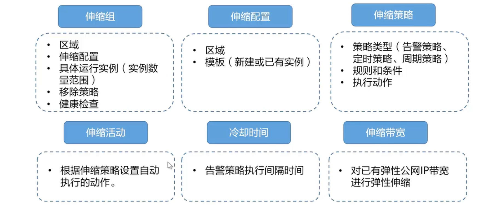
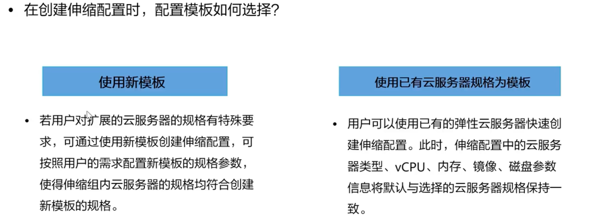
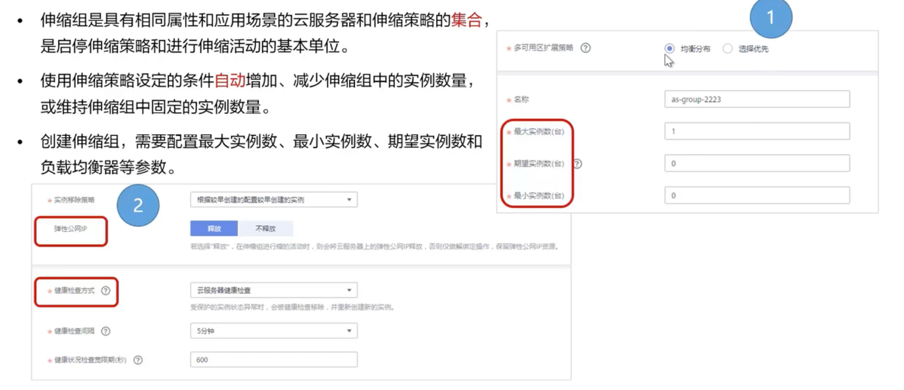
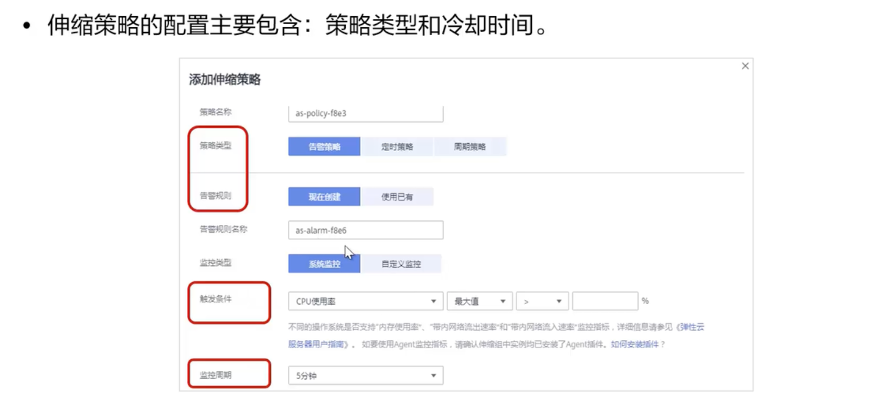

# 弹性伸缩 AS

## 是什么

是一种策略系统

## 优势

1. 自动调整资源

   

2. 加强成本管理

   

3. 提高容错能力

   

4. 提高可用性

   

## 产品架构

## 应用场景

## 相关概念

伸缩组：应用的对象

伸缩配置：策略

冷却时间：AS生效之间有CD，防止业务变化过快而稳定性降低

## 创建伸缩配置

## 创建伸缩组

