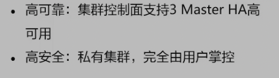

# 云容器引擎

## 是什么

Cloud Container Engine CCE 提供高度可扩展的、高性能的企业级Kubernetes集群，支持运行Docker容器。借助云容器引擎，用户可在华为云上轻松部署、管理和扩展容器化应用程序

## 优势

1. 简单易用

   

2. 开放兼容

   

3. 高性能

   

4. 安全可靠

   

## 应用场景

跟弹性伸缩的区别就是，他是一种篇网络的 策略性的服务，绑定后端服务器组

提供流量的负载均衡访问

完成传统应用的容器化

## 相关概念

## 实际操作

