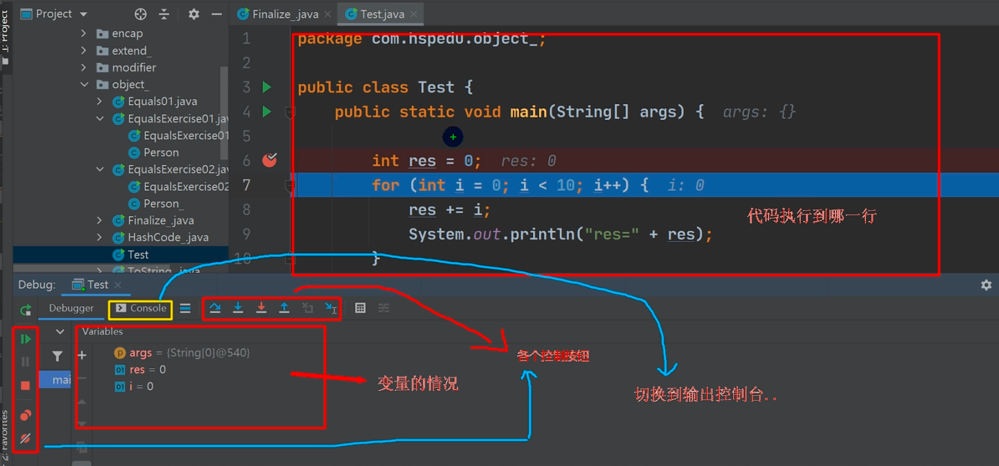

# IDEA断点调试方法

## 什么是断点调试 Debug

断点调试：程序在程序的某一个地方设置一个断点，调试的时候，程序停止在这个地方停住，可以一步步往下调试。

可以一步一步往下调试，调试过程中可以看到变量当前的值。

## 断点调试作用

出错时，可以调试到显示错误的代码停止，停下可以分析从而找到Bug。

断点调试是程序猿必须掌握的技能

并且可以帮助查看java底层代码的执行过程

## 如何使用

### F7 Step Into

**跳入方法内**

例如调用了源码的sort方法，想看内部是怎么实现的，可以使用此方法

如果无法跳入Java源码，则需要配置一下

Setting -> Build, Execution, Deployment ->Debugger ->Stepping -> javax和java勾掉

### F8 StepOver

**一行行执行**

### Shift+F8 Step Out

**跳出方法**

当调试到方法内部时，可以用此快捷键跳出方法

### F9 Resume

**执行到下一个断点**

假如设置了两个断点，程序调试到两个断点中间，可以直接F9跳到第二个断点位

注意，可以在Debug过程中动态下断点

## 图解

