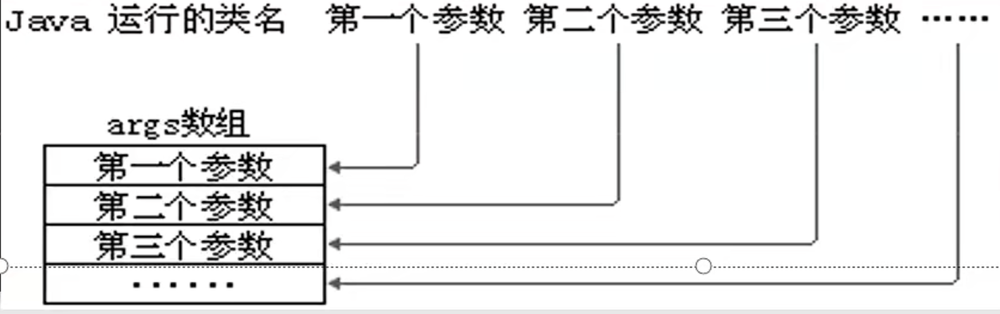
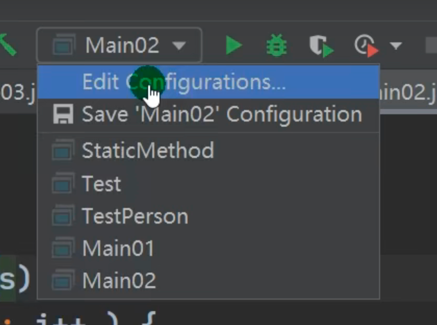
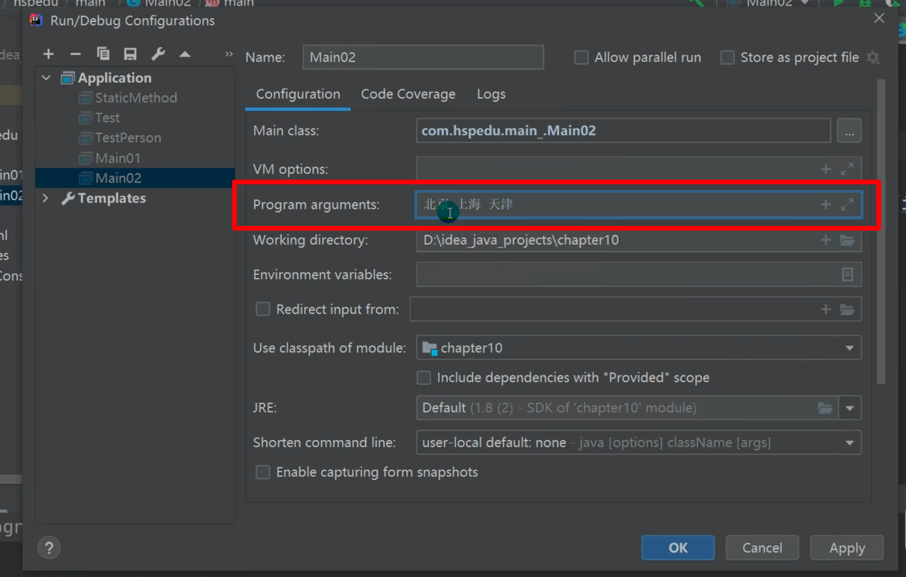

# Main方法语法

## 形式与规则

**public static void main(String [] args)**

1.Main方法 由**虚拟机**调用

2.由于调用的类不是本类，所以要写成**public**

3.调用main方法时，不需要创建对象，所以是**static**

4.args数组为 java命令运行时传入的参数

## 注意

Main方法由于是static，所以不能访问非静态成员

> 详见Static类变量静态变量

若要访问，先创建对象，再访问

## IDEA如何传入参数

命令行运行可以直接在后面用空格间隔传入参数，那么IDEA呢

