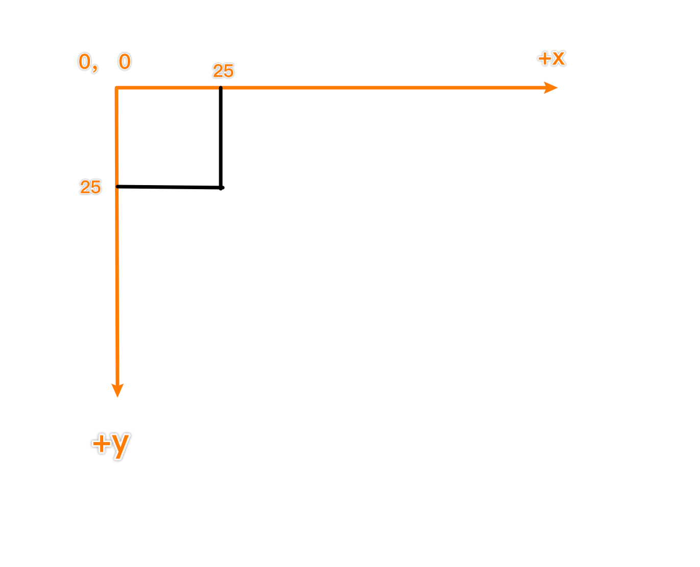
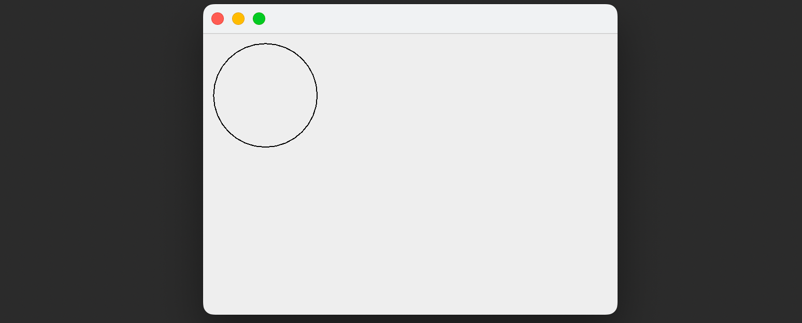
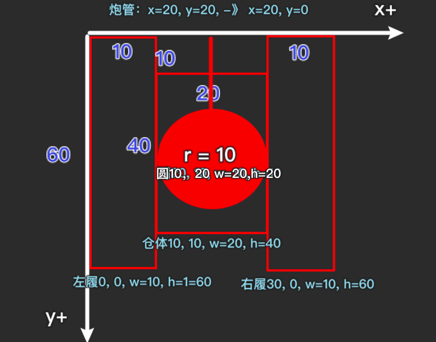

# 绘图

## 坐标体系

​		坐标原点位于左上角， 以像素为单位，在Java坐标体系中，第一个是x坐标，表示当前位置为水平方向， 距离坐标原点x个像素。第二个是y坐标，表示当前位置为垂直方向，距离坐标原点y个像素



## 绘制

```java
import javax.swing.*;
import java.awt.*;

//继承Frame进行绘图
public class DrawCircle extends JFrame{ //对应一个窗口， 可以理解成一个画框
    //定义一个画板
    private MyPanel mp = null;
    public static void main(String[] args) {
        new DrawCircle();

    }

    public DrawCircle(){
        //演示如何在面板上画出圆形
        mp = new MyPanel();
        //把面板放入到窗口里
        this.add(mp);
        //设置窗口大小
        this.setSize(400, 300);
        //可以显示
        this.setVisible(true);
      	//当点击窗口的小叉，窗口就会完全退出
        this.setDefaultCloseOperation(JFrame.EXIT_ON_CLOSE);
    }
}


//1 先定义一个面板MyPanel,继承JPanel类，画图形 就在面板上画

class MyPanel extends JPanel {
    // 说明
    //1。 MyPanel 对象就是一个画板
    //2。 Graphics g 把 g理解成一支画笔
    //3。 Graphics

    @Override
    public void paint(Graphics g) {
        super.paint(g); //调用父类的方法完成初始化，必须保留
        //画出一个图形化
        g.drawOval(10, 10, 100, 100); //左上角坐标x，左上角坐标y，宽，高

    }
}
```



**绘图原理**

Component类提供了两个和绘图相关最重要的方法：

1. paint(Graphics)绘制组件外观
2. Repaint() 刷新组件的外观


当组件第一次在屏幕显示的时候 程序会自动调用paint()方法来绘制组件

以下情况paint会再次被调用

1. 窗口最小化再最大化
2. 窗口的大小发生便哈
3. repaint函数被调用


## Graphices类

1. 画直线

```
g.drawLine(10, 10, 100, 100);
```

2. 画矩形边框

```
g.drawRect(10, 10, 50, 50);
```

3. 画圆形

```
g.drawOval(10, 10, 100, 100); 
```

4. 画填充矩形

```
g.setColor(Color.blue); //设置画笔颜色
g.fillRect(15, 15, 90, 90);
```

5. 画填充椭圆

```
g.setColor(Color.red);
g.fillOval(50, 50, 10, 20);
```

6. 画图片

```
Image image = Toolkit.getDefaultToolkit().getImage("/Users/chenyonglin/IdeaProjects/hspEdu/chapter16/src/bg.jpg"); //获取图片资源
g.drawImage(image, 100, 10, 246, 312, this);
```

7. 画字符串

```
g.setColor(Color.red); //设置颜色
g.setFont(new Font("宋体", Font.BOLD, 23)); //设置字体 粗体 大小
g.drawString("马保国", 100, 200); //此时xy定位为文字左下角
```


# 绘制地图和坦克



## Tank类

```java
package TankGame;

public class Tank {
    private int x; //坦克横坐标
    private int y; //坦克纵坐标

    public Tank(int x, int y) {
        this.x = x;
        this.y = y;
    }

    public int getX() {
        return x;
    }

    public void setX(int x) {
        this.x = x;
    }

    public int getY() {
        return y;
    }

    public void setY(int y) {
        this.y = y;
    }
}
```


## Hero类

```java
package TankGame;

/**
 * 自己的坦克
 */
public class Hero extends Tank{

    public Hero(int x, int y) {
        super(x, y);
    }


}
```


## MyPanel类

```java
package TankGame;

import javax.swing.*;
import java.awt.*;

/**
 * 坦克大战的绘图区
 */
public class MyPanel extends JPanel {
    //定义我的坦克
    Hero hero = null;

    public MyPanel() {
        this.hero = new Hero(100, 100); //初始化一个坦克
    }

    @Override
    public void paint(Graphics g) {
        super.paint(g);
        g.setColor(Color.blue);
        g.fillRect(0, 0, 1000, 750);

        //画出坦克-封装方法
        drawTank(hero.getX(), hero.getY(), g, 3, 0);
        drawTank(150, 150, g, 1, 1);

    }

    /**
     *
     * @param x 坦克的左上角x坐标
     * @param y 坦克的左上角y坐标
     * @param g 画笔
     * @param direct 坦克方向 0-上 1-下 2-左 3-右
     * @param type 坦克类型 0-自己 1-敌人
     */
    public void drawTank(int x, int y, Graphics g, int direct, int type){
        //根据不同类型的坦克，设置不同的颜色
        switch (type){
            case 0: //我们的坦克
                g.setColor(Color.cyan); //青色

                break;
            case 1: //敌人的坦克
                g.setColor(Color.YELLOW); //黄色

                break;
        }

        //根据坦克的方向，绘制坦克
        switch (direct){
            case 0:
                g.fill3DRect(x, y, 10, 60, false); //画出坦克左履
                g.fill3DRect(x+30, y, 10, 60, false);//画出坦克右履
                g.fill3DRect(x+10, y+10, 20, 40, false);//画出坦克仓体
                g.fillOval(x+10, y+20, 20, 20); //圆
                g.drawLine(x+20, y+20, x+20, y); //炮管

                break;
            case 1:
                g.fill3DRect(x, y, 10, 60, false); //画出坦克左履
                g.fill3DRect(x+30, y, 10, 60, false);//画出坦克右履
                g.fill3DRect(x+10, y+10, 20, 40, false);//画出坦克仓体
                g.fillOval(x+10, y+20, 20, 20); //圆
                g.drawLine(x+20, y+40, x+20, y+60); //炮管

                break;
            case 3:
                g.fill3DRect(x, y, 60, 10, false); //画出坦克左履
                g.fill3DRect(x, y+30, 60, 10, false);//画出坦克右履
                g.fill3DRect(x+10, y+10, 40, 20, false);//画出坦克仓体
                g.fillOval(x+20, y+10, 20, 20); //圆
                g.drawLine(x+40, y+20, x+60, y+20); //炮管

                break;
            case 2:
                g.fill3DRect(x, y, 60, 10, false); //画出坦克左履
                g.fill3DRect(x, y+30, 60, 10, false);//画出坦克右履
                g.fill3DRect(x+10, y+10, 40, 20, false);//画出坦克仓体
                g.fillOval(x+20, y+10, 20, 20); //圆
                g.drawLine(x+40, y+20, x, y+20); //炮管

                break;
            default:
                System.out.println("暂时没有处理");
                break;
        }
    }
}
```


## TankGameMainWin

```java
package TankGame;

import javax.swing.*;
import java.awt.*;

public class TankGameMainWin extends JFrame {
    //定义MyPanel
    MyPanel mp = null;
    public static void main(String[] args) {
        new TankGameMainWin();
    }

    public TankGameMainWin(){
        mp = new MyPanel();
        this.add(mp); //把面板 加进去
        this.setSize(1000, 750);
        this.setDefaultCloseOperation(JFrame.EXIT_ON_CLOSE);
        this.setVisible(true);

    }
}
```


# 监听键盘案例

```Java
package TankGame.event;

import javax.swing.*;
import java.awt.*;
import java.awt.event.KeyEvent;
import java.awt.event.KeyListener;

public class BallMove extends JFrame {
    MyPanel mp = null;
    public static void main(String[] args) {
        new BallMove();
    }

    public BallMove() {
        mp = new MyPanel();
        this.add(mp);
        this.setSize(400, 300);
        this.addKeyListener(mp); //添加窗口监听
        this.setDefaultCloseOperation(JFrame.EXIT_ON_CLOSE);
        this.setVisible(true);
    }
}

//面板 可以画出小球
//KeyListener监听器 可以监听键盘事件
class MyPanel extends JPanel implements KeyListener {
    private int x; //小球坐标
    private int y;
    MyPanel(){
       x = 10;
       y = 10;
    }


    @Override
    public void paint(Graphics g) {
        super.paint(g);
        g.fillOval(x, y, 20, 20);
    }

    //如果有字符输出，该方法就会触发
    @Override
    public void keyTyped(KeyEvent e) {

    }

    //当某个键按下，该方法会被触发
    @Override
    public void keyPressed(KeyEvent e) {
        //根据用户按下的不同键，来处理小球的移动(上下左右的键)
        if(e.getKeyCode() == KeyEvent.VK_DOWN){ //KeyEvent.VK_DOWN 就是向下的箭头对应
            y++;
        }

        //让面板重绘
        repaint();
    }

    //当某个键松开时，方法会被触发
    @Override
    public void keyReleased(KeyEvent e) {

    }
}

```
