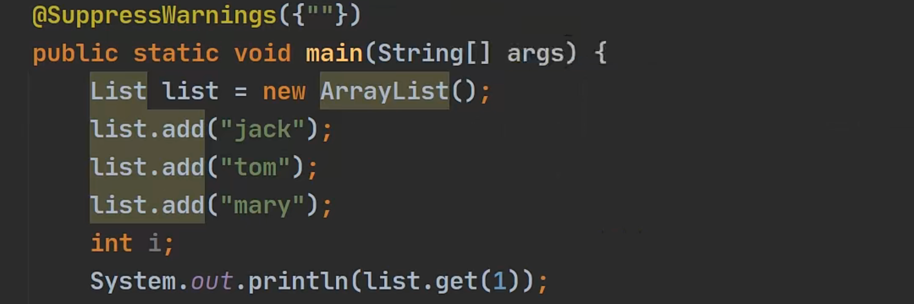
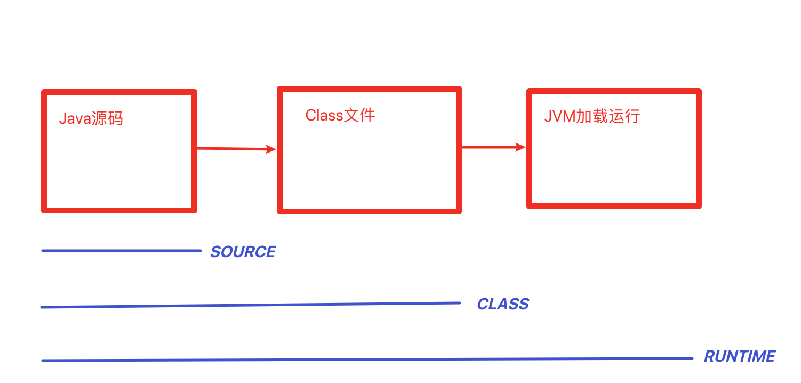

# Annotation注解是什么

1. 注解也被称为元数据，用于修饰解释包、类、方法、属性、构造器、局部变量等数据信息。

2. 和注释一样，注解不影响程序逻辑，但注解可以被编译或者运行，相当于嵌入在代码中的补充信息。
3. 在Java SE中，注解的使用目的比较简单，例如标记已经过时的功能，忽略警告等。在Java EE中注解占据了比较重要的角色，例如用来配置应用程序的任何切面，代替Java EE旧版中遗留的冗余代码和XML配置等


# 三个基本注解

使用注解时，需要在前面添加@符号，并把该注解当成一个修饰符使用，用于修饰它支持的程序元素

| 注解              | 作用                                           |
| ----------------- | ---------------------------------------------- |
| @Override         | 限定某个方法，重写父类方法，该注解只能用于方法 |
| @Deprecated       | 用于表示某个程序元素已过时                     |
| @SupperssWarnings | 抑制编译器警告                                 |


## @Override

1. 如果写了注解，编译器就回去检查该方法，编译器就会检查该方法是否真的重写了父类的方法，如果的确重写了，则编译通过；如果没有构成重写，则编译错误。
2. 如果不写@Override注解，语法合格，仍然构成重写。
3. @Override只能修饰方法，不能修饰其他类、包、属性等
4. 查看源码注释，@Target(ElementType.METHOD)表示只能修饰方法
5. @Target是注释注解的注释，称为元注解


**Override的定义源码**

```Java
@Target(ElementType.METHOD)
@Retention(RetentionPolicy.SOURCE)
public @interface Override{

}
```

如果发现@interface表示一个注解类


## @Deprecated

1. Deprecated修饰某个元素，表示该元素已经过时了
2. 即不再推荐使用，但仍然可以使用
3. 可以修饰类、方法、字段、包等等
4. 可以做两个版本之间的一个过渡


**Deprecated的源码**

```JAVA
@Documented
@Retention(RetentionPolicy.RUNTIME)
@Target(value={CONSTRUCTER, FIELD, LOCAL_VARIABLE, METHOD, PACKAGE, PARAMETER, TYPE})
public @interface Deprecated{

}
```


## @SupperssWarnings



1. 当我们不希望看到这些警告的时候，可以使用SupperssWarnings注解来抑制警告信息

2. 在大括号中，可以写你想抑制（不显示）的警告信息

3. 可以抑制的警告类型有：

> @SuppressWarning 中的属性介绍以及属性说明
>
> all，抑制所有警告
> boxing，抑制与封装/拆装作业相关的警告
> cast，抑制与强制转型作业相关的警告
> dep-ann，抑制与淘汰注释相关的警告
> deprecation，抑制与淘汰的相关警告
> fallthrough，抑制与switch陈述式中遗漏break相关的警告
> finally，抑制与未传回finally区块相关的警告
> hiding，抑制与隐藏变数的区域变数相关的警告
> incomplete-switch，抑制与switch陈述式(enum case)中遗漏项目相关的警告
> javadoc，抑制与javadoc相关的警告
> nls，抑制与非nls字串文字相关的警告
> null，抑制与空值分析相关的警告
> rawtypes，抑制与使用raw类型相关的警告
> resource，抑制与使用Closeable类型的资源相关的警告
> restriction，抑制与使用不建议或禁止参照相关的警告
> serial，抑制与可序列化的类别遗漏serialVersionUID栏位相关的警告
> static-access，抑制与静态存取不正确相关的警告
> static-method，抑制与可能宣告为static的方法相关的警告
> super，抑制与置换方法相关但不含super呼叫的警告
> synthetic-access，抑制与内部类别的存取未最佳化相关的警告
> sync-override，抑制因为置换同步方法而遗漏同步化的警告
> unchecked，抑制与未检查的作业相关的警告
> unqualified-field-access，抑制与栏位存取不合格相关的警告
> unused，抑制与未用的程式码及停用的程式码相关的警告

4. 关于SupperssWarnings作用范围 是和你写的位置也就是放置的位置相关。比如把此放在main方法，那么这个作用范围，就是main方法的代码块。如果把这个写在类上面，可以抑制整个类的警告。


**SupperssWarnings的源码**

```JAVA
@Retention(RetentionPolicy.SOURCE)
@Target(value={CONSTRUCTER, FIELD, LOCAL_VARIABLE, METHOD, PARAMETER, TYPE})
public @interface SupperssWarnings{
	
	String[] value();
}
```

1. 放置的位置有CONSTRUCTER, FIELD, LOCAL_VARIABLE, METHOD, PARAMETER, TYPE
2. String[] value();表示可以传入一个String数组


# JDK的元注解（了解）

## 是什么

JDK的元注解用于修饰其他注解的源码

本身作用不大，但是方便阅读源码


总类

| 注解       | 作用                                           |
| ---------- | ---------------------------------------------- |
| Retention  | 指定注解的作用范围，三种：SOURCE,CLASS,RUNTIME |
| Target     | 指定注解可以用在哪些方面                       |
| Documented | 指定注解是否在javadoc中体现                    |
| Inherited  | 子类会继承父类的注解                           |


## @Retention

只能用于修饰一个注解定义，用于指定该注解可以保留多长时间

Rentention包含一个RententionPolicy类型的成员变量，使用@Rentention时必须为该value成员变量指定值：

| RetenionPolicy | 作用                                                         |
| -------------- | ------------------------------------------------------------ |
| SOURCE         | 编译器使用后，直接丢弃这种策略的注解                         |
| CLASS          | 编译器将把注解记录在CLASS文件中，当运行程序时，不会保留注解。默认值 |
| RUNTIME        | 编译器将把注解记录在CLASS文件中，当运行程序时，JVM保留注解，程序可通过反射获取该注解 |




## @Target

​		用于修饰注解的定义，用于指定被修饰的注解能用于修饰哪些程序元素，@Target也包含一个名为value的成员变量


能取得值如下

> TYPE 类
>
> FIELD 字段
>
> METHOD 方法
>
> PARAMETER 参数
>
> CONSTRUCTOR 构造器
>
> LOCAL_VARIABLE 局部变量
>
> ANNOTATION_TYPE 注解类
>
> PACKAGE 包
>
> TYPE_PARAMETER
>
> TYPE_USE


## @Documented

​		用于指定该元注解修饰的注解类将被javadoc工具提取成文档，即在生成文档时，可以看到该注解


## @Inherited

被它修饰的注解将具有继承性。如果某个类使用了被@Inherited修饰的注解，则子类将自动拥有该注解